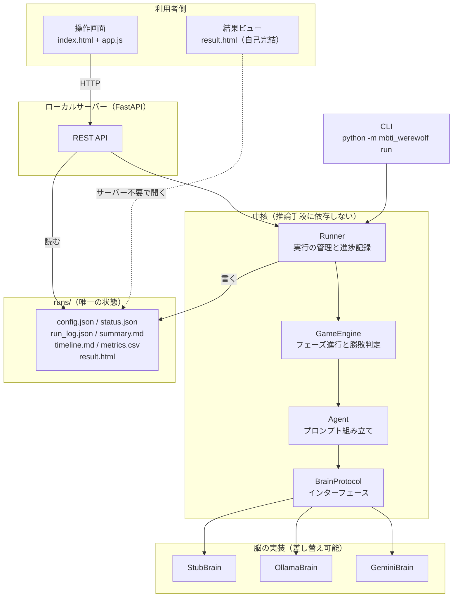
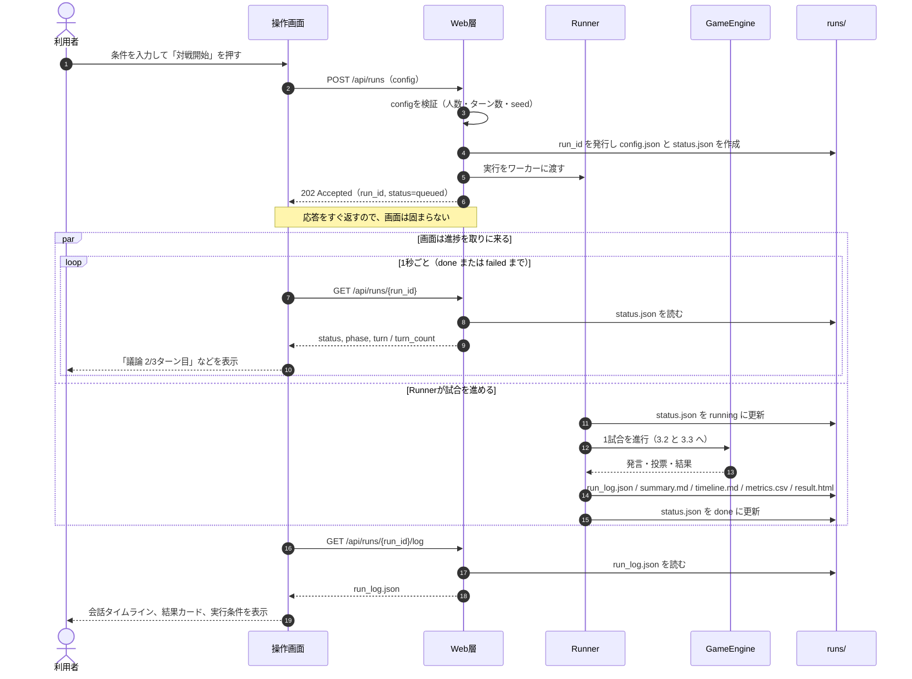
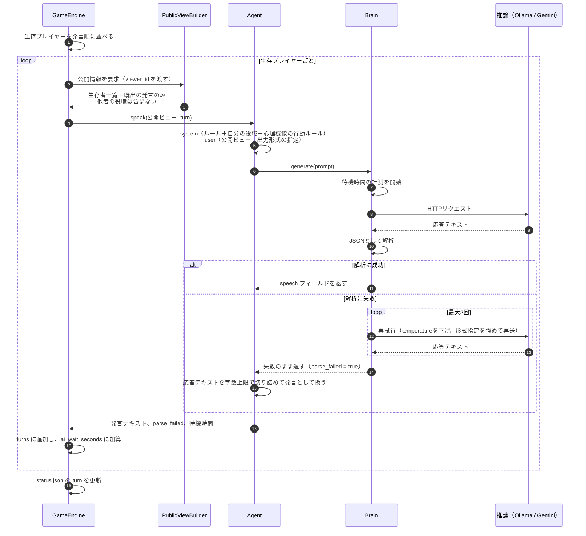
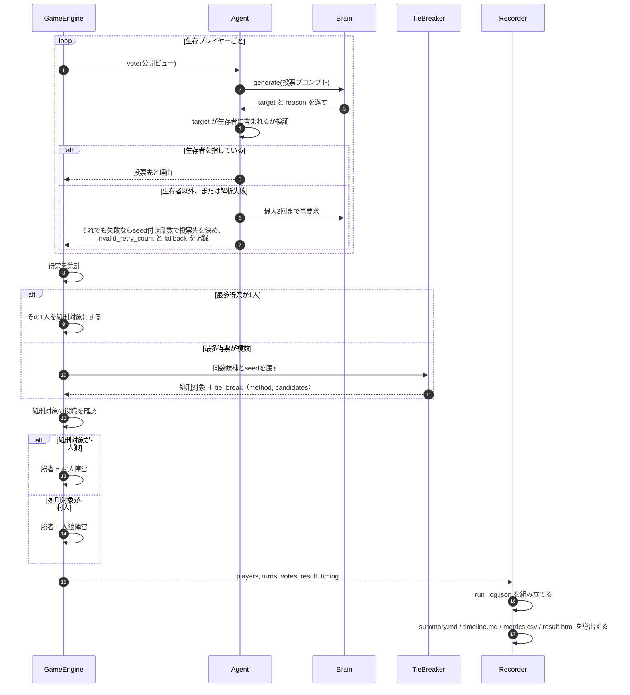
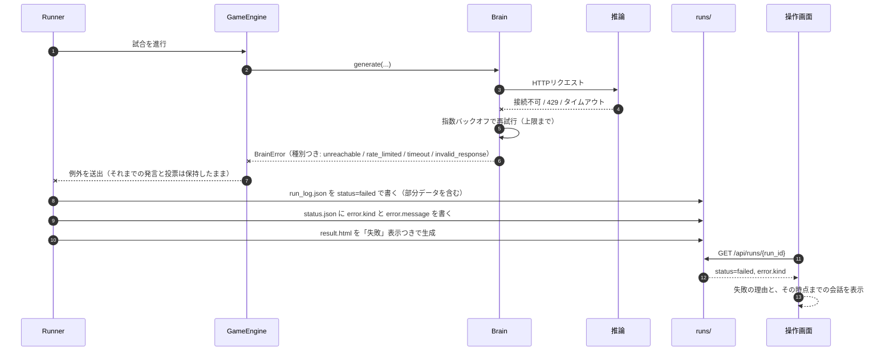
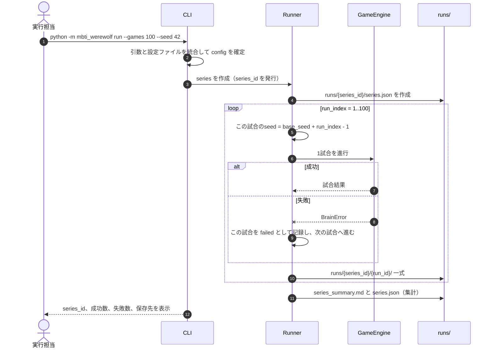
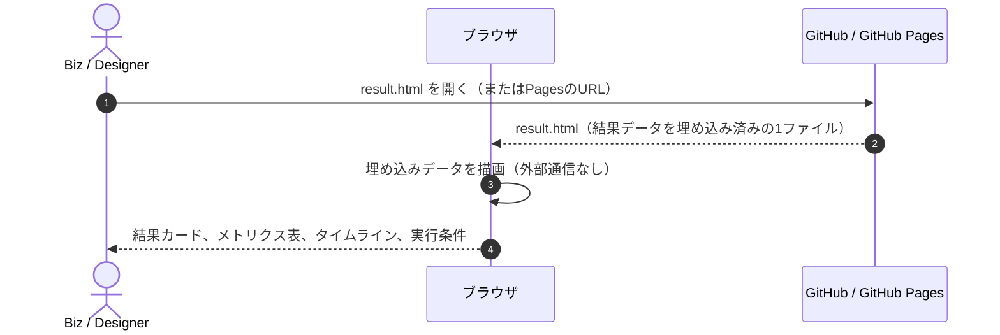
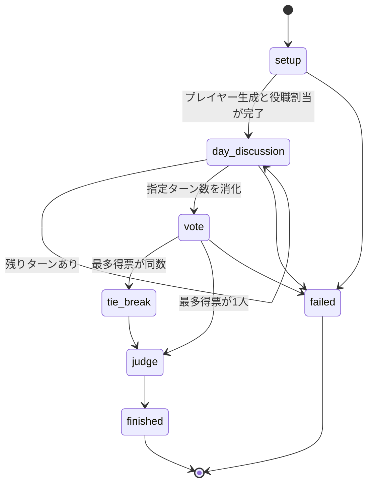
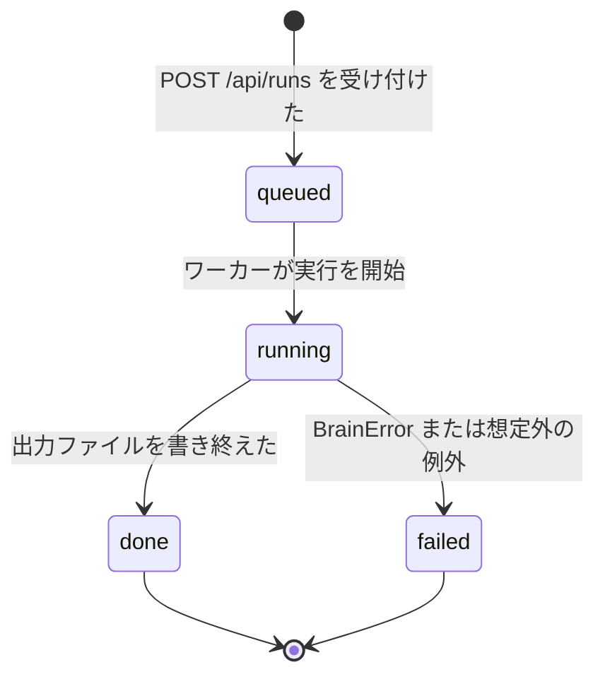
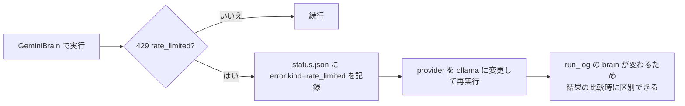

# AIテスト_設計書

MBTI人狼AI先行テストについて、要件定義書の要件をどう実現するかを定義する。

## 0. 文書情報

| 項目 | 内容 |
| --- | --- |
| バージョン | 1.1 |
| 最終更新 | 2026-08-15 |
| 1.1の変更点 | 実装（`playgrounds/mbti-werewolf`）で確定した事項と本書との差分を0.4に追加した。 |
| 作成者 | ゆうじろう（Engineer） |
| 上位文書 | [要件定義書](./system-requirements.md) / [要求定義書](./requirements.md) |
| Confluence版 | [AIテスト_設計書](https://mayuun2.atlassian.net/wiki/spaces/hackathon/pages/1998901)（章ごとに子ページへ分割。図は`docs/diagrams/`のPNGを参照している） |
| 本書の役割 | 要件定義書の「システムが何を満たすべきか」を、「どう実現するか」として確定する。 |
| 本書の読者 | 実装担当（Engineer）。画面の見せ方はDesignerも参照する。 |

### 0.1 本書の位置づけ

| 文書 | 答えること | 本書との関係 |
| --- | --- | --- |
| 要求定義書 | なぜ作るか、何がほしいか | 上位。変更はConfluenceが正本。 |
| 要件定義書 | システムは何を満たすべきか | 上位。本書の要件IDはここを指す。 |
| **設計書（本書）** | **どう実現するか** | **構成、処理順序、データ構造、実装順序を確定する。** |

### 0.2 設計方針

以降のすべての判断は、この3点を優先して決めている。

| 方針 | 内容 | 根拠 |
| --- | --- | --- |
| 無料で完結させる | 課金が発生しうる経路を構成に持ち込まない。既定はローカル実行。 | 要件2.1、NF-01、NF-02 |
| 脳を差し替え可能にする | 推論手段はインターフェースの裏に隔離し、ゲーム進行から独立させる。 | F-15、F-16、NF-08 |
| 出力ファイルを唯一の状態にする | データベースを持たず、`runs/` 配下のファイルだけを状態とする。画面はその上の薄い読み取り層にする。 | F-40、F-41、NF-15、AC-16 |

3番目が本設計の中心である。画面から実行してもコマンドから実行しても同じファイル群を書くため、片方の経路だけで作られた結果がもう片方から見えないという事態が起きない。

### 0.3 要件定義書で保留した決定の確定

要件定義書11章の未決定事項に対する本書での決定は以下である。

| 保留項目 | 本書での決定 | 詳細 |
| --- | --- | --- |
| 推論手段の選定 | ローカルのOllamaを既定とし、Gemini無料枠を比較用に併設する。テスト用のStubも用意する。 | 1.2、5.5 |
| 初回4人の心理機能 | `Ne` / `Ti` / `Fe` / `Si` の4種に固定する。 | 4.3 |
| 役職割当方式 | seed付きランダム。 | 4.4 |
| 同数得票時の決着方法 | seed付きランダムで1人を選び、決着方法をログに残す。 | 4.5 |
| 指標算出方法 | 確実に取る指標はコードで集計。できれば取る指標はv1でルールベース、AI分類はv2以降。 | 9章 |
| 出力schema詳細 | 本書6章で確定する。 | 6章 |
| 操作画面の実装方式 | FastAPIのローカルサーバー + 素のHTML/JS。ビルド工程を持たない。 | 7章 |
| 実行の起動方法 | 単一ワーカーでの非同期実行 + 画面からの1秒間隔ポーリング。 | 8.3 |
| 結果ビューの生成方式 | 実行完了時に、データを埋め込んだ自己完結HTMLを生成する。 | 7.5 |
| 性能の閾値 | 本書では決めない。初回実測後に上位文書へ反映する。 | 14章 |

### 0.4 実装で確定した事項と本書との差分

実装（`playgrounds/mbti-werewolf`）を進める中で、本書の記述を変えた方がよいと判断した点と、
本書が決めていなかったために実装側で決めた点を1か所にまとめる。該当する章の記述はこの表を優先する。

| 対象 | 本書の当初の記述 | 実装での確定 | 理由 |
| --- | --- | --- | --- |
| 1.1 言語 | Python 3.12以上 | **Python 3.9以上**（確認した実機は3.9.6） | 実機にはmacOS同梱の3.9.6しか入っておらず、新しいPythonの導入自体が要件NF-04（導入容易性）の障壁になる。3.9で動く書き方にそろえた。3.12でもそのまま動く。 |
| 1.1 依存 | バージョンは実装時に記録する | `requirements.txt` に固定。ライセンスと料金区分は[無料構成の確認記録](./free-stack-check.md)に記載 | 要件NF-02の根拠を1ファイルに集めた。 |
| 1.1 推論（既定） | 既定はOllama | **`config/default.json` の既定は `stub`** | Ollamaが未導入の環境でも `clone` 直後に1試合が完走し、出力と画面を確認できる。実際の観察は `--brain ollama` で行う。 |
| 5.1 脳のインターフェース | `generate(system, user)` | `generate(request)`。`Request` は `system` / `user` / `expect_keys` / `choices` / `tag` を持つ | 期待するキーと選択肢を渡せないと、Brain側で形式の検証とリトライができない。引数の追加ではなくオブジェクトにまとめ、今後の追加で署名が変わらないようにした。 |
| 3.5 試合ごとのseed | `base_seed + run_index` | **`base_seed + run_index - 1`** | 当初の式では単発実行で seed 42 を指定すると実際には43が使われる。1試合目が指定値そのままになる式に変えた。複数試合の再現性は変わらない。 |
| 4.4 発言順 | 規定していなかった | seed付きランダムで決め、`run_log.speaking_order` に残す | 順番を固定すると先頭の心理機能だけが常に文脈なしで話すことになり、機能ごとの発言量の比較に偏りが入る。 |
| 4.3 心理機能 | 初回MVPは4種を固定 | 4種を既定にしたうえで、8種すべてを `agents/functions.py` に定義 | 8人版（要件F-08）を設定変更だけで試せるようにした。定義を増やすコストがほぼないため先に入れた。 |
| 6.3 設定 | — | `base_seed` と `brain.max_retries` を追加 | 前者は試合ごとにseedをずらした際の元の値を残すため。後者は5.4のリトライ回数を設定値にするため。 |
| 6.4 状態 | — | `status.json` に `series_id` を追加 | 画面が1ファイル読むだけでseriesを特定できるようにした。 |
| 6.1 構成 | — | `pyproject.toml` を追加。プロンプトは `system_speak` / `user_speak` / `system_vote` / `user_vote` の4ファイル | 前者は `pip install -e .` で `python -m mbti_werewolf` を使えるようにするため。後者はuser側の文面もコードから出し、版として比較できるようにするため（要件F-14）。 |
| 7.4 API | 6エンドポイント | `GET /api/series/{series_id}` を追加 | 多試合実行の進捗（何試合目か）は試合単位の `status.json` では表せない。 |
| 10章 テスト | 6本 | `test_web_api.py` と `test_cli.py` を追加（計37件） | 画面から実行する経路が要件の主経路になったため、受入基準AC-13〜AC-16を自動で確認できるようにした。 |
| 13章 出力容量 | 100試合実行後に実測する | 1試合あたり**約32KB**（stub実測）。100試合で約3.2MB | 桁が分かれば保存方針を判断できるため先に測った。実LLMでは発言が長くなるため増えるが桁は変わらない。 |

---

## 1. 技術スタック

### 1.1 採用するもの

| 区分 | 採用 | 料金・ライセンス | 選定理由 |
| --- | --- | --- | --- |
| 言語 | Python 3.9以上（実機は3.9.6） | PSF License（無料） | 標準ライブラリだけで乱数のseed管理、JSON、CSV、日時、HTTPサーバーが揃う。macOS同梱のPythonで動くため、言語処理系の追加インストールが不要になる。 |
| Web層 | FastAPI + uvicorn | MIT / BSD（無料） | 非同期の受け付けと静的ファイル配信を少ない記述で用意できる。 |
| HTTP通信 | httpx | BSD（無料） | Ollamaにも Gemini にも同じクライアントで届く。ベンダーSDKを入れずに済む。 |
| 画面 | 素のHTML / CSS / JavaScript | 無料 | npmとビルド工程を持たない。差し替え前提の画面に build を挟む価値がない。 |
| 推論（既定） | Ollama + `gemma3:4b` | Ollama本体はMIT。`gemma3:4b` は Gemma Terms of Use（無償利用可、OSIオープンソースではない）。 | ローカル完結で回数制限がない。100試合以上の実行はこの経路しか成立しない。 |
| 推論（比較用） | Gemini API 無料枠（`gemini-3.1-flash-lite`） | 無料枠のまま利用（課金を有効化しない） | ローカル小型モデルで議論が成立しない場合の品質比較用。 |
| 推論（テスト用） | Stub（LLMを呼ばない） | 無料 | LLMなしで1試合を完走できるため、進行とファイル出力を即時・無課金で検証できる。 |
| テスト | pytest | MIT（無料） | 再現性と役職漏れの検査を自動化する。 |
| 保存・共有 | GitHub / GitHub Pages | 無料枠 | 要件のIF-03、IF-04。 |

依存パッケージは `playgrounds/mbti-werewolf/requirements.txt` に固定する。実際にインストールした値は fastapi 0.128.8 / uvicorn 0.39.0 / httpx 0.28.1 / pytest 8.4.2 である（2026-08-15時点）。各パッケージのライセンスと料金区分、課金経路がないことの確認結果は[無料構成の確認記録](./free-stack-check.md)に残している。

経路ごとに必要な依存が違う点は実装で分けている。`stub` でのCLI実行は標準ライブラリだけで動き、httpxはOllamaとGeminiのときだけ、FastAPIとuvicornは操作画面のときだけ読み込む。

### 1.2 推論手段を3つ用意する理由

要件のF-15は脳の差し替えを求めているが、差し替え先が実在しないと要件を満たしたか確認できない。そのため最初から3実装を並べる。

| 実装 | 用途 | 回数の制約 | 品質 |
| --- | --- | --- | --- |
| `StubBrain` | 進行・出力・画面の検証、CI、受入基準AC-01〜AC-05の確認 | なし | 議論としては無意味（固定文＋seed付き乱数の投票） |
| `OllamaBrain` | 本命。1試合の観察、多試合実行、夜間実行 | なし（ローカル） | 小型モデル相応 |
| `GeminiBrain` | 品質比較。ローカルで議論が成立しない場合の判断材料 | 無料枠の1日あたり上限に依存 | 高い |

1試合あたりの推論呼び出し回数は、4人・3ターン・投票1回で **発言12回 + 投票4回 = 16回** である。無料枠の1日あたり上限が仮に250回なら15試合前後、1,000回なら60試合前後で頭打ちになる。要件のF-23が想定する100試合以上はローカル実行でしか成立しない。この計算が「既定をOllamaにする」判断の根拠である。

Gemini無料枠の実際の上限はモデル・プロジェクト・時期で変わり、固定値として扱えない。実装時にAI Studioの使用量画面で確認し、確認日と値を `docs/` の実行メモに残す。

### 1.3 無料であることの確認手順

要件のNF-01、NF-02、AC-07を満たしたと判断するための手順を定める。

| 確認 | 手順 |
| --- | --- |
| 課金経路がない | Ollamaのみを使う構成で1試合を完走する。APIキーを環境変数に設定しない状態で成功すること。 |
| 依存が無料 | `requirements.txt` の各パッケージのライセンスと料金区分を一覧にして `docs/` に残す。 |
| モデルの重みが無償利用可 | 使用するモデルの利用規約を実装時に確認し、確認日とあわせて記録する。 |
| Geminiが無料枠のまま | AI Studioで課金を有効化しない。課金を有効化すると無料枠を外れるため、有効化しないこと自体を運用ルールにする。 |

Gemini無料枠は、入出力がGoogleの製品改善に使われる可能性がある。本テストで扱うのは架空の心理機能設定と人狼の会話だけなので支障はないが、認証情報や実データをプロンプトに含めない（NF-11）。

---

## 2. システム構成

### 2.1 全体構成



### 2.2 コンポーネントの責務

| コンポーネント | 責務 | 持たない責務 |
| --- | --- | --- |
| Web層（`web/app.py`） | HTTPの受け付け、`runs/` の読み取り、静的ファイル配信 | ゲームのルール、推論の呼び出し |
| Runner（`runner.py`） | 実行単位の管理、seedの割り振り、進捗と出力の書き込み、失敗の記録 | 発言の生成、勝敗の判定 |
| GameEngine（`engine/game.py`） | フェーズ進行、投票集計、同数の決着、勝敗判定 | プロンプトの文面、HTTP通信 |
| PublicViewBuilder（`engine/view.py`） | プレイヤー視点の公開情報だけを組み立てる | 推論、記録 |
| Agent（`agents/agent.py`） | 心理機能と役職からプロンプトを作り、応答を解釈する | HTTP通信、リトライ制御 |
| Brain実装（`brains/*.py`） | 推論手段への通信、応答形式の検証、リトライ、待機時間の計測 | ゲームのルール |
| Recorder（`record/*.py`） | `run_log.json` を組み立て、他の出力を導出する | 推論、進行 |

### 2.3 依存の方向

依存は外から内へ一方向にする。`engine` と `agents` は `brains` の具体実装を直接importしない。参照するのは `brains/base.py` のインターフェースだけである。

```text
web  ─→ runner ─→ engine ─→ agents ─→ brains/base（インターフェース）
cli  ─→ runner                              ↑
                          brains/factory ───┘（設定から実装を選んで注入する）
```

推論手段を追加するときに触るのは `brains/` 配下と設定の選択肢だけになる。これがF-15の「ゲーム進行部分を作り直さずに済む」を構造として担保する部分である。

---

## 3. 処理シーケンス

### 3.1 画面から1試合を実行する（正常系）

要件のF-51からF-54にあたる主経路である。実行開始の応答をすぐ返し、進捗はポーリングで見せる。会話は実行完了後にまとめて取得する。



進捗として返すのはフェーズとターン番号だけで、発言そのものは返さない。会話を1発言ずつ流さないという要件（要件定義書1章、10章）を、APIの返す情報の範囲で担保している。

### 3.2 1ターンの発言生成

F-10からF-14、およびF-17にあたる。役職の非対称性を守る箇所と、応答形式が崩れた場合の扱いをここで確定する。



解析に失敗しても試合を止めずに続ける。ただし `parse_failed` を発言単位で残すため、後から「この結果は形式崩れをどれだけ含むか」を判断できる。要件のF-17が求める継続と、NF-05が求める記録の両方をこの1フィールドで満たしている。

### 3.3 投票、同数の決着、勝敗判定

F-04からF-06にあたる。無効票と同数得票という2つの分岐を、どちらも決定的に処理する。



投票先が生存者以外になる、投票が解析できない、得票が同数になる、のどれが起きても試合は必ず終了する。要件のF-06が求める「常に1試合が終了する状態」を、乱数のseedを固定した決着で満たしている。

### 3.4 実行が失敗した場合

F-37、F-55、NF-07にあたる。無料枠の上限到達や通信失敗は起きる前提で設計する。



失敗の種別を4つに分類して記録する理由は、要件のNF-07が「原因が判別できる形で終了する」ことを求めているためである。`rate_limited` が出たら別の無料手段へ切り替える判断（NF-08）に直結する。

### 3.5 コマンドから多試合を実行する

IF-07、F-23、F-38にあたる。夜間の長時間実行は画面を開いたままにしない。



多試合実行では1試合の失敗で全体を止めない。100試合のうち数試合が無料枠やタイムアウトで落ちても、残りの結果から傾向を読めるようにする。試合ごとのseedを `base_seed + run_index - 1` で決めるため、1試合目は指定した `base_seed` がそのまま使われ、同じ `base_seed` を指定すれば100試合の並びごと再現できる（F-21、F-22）。

### 3.6 実行環境を持たないメンバーが結果を見る

F-41、NF-15、AC-12にあたる。Biz・Designerはサーバーを起動しない。



`result.html` は実行結果のJSONをファイル内に埋め込んだ自己完結HTMLとして生成する。外部からデータを取得しないため、`file://` で直接開いてもGitHub Pages経由でも同じように表示される。操作画面と違ってPythonの起動を必要としないので、要件のNF-15が求める二経路の独立を満たす。

---

## 4. ゲーム進行の設計

### 4.1 フェーズの状態遷移



### 4.2 実行状態の遷移

`status.json` の `status` が取る値。操作画面はこの値だけで表示を切り替える（F-52）。



### 4.3 心理機能の割り当て

初回MVPの4人に割り当てる心理機能は `Ne` / `Ti` / `Fe` / `Si` に固定する。要求定義書6.4の行動ルール案から、行動が最も分かれる4種を選んだ。

| 心理機能 | 行動ルール（プロンプトに書く方針） | この4種に入れた理由 |
| --- | --- | --- |
| `Ne` | 可能性を広げ、複数の仮説を並べる | 発言が長く仮説が多くなるため、発言量の差が出やすい |
| `Ti` | 発言の論理矛盾を細かく指摘する | 他者の発言を引用するため、疑い方の差が出やすい |
| `Fe` | 場の空気と協調性を見る | 同調が多く、`Ti` と対比が付く |
| `Si` | 過去の発言やルールとのズレを見る | 将来のhistory_mode検証（F-18）で主役になる |

`Ne` と `Ti` は攻めの向きが違い、`Fe` と `Ti` は判断軸が対立する。ログを読んだときに差が見えるかどうかがこのテストの目的なので、似た機能を並べないことを優先した。使用した機能は `config.functions` とログに残るため、後から4種を変えて比較できる。

8種すべて（`Ne` / `Ni` / `Se` / `Si` / `Te` / `Ti` / `Fe` / `Fi`）は `agents/functions.py` に定義済みである。既定は上記4種だが、設定の `functions` と人数を変えるだけで8人版を試せる（要件F-08）。

### 4.4 役職の割り当て

seed付きランダムとする。

| 項目 | 決定 |
| --- | --- |
| 方式 | `random.Random(seed)` で生存プレイヤーから人狼を選ぶ |
| 記録 | `role_assignment_mode: "seeded_random"` と `seed` を `config` に残す |
| 発言順 | 同じseedで並べ替え、`run_log.speaking_order` に残す。順番を固定すると先頭の心理機能だけが常に文脈なしで話すことになり、機能ごとの発言量の比較に偏りが入る |
| 再現性 | 同じseedなら心理機能の割当、役職、発言順がすべて一致する（F-22） |

固定割当にしなかったのは、心理機能と役職の組み合わせを試合ごとに変えたいからである。要求定義書8.1が見たい差分として「同じ心理機能の役職差」を挙げているため、seedを変えるだけで組み合わせが動く方式が適している。

### 4.5 同数得票の決着

| 項目 | 決定 |
| --- | --- |
| 方式 | 同数候補の中から `random.Random(seed + turn_count)` で1人を選ぶ |
| 記録 | `result.tie_break` に `method`、`candidates`、選ばれた `player_id` を残す |
| 再投票 | 行わない |

再投票を選ばなかった理由は2つある。1つは推論の呼び出しが増えて待機時間が伸びること、もう1つは再投票でも同数になる可能性が残り、終了条件を保証できないことである。乱数で決めると「実力で決まった処刑ではない」という情報がログに必要になるため、`tie_break` を必ず残す。

---

## 5. エージェント設計

### 5.1 脳のインターフェース

`brains/base.py` に置く。ゲーム進行側が知るのはこの形だけである。

```python
class BrainError(Exception):
    kind: str  # unreachable / rate_limited / timeout / invalid_response


class Request:
    system: str
    user: str
    expect_keys: tuple[str, ...]  # 例: ("speech",) または ("target", "reason")
    choices: tuple[str, ...]      # 投票先など、値が限られる項目の候補
    tag: str                      # 呼び出しの識別。StubBrainの出力切替と調査に使う


class Brain(Protocol):
    name: str          # ログに残す識別名。例: "ollama:gemma3:4b"
    endpoint_kind: str # "local" / "free_api" / "stub"

    def generate(self, request: Request) -> BrainResponse:
        """1回の推論。失敗時は BrainError を送出する。"""
```

`BrainResponse` は生成テキスト、待機時間、リトライ回数、`parse_failed` を持つ。JSONの解析とリトライはBrain側の責務とし、Agentは解釈済みの結果だけを扱う。期待するキーと選択肢を `Request` にまとめたのは、今後の追加で `generate` の署名が変わらないようにするためである。

### 5.2 プロンプトの構成とバージョン管理

| 区分 | 内容 |
| --- | --- |
| system | ゲームのルール、プレイヤー数、自分の `player_id`、自分の役職、心理機能の行動ルール、出力形式（JSONのみ）、字数上限 |
| user | 公開ビュー（生存者一覧、これまでの発言）、現在のターン、今回の指示（発言または投票） |

プロンプトは `agents/prompts/v1/` に4ファイルとして置き、`agent_prompt_version: "v1"` をログに残す（F-14）。`system_speak.md` / `user_speak.md` / `system_vote.md` / `user_vote.md`。user側の文面もコードから出し、版として比較できるようにする。文面を変えたら `v2` として新しいディレクトリを作り、古い版を残す。

### 5.3 役職の非対称性の担保

要件のF-11は村人エージェントへの入力に他者の役職が含まれないことを求めている。これをコードの構造とテストの両方で守る。

| 手段 | 内容 |
| --- | --- |
| 構造 | `PublicViewBuilder` が唯一のプロンプト入力源になる。Agentはゲームの内部状態を直接受け取らない。 |
| 検査 | 自分以外の `role` がプロンプト文字列に出現しないことをテストで検証する（10章 `test_role_isolation`）。 |

初回MVPは人狼1人なので仲間情報は不要だが、8人版で人狼が複数になった場合に備え、公開ビューは `viewer_id` を引数に取る形にしておく。

### 5.4 応答形式と失敗時の扱い

出力はJSONのみを要求する。

| 用途 | 期待する形 |
| --- | --- |
| 発言 | `{"speech": "..."}` |
| 投票 | `{"target": "p3", "reason": "..."}` |

| 段階 | 処理 |
| --- | --- |
| 1 | `json.loads` で解析する |
| 2 | 失敗したら最初の `{` から最後の `}` までを切り出して再解析する（前置きを付ける小型モデル向け） |
| 3 | それでも失敗したら、temperatureを下げて最大3回まで再送する |
| 4 | 最終的に失敗したら、発言は生テキストを字数上限で切り詰め、投票はseed付き乱数で決める。どちらも `parse_failed` または `fallback` を記録する |

発言の字数上限は設定値 `max_output_chars` で持つ。小型モデルは長文になりやすく、待機時間が伸びてタイムラインも読みにくくなるため、プロンプトでの指示と実装側の切り詰めの二重で抑える。

### 5.5 脳の実装

| 実装 | 通信先 | 備考 |
| --- | --- | --- |
| `StubBrain` | なし | 心理機能ごとの固定文テンプレートに乱数で語を差し込む。投票はseed付き乱数。待機時間は0。 |
| `OllamaBrain` | `http://localhost:11434/api/generate` | モデル名は設定値。Ollamaが起動していない場合は `unreachable` を返す。 |
| `GeminiBrain` | Gemini APIのHTTPエンドポイント | APIキーは環境変数 `GEMINI_API_KEY` から読む。未設定なら選択できない。429は `rate_limited` に分類する。 |

`brains/factory.py` が `config.brain.provider` の値から実装を返す。設定の1行を変えるだけで切り替わるため、F-15の検証は「providerを変えて同じ実行ができる」ことの確認になる。

使用した脳は `run_log.json` の `brain` に `provider`、`model`、`endpoint_kind` として残す（F-16）。

### 5.6 無料枠が尽きた場合



無料枠の上限に達したときは、自動で別の脳に切り替えない。切り替わったことに気付かないまま結果を比較すると、品質差の原因が分からなくなるためである。失敗として明示的に止め、人が設定を変えて再実行する（NF-08）。

---

## 6. データ設計

### 6.1 ディレクトリ構成

```text
playgrounds/mbti-werewolf/
  README.md
  requirements.txt
  pyproject.toml                # pip install -e . で python -m mbti_werewolf を使えるようにする
  config/
    default.json                # 既定の実験条件
  src/mbti_werewolf/
    __main__.py                 # ui / run のサブコマンド
    config.py                   # 設定の読み込みと検証
    runner.py                   # 実行管理、進捗と出力の書き込み
    engine/
      game.py                   # フェーズ進行
      roles.py                  # 役職割当
      view.py                   # PublicViewBuilder
      tiebreak.py               # 同数の決着
    agents/
      agent.py
      functions.py              # 心理機能の行動ルール
      prompts/v1/
        system_speak.md
        user_speak.md
        system_vote.md
        user_vote.md
    brains/
      base.py                   # Brain / BrainError / Request
      stub.py
      ollama.py
      gemini.py
      factory.py
    record/
      run_log.py
      metrics.py
      summary.py                # summary.md
      timeline.py               # timeline.md
      series.py                 # series_summary.md
      result_view.py            # result.html
    web/
      app.py                    # FastAPI
      static/
        index.html
        app.js
        style.css
  tests/
    test_engine.py
    test_reproducibility.py
    test_role_isolation.py
    test_brain_parse.py
    test_tiebreak.py
    test_failure_record.py
    test_web_api.py
    test_cli.py

runs/
  s-20260815-170000/            # series
    series.json
    series_summary.md
    r001/
      config.json
      status.json
      run_log.json
      summary.md
      timeline.md
      metrics.csv
      result.html
```

1試合だけの実行も1試合のseriesとして扱う。多試合実行と構造を分けないことで、集計と画面の一覧処理を1本にできる。

### 6.2 識別子の命名

| 識別子 | 形式 | 例 |
| --- | --- | --- |
| `series_id` | `s-YYYYMMDD-HHMMSS` | `s-20260815-170000` |
| `run_id` | `{series_id}-r{run_index:03d}` | `s-20260815-170000-r001` |

`run_id` が `series_id` を含むため、APIは `run_id` だけを受け取れば保存先を特定できる。

### 6.3 設定（config.json）

```json
{
  "player_count": 4,
  "turn_count": 3,
  "game_count": 1,
  "functions": ["Ne", "Ti", "Fe", "Si"],
  "role_assignment_mode": "seeded_random",
  "role_composition": { "werewolf": 1, "villager": 3 },
  "seed": 42,
  "base_seed": 42,
  "history_mode": "none",
  "history_scope": null,
  "brain": {
    "provider": "stub",
    "model": "",
    "temperature": 0.8,
    "max_output_chars": 200,
    "timeout_seconds": 120,
    "max_retries": 3
  },
  "machine_name": "yuujirou-mba-m2"
}
```

`base_seed` は試合ごとにseedをずらした際の元の値である。1試合目の `seed` は `base_seed` そのものになる。`machine_name` は環境変数または設定で与える。要件のF-36が求める実行環境の記録であり、誰のPCで回した結果かを後から比較するために使う。既定の `provider` は `stub` である。Ollamaが未導入でもclone直後に1試合が完走し、出力と画面を確認できる。実際の観察は `--brain ollama` で行う。

### 6.4 実行状態（status.json）

画面が1秒ごとに読むファイル。小さく保つ。

```json
{
  "run_id": "s-20260815-170000-r001",
  "series_id": "s-20260815-170000",
  "status": "running",
  "phase": "day_discussion",
  "turn": 2,
  "turn_count": 3,
  "started_at": "2026-08-15T17:00:00+09:00",
  "updated_at": "2026-08-15T17:00:41+09:00",
  "error": null
}
```

失敗時は `error` に `{"kind": "rate_limited", "message": "..."}` が入る。

### 6.5 実行ログ（run_log.json）

出力の正本。他の出力はすべてこのファイルから導出する。

```json
{
  "schema_version": "1",
  "run_id": "s-20260815-170000-r001",
  "series_id": "s-20260815-170000",
  "run_index": 1,
  "status": "done",
  "config": { "...": "6.3 と同じ内容" },
  "brain": {
    "provider": "ollama",
    "model": "gemma3:4b",
    "endpoint_kind": "local"
  },
  "players": [
    { "player_id": "p1", "function": "Ne", "role": "villager", "agent_prompt_version": "v1" },
    { "player_id": "p2", "function": "Ti", "role": "werewolf", "agent_prompt_version": "v1" },
    { "player_id": "p3", "function": "Fe", "role": "villager", "agent_prompt_version": "v1" },
    { "player_id": "p4", "function": "Si", "role": "villager", "agent_prompt_version": "v1" }
  ],
  "speaking_order": ["p4", "p3", "p1", "p2"],
  "turns": [
    {
      "turn": 1,
      "player_id": "p1",
      "speech_text": "まだ判断材料が少ないので、可能性を3つ挙げます。",
      "referenced_history_ids": [],
      "parse_failed": false,
      "wait_seconds": 3.2
    }
  ],
  "votes": [
    {
      "voter": "p1",
      "target": "p2",
      "reason": "発言の前半と後半で結論が変わっているため。",
      "invalid_retry_count": 0,
      "fallback": false
    }
  ],
  "result": {
    "executed": "p2",
    "executed_role": "werewolf",
    "winner": "village",
    "tie_break": null
  },
  "metrics": {
    "per_player": [
      {
        "player_id": "p1", "function": "Ne", "role": "villager",
        "speech_count": 3, "avg_chars": 78, "final_vote": "p2", "win": true,
        "suspicion_count": 2, "suspected_by_count": 0,
        "question_count": 1, "rebuttal_count": 0, "agreement_count": 1, "hypothesis_count": 3
      }
    ]
  },
  "timing": {
    "started_at": "2026-08-15T17:00:00+09:00",
    "ended_at": "2026-08-15T17:01:01+09:00",
    "elapsed_seconds": 61.4,
    "ai_wait_seconds": 54.8,
    "machine_name": "yuujirou-mba-m2"
  },
  "failure": null
}
```

`schema_version` を持たせる理由は、実装途中でschemaを変えたときに古い実行結果を読み分けられるようにするためである。要件のNF-10が求めるリポジトリ運用の維持にも関わる（古い結果を消さずに残せる）。

`ai_wait_seconds` は各推論呼び出しの待機時間の合計、`elapsed_seconds` は実行全体の所要時間とする。両方を持つことで、待機時間が支配的なのか進行処理が重いのかを切り分けられる（F-35、NF-06）。

### 6.6 集計（metrics.csv）

要件4.3の必須列を先頭に置き、要件4.4の「できれば取る指標」を後ろに足す。

```text
run_id,series_id,player_id,function,mbti_types,role,speech_count,avg_chars,final_vote,win,elapsed_seconds,suspicion_count,suspected_by_count,question_count,rebuttal_count,agreement_count,hypothesis_count
```

1行 = 1プレイヤー。複数試合の結果を縦に連結すれば、そのまま表計算ソフトで機能別の集計ができる。

### 6.7 人が読む出力

| ファイル | 構成 |
| --- | --- |
| `summary.md` | 勝敗、勝ったMBTI、人狼だったMBTI、処刑された人、最も疑われた人、最も発言した人、実行条件、所要時間 |
| `timeline.md` | ターンごとに「`p1`（Ne / 村人）: 発言」の並び。役職は実行後の閲覧用なので明記する |
| `series_summary.md` | 試合数、成功・失敗数、陣営別の勝率、心理機能別の勝率とMBTI候補、合計所要時間 |
| `history_input.json` | history_modeが `none` 以外のとき、エージェントへ渡した過去情報（Want、F-39） |

`timeline.md` には役職を書く。エージェントへの入力（公開ビュー）とは別物であり、人が結果を読むためのファイルなので、役職が見えている方が読みやすい。混同を避けるため、エージェント入力を組み立てるのは `engine/view.py` だけに限定する。

MBTIの4文字は、要求定義書6.5の対応表で主機能から候補2タイプとして出す。初回MVPは1人1心理機能のため、タイプは一意に決まらない。

---

## 7. 画面設計

### 7.1 前提

画面は完成後にブラッシュアップする前提で作る。本書では、後から作り直しても実行側に手を入れずに済む状態を確保することを目的とし、見た目は規定しない。

| 方針 | 内容 |
| --- | --- |
| API契約を先に固定する | 画面はAPIの上の薄い層にする。画面を作り直してもAPIとファイル形式は変えない。 |
| ビルド工程を持たない | npm、バンドラ、フレームワークを使わない。`index.html` と `app.js` と `style.css` の3ファイル。 |
| 状態を画面に持たない | 実行状態の正本は `runs/` 配下のファイル。画面を再読み込みしても表示が復元できる。 |

この方針の効果は、Designerが見た目を調整するときに `static/` の3ファイルだけを触ればよく、Pythonを動かせなくてもレイアウトの変更ができることである。

### 7.2 やらないこと

初回では以下を作らない。ブラッシュアップの候補として残す。

- レスポンシブ対応、デザインシステム、コンポーネント分割
- 発言を1つずつ流すライブ表示（要件のスコープ外）
- 実行の中断ボタン、同時複数実行
- ログイン、権限管理

### 7.3 画面構成

1画面で完結させる（NF-14）。上から順に並べる。

| 区画 | 内容 | 対応要件 |
| --- | --- | --- |
| 設定パネル | 参加人数、ターン数、試合回数、役職割当方法、seed、history_mode、脳（provider / model） | F-50 |
| 実行ボタン | 「対戦開始」。押すと設定パネルを読み取り専用にする | F-51 |
| 状態表示 | queued / running（フェーズとターン番号）/ done / failed。失敗時は原因の種別と本文 | F-52、F-55 |
| 結果カード | 勝敗、勝ったMBTI、人狼だったMBTI、処刑された人、最も疑われた人、最も発言した人 | F-53 |
| 会話タイムライン | ターンごとの発言一覧。実行完了後にまとめて表示する | F-53 |
| メトリクス表 | 心理機能ごとの集計（MBTI候補を含む） | F-53 |
| 実行条件 | seed、人数、ターン数、history_mode、実行環境、所要時間、使用した脳 | F-54 |
| 過去実行の一覧 | `runs/` の走査結果から選んで表示を切り替える | F-56 |

### 7.4 API

| Method | Path | 用途 | 応答 |
| --- | --- | --- | --- |
| `GET` | `/api/config/default` | 設定パネルの初期値 | `config.json` の既定値 |
| `POST` | `/api/runs` | 実行を開始する | `202` `{run_id, status}` |
| `GET` | `/api/runs` | 実行の一覧（`runs/` を走査） | `run_id`、`status`、開始時刻、勝敗の配列 |
| `GET` | `/api/runs/{run_id}` | 状態と進捗 | `status.json` の内容 |
| `GET` | `/api/runs/{run_id}/log` | 結果の全データ | `run_log.json` |
| `GET` | `/api/series/{series_id}` | 連続実行の進捗と集計 | `series.json` |
| `GET` | `/health` | 起動確認 | `{"status": "ok"}` |

一覧をディレクトリの走査で作るため、コマンドから実行した結果も画面の一覧に現れる。要件のAC-16が求める「両経路で同じ実行と出力」を、別々の登録処理を持たない形で満たしている。

### 7.5 結果ビュー（result.html）

操作画面とは別に、実行完了時に自己完結HTMLを生成する。

| 項目 | 決定 |
| --- | --- |
| 生成タイミング | 実行完了時および失敗時にRunnerが書き出す |
| データの持ち方 | `run_log.json` の内容を `<script type="application/json">` としてHTML内に埋め込む |
| 外部依存 | なし。CSSもインラインに含める |
| 開き方 | `file://` で直接開く、またはGitHub Pages経由 |

データを埋め込む理由は、`file://` から `fetch` で別ファイルを読むとブラウザに拒否されるためである。1ファイルに閉じることで、ZIPで渡してもGitHubのPagesに置いても同じ挙動になる。

### 7.6 GitHub Pages

公開するのは結果ビューだけである。操作画面（FastAPI）はローカルに残す。

| 項目 | 決定 |
| --- | --- |
| URL | https://ziriss8120121.github.io/hackathon-test/ |
| 最新の試合 | https://ziriss8120121.github.io/hackathon-test/runs/latest.html |
| 中身 | `runs/` の `result.html`、`latest.html`、それを選ぶ一覧 |
| 生成 | `python -m mbti_werewolf pages` |
| 更新 | `main` への push で GitHub Actions が生成して公開する |
| 生成物 | `site/`（gitignore。リポジトリには置かない） |

操作画面を公開しない理由は、実行がローカルの脳（Ollama / 環境変数のAPIキー）に依存するためである。結果ファイルは自己完結なので、ブラウザだけで読める。

---

## 8. 実行方式

### 8.1 起動コマンド

| 目的 | コマンド |
| --- | --- |
| 操作画面を開く | `python -m mbti_werewolf ui` |
| 1試合を実行する | `python -m mbti_werewolf run` |
| 100試合を実行する | `python -m mbti_werewolf run --games 100 --seed 42` |
| 脳を切り替える | `python -m mbti_werewolf run --brain stub` |
| GitHub Pages用サイトを生成する | `python -m mbti_werewolf pages` |

`ui` は内部でuvicornを起動し、既定ポートで待ち受ける。単一のコマンドで画面まで到達するため、要件のF-57とNF-04を満たす。

### 8.2 設定の優先順位

後のものが前を上書きする。

```text
config/default.json  →  --config で指定したファイル  →  コマンド引数  →  画面のフォーム入力
```

画面からの実行はフォームの値をそのままAPIに渡すため、最も優先度が高い経路になる。どの経路で実行しても、確定した設定は `runs/{run_id}/config.json` に同じ形で保存される（F-20、IF-06）。

### 8.3 非同期実行の方式

| 項目 | 決定 | 理由 |
| --- | --- | --- |
| 実行の場所 | `ThreadPoolExecutor(max_workers=1)` のワーカースレッド | 推論待ちが大半を占めるためスレッドで足りる。同時実行を1本に絞る。 |
| 同時実行 | 1本のみ。実行中の再要求は `409` を返す | ローカルLLMを並列に叩くとメモリを食い潰し、待機時間の計測も汚れる。 |
| 進捗の共有 | `status.json` への書き込み | プロセスをまたいでも読めるため、CLI実行の進捗も画面から見える。 |
| 応答 | `POST` は即座に `202` を返す | 画面を待たせない（NF-14）。 |

進捗をメモリ上の辞書ではなくファイルに書く判断が、CLI実行と画面の一覧を統合できている理由である。

### 8.4 長時間実行

| 条件 | 推奨する経路 |
| --- | --- |
| 1〜10試合、条件を変えながら試す | 操作画面 |
| 100試合以上、夜間に回す | コマンド起動（IF-07） |
| メモリ16GB以上の実機で回す | `qwen3.5:9b` などの中型モデルも選択可 |
| メモリに余裕がない実機で回す | `gemma3:4b`。他アプリを閉じる |

夜間実行を画面から行わない理由は、ブラウザやスリープの影響を受けるためである。コマンド起動なら `nohup` などでシェルから切り離せる。

---

## 9. 指標集計の設計

### 9.1 確実に取る指標

コードで数える。推論を使わないため、実行のたびに同じ値になる。

| 指標 | 算出方法 |
| --- | --- |
| `speech_count` | `turns` のうち当該プレイヤーの件数 |
| `avg_chars` | 発言テキストの文字数の平均 |
| `final_vote` | `votes` の `target` |
| `win` | `result.winner` と自分の陣営の一致 |
| `elapsed_seconds` / `ai_wait_seconds` | 計測値 |

### 9.2 できれば取る指標

v1はルールベースで数える。AI分類はv2以降とする。

| 指標 | v1の判定方法 |
| --- | --- |
| `suspicion_count` | 他プレイヤーIDへの言及と、疑いを表す語の共起 |
| `suspected_by_count` | 他プレイヤーの疑い発言のうち、自分が対象になった件数 |
| `question_count` | 疑問符で終わる文の数 |
| `rebuttal_count` | 逆接の接続表現を含む文の数 |
| `agreement_count` | 同意を表す語を含む文の数 |
| `hypothesis_count` | 推量を表す表現の数 |

ルールベースを選んだ理由は2つある。1つは推論の呼び出しが1試合あたり16回から増え、無料枠と待機時間を圧迫すること。もう1つは、判定基準がコードとして固定されるため、試合間の比較が成立することである。AIに分類させると判定が揺れ、心理機能ごとの差を見たいという目的とノイズが混ざる。

精度は追わない。語彙リストは `record/metrics.py` に定数として置き、判定基準を本書と同じ場所に書き残す。数値そのものではなく機能間の相対差を見る指標として扱う。

---

## 10. テスト設計

`StubBrain` があるため、推論なしで受入基準の大半を検証できる。

| テスト | 内容 | 対応要件 |
| --- | --- | --- |
| `test_engine` | Stubで1試合が完走し、4つの出力ファイルが揃う | F-07、AC-01〜AC-03 |
| `test_reproducibility` | 同一設定・同一seedで2回実行し、心理機能・役職・発言順が一致する | F-22、NF-05、AC-09 |
| `test_role_isolation` | 村人視点のプロンプトに他者の `role` が出現しない | F-11 |
| `test_brain_parse` | 前置き付き応答、JSON崩れ、生存者以外への投票を与え、試合が完走して `parse_failed` が記録される | F-17、AC-11 |
| `test_tiebreak` | 得票が同数になる状況で試合が終了し、`tie_break` が記録される | F-06 |
| `test_failure_record` | 通信失敗を模して、部分ログと `error.kind` が残る | F-37、NF-07、AC-11 |
| `test_web_api` | 画面から実行するAPIの契約。条件設定、202応答、完了後の結果取得 | F-50〜F-56、AC-13〜AC-16 |
| `test_cli` | コマンド起動と、設定だけでの条件変更（8人版を含む） | IF-07、F-23、AC-10、AC-16 |

`test_reproducibility` はStubで実行する。実際のLLMは同じseedでも出力が揺れるため、再現性の対象は割当と進行順序に限る（NF-05の「脳の出力揺れは許容する」に対応）。

CIで動かす場合もStubのみを使う。GitHub Actions上でLLMを呼ばないため、無料枠の消費もモデルのダウンロードも発生しない。

---

## 11. 実装順序

| 段階 | 作るもの | 完了条件 |
| --- | --- | --- |
| M0 | 設定読み込み、GameEngine、StubBrain、`run_log.json` | Stubで1試合が完走する |
| M1 | `summary.md`、`timeline.md`、`metrics.csv`、`result.html` | AC-03、AC-04、AC-12を満たす |
| M2 | `OllamaBrain`、プロンプトv1、心理機能の行動ルール | 実際のモデルで議論と投票が成立する |
| M3 | CLI（`run`）、series、`series_summary.md` | 10試合の連続実行が1コマンドで終わる |
| M4 | Web層、操作画面、`status.json` による進捗 | AC-13〜AC-15を満たす |
| M5 | テスト一式、無料であることの確認記録 | AC-07〜AC-11を満たす |
| M6 | `GeminiBrain`、GitHub Pages公開 | 品質比較ができる、URLで共有できる |

コードはM0からM6まで実装済みである。M2の実機確認（Ollama 0.32.13 + `gemma3:4b`）と Gemini 無料枠での1試合（`gemini-3.1-flash-lite`）は 2026-08-15 に完了した。GitHub Pages は結果ビューの公開用で、URLは https://ziriss8120121.github.io/hackathon-test/ である。

M0からM1までを推論なしで作る理由は、出力形式と画面の判断を、LLMの品質や待機時間と切り離して先に固めるためである。ここが固まっていれば、M2でモデルの品質が期待に届かなかった場合も、出力とテストを作り直さずにモデルだけを差し替えて再実行できる。

要件のMVP受入基準（AC-01〜AC-05）はM1の完了時点でStubで通る。実際の観察価値が出るのはM2以降になる。

---

## 12. 要件トレーサビリティ

| 要件 | 本書の該当箇所 |
| --- | --- |
| F-01〜F-08 ゲーム進行 | 3.2、3.3、4.1、4.3、4.4、4.5 |
| F-10〜F-14 エージェント | 5.1、5.2、5.3 |
| F-15、F-16 脳の差し替えと記録 | 1.2、2.3、5.5、6.5 |
| F-17 想定外応答の継続 | 3.2、5.4、10章 |
| F-18、F-39 過去ログ参照 | 6.1、6.7（Want、M6以降） |
| F-20〜F-24 設定と再現性 | 6.3、8.2、4.4、10章 |
| F-30〜F-39 記録・出力 | 6.5、6.6、6.7 |
| F-50〜F-57 操作画面 | 7.3、7.4、8.1、8.3 |
| F-40〜F-42 共有 | 6.1、7.5 |
| NF-01、NF-02 コスト | 1.1、1.3 |
| NF-03、NF-04 可搬性と導入 | 1.1、8.1、8.4 |
| NF-05 再現性 | 4.4、10章 |
| NF-06 性能可視化 | 6.5（`timing`） |
| NF-07 耐障害性 | 3.4、5.4、6.4 |
| NF-08 継続性 | 5.5、5.6 |
| NF-09 拡張性 | 2.3、5.3、6.1 |
| NF-10 データ量 | 6.1、6.5（`schema_version`） |
| NF-11 秘密情報 | 1.3、5.5（環境変数から読む） |
| NF-13 可読性 | 6.7、7.3 |
| NF-14 操作性 | 3.1、7.3、8.3 |
| NF-15 二経路の維持 | 0.2、3.6、7.5 |
| IF-01〜IF-08 | 1.1、5.5、6.1、7.4、8.1 |
| AC-01〜AC-16 | 10章、11章 |

---

## 13. リスクと設計上の対処

| リスク | 設計上の対処 |
| --- | --- |
| 小型モデルの品質が低く議論が成立しない | 出力形式をJSONに固定し、字数上限を設ける。品質が不足する場合は `GeminiBrain` で比較して判断する（1.2、5.5）。 |
| メモリに余裕のない実機で実行が重い | 既定モデルを小型のものにし、長時間実行は余裕のある実機へ寄せる（8.4）。 |
| Gemini無料枠の上限に達する | 自動切り替えをせず失敗として明示する。多試合はローカルで回す（1.2、5.6）。 |
| 発言が長すぎて待機時間が伸びる | プロンプトでの字数指示と実装側の切り詰めの二重で抑える（5.4）。 |
| 応答形式が安定せず集計できない | 段階的な解析とリトライ、最終フォールバックを持つ。`parse_failed` を残す（5.4）。 |
| 画面の作り込みに時間を取られる | APIを先に固定し、画面は3ファイルに閉じる。作り直しても実行側を触らない（7.1）。 |
| 出力が増えてリポジトリが重くなる | `schema_version` を持たせて古い結果を残せる形にする。stub実測で1試合あたり約32KB、100試合で約3.2MB。実LLMでは発言が長くなるため増えるが桁は変わらない。当面は出力をそのままcommitする（6.5、[無料構成の確認記録](./free-stack-check.md)）。 |
| 性能の閾値が決まらない | `elapsed_seconds` と `ai_wait_seconds` を必ず記録し、初回実測後に上位文書へ反映する（6.5）。 |

---

## 14. 本書でも決めないこと

| 項目 | 決める時期 |
| --- | --- |
| ~~依存パッケージの固定バージョン~~ | 確定済み。`requirements.txt` と[無料構成の確認記録](./free-stack-check.md)に記載 |
| ~~プロンプトv1の具体的な文面~~ | 確定済み。`agents/prompts/v1/` に4ファイルとして配置 |
| ~~指標判定の語彙リスト~~ | 確定済み。`record/metrics.py` の定数として配置 |
| ~~使用するモデルの最終選定と利用規約の確認記録~~ | 確定済み。`gemma3:4b`。規約と確認日は[無料構成の確認記録](./free-stack-check.md)の4節 |
| ~~性能の閾値~~ | 当面の目安は1試合10分以内。実測（約2分50秒）は同記録の6節 |
| 8人版・16人版の役職構成 | MVPの結果を見てから決める |
| 画面のレイアウトと配色 | 動くものを見てからDesignerと調整する |
