# AIテスト_設計書

MBTI構成の異なるAIエージェント集団によるワンナイト人狼実験について、要件定義書の要件をどう実現するかを定義する。

## 0. 文書情報

| 項目 | 内容 |
| --- | --- |
| バージョン | 2.8 |
| 最終更新 | 2026-08-29 |
| 作成者 | ゆうじろう（Engineer） |
| 上位文書 | [要件定義書](./system-requirements.md) v2.1 / [要求定義書](./requirements.md) v2.2-draft |
| 参照する正本 | [ルール文書v0.7](./m-plus-experiment/01_werewolf-rules_v0.7.md) / [Agent設定文書v1](./m-plus-experiment/02_agent-settings_v1.md) / [実験計画文書v1](./m-plus-experiment/03_experiment-plan_v1.md) |
| Confluence版 | [AIテスト_設計書](https://mayuun2.atlassian.net/wiki/spaces/hackathon/pages/1998901)（章ごとに子ページへ分割。図は`docs/diagrams/`のPNGを参照している） |
| 本書の役割 | 要件定義書の「システムが何を満たすべきか」を、「どう実現するか」として確定する。 |
| 本書の読者 | 実装担当（Engineer）。画面の見せ方はDesignerも参照する。実行規模と段階実行はしらまゆ（実行担当）も参照する。 |
| 2.0の変更点 | v1.1（4人簡略版人狼のAI先行テスト）の設計を破棄し、要件定義書v2.0に対応する設計へ全面刷新した。v1.1の章番号・要件ID参照・出力schemaは本書に引き継がれていない。 |
| 2.1の変更点 | ルール文書v0.6とAgent設定文書v1を反映した。v2.0で仮置きしていたルールを実際のルールへ置き換え、夜の順序、怪盗の2段階処理、追放判定、棄権と無効試合、回答機会の上限を修正した。乱数フォールバックを全廃し、発言ごと・投票ごとのprivate memoを追加した。`case_log.json` の出力形式が変わっている（6.7）。あわせて要求定義書v2.1-draftが定めた人物プールの人数構成を6.3へ反映した。 |
| 2.2の変更点 | 公開議論を自由議論へ差し替えた[ルール文書v0.7](./m-plus-experiment/01_werewolf-rules_v0.7.md)を発行し、本書の参照をv0.6からv0.7へ切り替えた。ルールセットは `status: "proposed"` を外して確定版とした（4.1）。ルール文書の未承認を理由にした保留を解消し、残る提案はprivate memoの1件だけになった（12.1）。設計の内容そのものは変わっていない。 |
| 2.3の変更点 | private memoの取得が受け入れられ、要求定義書の課題A5と要件定義書F-28が変更された。これにより上位文書との矛盾がすべて解消し、12.1に未反映の提案はなくなった。あわせて、memoを指標の入力にしないことと、memoを実験条件として `persona_prompt_version` で識別することを5.3へ明記した。出力形式と指標の定義は変わっていない。 |
| 2.4の変更点 | `transcript.md` を先行実験の結果文書（WORLD A / B）と同じ構成に変更した。実行条件・開始時役職・夜処理・公開議論・投票・結果を1ファイルに置き、公開議論と投票の表にprivate memoを横並びで載せる。v2.3で「memoを人が読む出力に含めない」としていた記述を撤回した（5.3）。あわせて `summary.md` から会話を外し、v1の4人版をM3まで動く状態で残す移行手順を0.4へ追記した。指標の定義と `case_log.json` の形式は変わっていない。 |
| 2.5の変更点 | M0・M1とWORLD A / B形式の `transcript.md` を実装した際に決めた2点を反映した。(1) 全員が連続発言の上限に達したラウンドを `max_rounds` に数える（4.5）。数えないと上限を設けたことで議論ラウンド数が静かに減る。(2) `discussion.max_consecutive_speeches` の `null` を設定として通す（6.4）。4.5で無効化した実行を段階2で試すと決めているため。あわせて10章のテスト一覧を実際のファイル構成へ合わせ、`test_transcript` を追加した。出力形式と指標の定義は変わっていない。 |
| 2.6の変更点 | M2（中断・再開）の実装で決めたことを3.5と6.5へ反映した。再開はケース単位で `done` を飛ばす。出力先は同じ `experiment_id` へ書き足す。条件は `trial.json` が正本で、指定と違えばTrialの記録を採用して違いを表示する。人物プールとパターンセットは読み直さず、ルールセットは版が違えば停止する。復元した座席の役職の枚数をルールセットと照合する。失敗したケースは既定で1回だけ作り直して再実行し、それでも失敗したら次のケースへ進む。Trialの `status.json` と `case_skipped` を追加し、実験の `status.json` は前回までの完了分を含めて数えることにした。`--cases` で実行対象を絞れるようにした（M5前の実測用）。あわせてM3の分担を確定した。`trial_metrics.csv` と `experiment_metrics.csv` はM3で出し、Judge依存の2列（`final_entropy`・`convergence_round`）は空欄にしてM4で埋める。`speech_labels.csv` はM4へ移した。v1の削除はM3のうち `result.html` と最新結果リンクが動いた後に行う。v2の `result.html` は中身を新規に作り、CSSと `latest.html` の仕組みだけv1から流用する（0.4、6.9、11章）。 |
| 2.7の変更点 | M3（人が読む出力と集計CSV）の実装で決めたことを反映した。(1) ケースの `result.html` は埋め込みJSONをJavaScriptで描く形をとらず、生成時にPython側でHTMLへ書き出す。同じ内容を二重に持たない、出力文字列をテストで直接検査できる、JavaScriptが動かない環境でも読める、の3点による（7.5）。(2) 画面幅640px以下で3列以上の表を1行1ブロックへ折り返す。private memoの列を足したことで、7.6の「ケースの会話全文は横に長い表を持たない」という前提が成り立たなくなったため（7.5、7.6）。(3) `latest.html` はM3では直近に完了したケースの `result.html` を指し、M4で `experiment.html` が出たら向け直す。全ケース失敗の実行では書き換えない（7.6）。(4) 集計CSVに、9章に定義があるのに列がなかった指標を末尾へ足した（`village_vote_accuracy`・`pass_rate`・`speech_count_gini`・`decided_from_unknown_count`、およびプレイヤー側の4列）。分母が0の割合は空欄にする（6.9）。(5) 失敗として扱う範囲に脳とエンジンの生成を含めた。実行中の例外だけを捕まえる形では、モデル名の誤りで実験全体が止まる（3.5）。あわせて `record/case_summary.py` と `record/case_result_view.py` を移行期間の別名として0.4へ追記し、10章のテストへ出力の検査3件を追加した。 |
| 2.8の変更点 | M3の最後の作業であるv1の削除を実施し、0.4の移行期間を終了した。実施内容を0.4へ記録し、6.1のファイル構成を実装に合わせた。0.4で「削除せず残す」としていた3つを削除へ変更した。(1) `engine/tiebreak.py` は、ルールv0.7が同数得票者の全員を追放するため呼び出し元がない。残すと「使わないが消さないコード」の判断根拠が本書だけになり、次に読む人が誤って呼ぶ余地が残る（4.6）。(2) `agents/prompts/v1/` は、v1の4人版プロンプトであり、v2.0のプロンプトと入力の形が違うため版の比較対象にならない。比較の対象になるのは `prompts/v2/` 以降である（F-07の解釈を変更）。(3) `web/` は、v1のrun単位の1画面構成のままではv2.0の3階層を表示できず、M6で作り直すまで動かせない。`requirements.txt` から `fastapi` と `uvicorn` も外した。あわせて `engine/game.py` を `engine/case.py` の名前で確定し（6.1）、`agents/functions.py` は実行経路から外れた参照用として残すことを明記した。CLIから `run` と `ui` を削除した（8.1）。10章のテスト一覧から `test_failure_record`（内容を `test_resume` へ統合）と `test_web_api`（M6へ移動）を外し、19ファイルとした。テスト関数は269本が緑である。あわせて `config/default.json` を削除した。v2.0の既定値は `config.py` が持ち、この設定ファイルは読み込まれていなかった（8.2）。指標の定義と出力形式は変わっていない。 |

### 0.1 本書の位置づけ

| 文書 | 答えること | 本書との関係 |
| --- | --- | --- |
| 要求定義書 | なぜ作るか、何がほしいか | 上位。変更はConfluenceが正本。 |
| 要件定義書 | システムは何を満たすべきか | 上位。本書の要件IDはここを指す。 |
| **設計書（本書）** | **どう実現するか** | **構成、処理順序、データ構造、指標算出、実装順序を確定する。** |
| [ルール文書v0.7](./m-plus-experiment/01_werewolf-rules_v0.7.md) | ゲームのルールはどうなっているか | 参照。本書はルールを外部データとして読み込む構造にする（0.5、4.1）。v0.6から公開議論を自由議論へ改訂した版である（0.5）。 |
| [Agent設定文書v1](./m-plus-experiment/02_agent-settings_v1.md) | エージェントに何を与え、何を与えないか | 参照。プロンプトの前提部と情報の非対称性の根拠にする（4.7、5.2）。 |
| [実験計画文書v1](./m-plus-experiment/03_experiment-plan_v1.md) | 何を観察し、何を統制するか | 参照。統制条件と観察用ログの項目を引き継ぐ（3.1、5.3、6.7）。 |

### 0.2 設計方針

以降のすべての判断は、この5点を優先して決めている。1から3はv1.1から引き継ぐ方針、4と5はv2.0で追加した方針である。

| 方針 | 内容 | 根拠 |
| --- | --- | --- |
| 無料で完結させる | 課金が発生しうる経路を構成に持ち込まない。既定はローカル実行。 | 要件2.1、NF-01、NF-02 |
| 脳を差し替え可能にする | 推論手段はインターフェースの裏に隔離し、ゲーム進行から独立させる。JudgeもエージェントもBrainを通す。 | F-58、IF-01、IF-02、NF-10 |
| 出力ファイルを唯一の状態にする | データベースを持たず、`runs/` 配下のファイルだけを状態とする。画面はその上の薄い読み取り層にする。 | F-52、F-53、NF-17 |
| 実行・評価・分析を分離する | ゲーム実行、Judge評価、分析生成を別コマンドにし、それぞれ独立に再実行できる。 | F-39、F-41、F-45、IF-09、NF-18 |
| 変わる部分を外部データにする | ルール、人物プール、人格プロンプト、Judge評価基準、指標定義をコードから出し、バージョンで識別する。 | F-07、NF-11 |

4番目がv2.0の中心である。1,700ケースの実行には日単位の時間がかかるため、Judgeの評価基準や指標の定義を変えるたびにゲームを再実行する構成では実験が終わらない。ゲームの生データを一度取れば、評価と分析だけを何度でも作り直せる形にする。

### 0.3 要件定義書で保留した決定の確定

要件定義書11章の未決定事項に対する本書での決定は以下である。

| 保留項目 | 本書での決定 | 詳細 |
| --- | --- | --- |
| ゲームルールの詳細 | [ルール文書v0.7](./m-plus-experiment/01_werewolf-rules_v0.7.md)の内容を採用し、ルールセットをJSONの外部データとして持つ。公開議論の方式は要求定義書のFR-15を優先し、v0.6の3ラウンド固定から自由議論へ改訂した。 | 0.5、4.1、4.2 |
| 8人の選定方式 | seed付きの非復元抽出を既定とし、パターンセットとして保存して再利用できる形にする。 | 6.3 |
| 議論の終了条件と上限 | ラウンド制の問い合わせと4つの終了条件で打ち切る。既定値は段階実行で見直す。 | 4.5 |
| 自信度の尺度 | 1〜5の5段階。 | 5.3 |
| Judgeのラベル定義 | 発言ラベル9種、公開スタンス（対象・向き・強度1〜3）。 | 5.5 |
| 指標と統計方法 | 正確性・収束・判断変化の指標を9.1〜9.3で定義。RQ1はTrialを単位とした対応あり比較で確認的分析、RQ2は記述統計中心の探索的分析。 | 9章 |
| 推論手段の選定 | エージェントはローカルのOllamaを既定、Judgeも同じ既定。Gemini無料枠を比較用、Stubをテスト用に併設する。 | 1.2、5.6 |
| 出力schema詳細 | 本書6章で確定する。v1出力との非互換は0.6にまとめる。 | 6章、0.6 |
| 操作画面の実装方式 | FastAPIのローカルサーバー + 素のHTML/JS。ビルド工程を持たない。 | 7章 |
| 実行の起動方法 | 単一ワーカーでの非同期実行 + 画面からのポーリング。長時間実行はコマンド起動。 | 8.3、8.4 |
| 生データの保存・公開方法 | ケースの生データはリポジトリに含め、Transcriptの重複表現を持たない。公開は結果ビューと分析HTMLのみ。 | 6.1、6.10、7.6 |
| 実行規模と段階実行 | 呼び出し回数を試算し、1 Trial → 5 Trial → 本実行の3段階で実測して判断する。 | 1.3、11章 |
| 使用モデルの確定 | 本書では決めない。段階実行の品質確認後に上位文書へ反映する。 | 14章 |
| Trial数の確定 | 本書では決めない。段階実行の実測後に上位文書へ反映する。 | 14章 |
| 人物プールの人数構成 | 本書では決めない。プールの生成方式と保存形式だけを定める。 | 6.3、14章 |

### 0.4 v1実装から流用する部分と作り直す部分

v2.0は `playgrounds/mbti-werewolf` を拡張する。パッケージを新設せず、同じパッケージ内でモジュールを入れ替える。流用と作り直しの境界を以下に確定する。

| 現行モジュール | v2.0での扱い | 理由 |
| --- | --- | --- |
| `brains/base.py`、`stub.py`、`ollama.py`、`gemini.py`、`factory.py` | **流用**。`Request` に `expect_keys` と `choices` があるため、個別判断・発言意欲・Judgeの呼び出しも同じ形で通る。`factory` はエージェント用とJudge用で別インスタンスを返せるようにする。 | 脳の抽象はv2.0の要求（F-58、IF-02）をそのまま満たしている。ここを作り直す理由がない。 |
| `engine/tiebreak.py` | **廃止**。ルールv0.7は同数得票者の全員を追放するため、乱数で1人を選ぶ処理が不要になる。 | 4.6。M3で削除した（下記「v1を削除した結果」）。 |
| `engine/view.py` | **流用のうえ拡張**。`viewer_id` を取る構造は維持し、他者の年齢・性別の開示、人狼の仲間情報、占い師・怪盗の取得情報を追加する。 | 情報の非対称性を1か所に閉じる設計（F-16、F-17）はv2.0でより重要になる。 |
| `agents/mbti_types.py` | **流用のうえ拡張**。`TYPE_STACKS` の16タイプはそのまま使う。`DISPLAY_NAMES` を4タイプから16タイプへ拡張し、候補2タイプへのフォールバックは削除する。 | v2.0ではMBTIタイプが必ず確定するため、主機能から候補を推定する経路が不要になる。 |
| `agents/functions.py` | **流用**。心理機能の定義は人格プロンプトの材料として使う。実行経路からは読まない。 | 8種の定義は `prompts/v2/tendencies.json` の16タイプの傾向文を書き起こした材料である。消すと傾向文の由来が追えなくなる。 |
| `record/pages.py` | **流用のうえ拡張**。GitHub Pagesの生成対象にTrial・実験・RQの分析HTMLを追加する。 | 生成の枠組みは変わらない。 |
| `config.py` | **作り直し**。実験・Trial・ケースの3層になり、`player_count` や `turn_count` を持たなくなる。 | v1の設定は1試合1層を前提としている。 |
| `runner.py` | **作り直し**。実験 → Trial → ケースの3層の実行管理と再開処理になる。 | v1は series → run の2層で、再開機能を持たない。 |
| `engine/game.py` | **作り直し**。夜の役職処理、自由議論、2時点の個別判断、投票が新しいフェーズ構成になる。 | v1は昼議論と投票だけで、ターン固定の進行になっている。 |
| `engine/roles.py` | **作り直し**。役職が4種（人狼・占い師・怪盗・村人）になり、開始時役職と最終役職を区別する。 | v1は人狼・村人の2種のみ。 |
| `agents/agent.py` | **作り直し**。発言意欲の判断、個別判断、夜行動の呼び出しが増える。 | v1は発言と投票の2種のみ。 |
| `agents/prompts/v1/` | **削除**。`prompts/v2/` を新設する。 | v1の4ファイルは4人・心理機能1つ・ターン固定を前提にしており、v2.0のプロンプトと入力の形が違う。版の比較（F-07）が成り立つのは `prompts/v2/` 以降である。 |
| `record/run_log.py`、`metrics.py`、`summary.py`、`timeline.py`、`series.py`、`result_view.py` | **作り直し**。schemaと出力単位が変わる。 | 6章の新schemaに合わせる。 |
| `web/app.py`、`web/static/` | **削除してM6で作り直す**。実験 → Trial → ケースの3階層になる。 | v1は run 単位の1画面構成で、v2.0の3階層を表示できない。M6まで動かせないため残さない。 |

新設するモジュールは `experiment.py`、`engine/rules.py`、`engine/night.py`、`engine/discussion.py`、`engine/vote.py`、`agents/persona.py`、`judge/`、`analysis/` である（6.1）。

**移行期間の扱い**

上表の「作り直し」を一度に実行すると、v1の4人版が動かなくなる。v1が動かなくなる期間は、M0からM3までのあいだ、人が読める出力が1つも出せない状態になる。要求定義書がスマホから開ける結果HTMLを重視項目に挙げているため、M3でv2の `transcript.md` が出せるようになるまで、v1を動く状態で残す。

| 対象 | 移行期間の扱い | M3以降 |
| --- | --- | --- |
| `config.py` | v1のまま残す。v2の設定は `experiment_config.py` として新設する | v1を削除し、`experiment_config.py` を `config.py` へ改名する |
| `runner.py` | v1のまま残す。v2の実行管理は `experiment_runner.py` として新設する | v1を削除し、`experiment_runner.py` を `runner.py` へ改名する |
| `engine/game.py` | v1のまま残す。v2のケース進行は `engine/case.py` として新設する | v1を削除する。v2は `engine/case.py` の名前で確定する |
| `engine/roles.py` | v1の関数を残したまま、v2の4役職の割当関数を同じファイルへ追加する | v1の関数を削除する |
| `engine/view.py` | v1の構造を維持したまま、v2で必要な開示情報を追加する | v1の `PublicView` と `PublicViewBuilder` を削除する |
| `record/` のv1モジュール | v1のまま残す。v2の出力は `record/case_log.py`、`record/transcript.py` などを新設する | v1を削除する |
| `record/summary.py` | v1のまま残す。v2のケース要約は `record/case_summary.py` として新設する | v1を削除し、`record/case_summary.py` を `record/summary.py` へ改名する |
| `record/result_view.py` | v1のまま残す。v2の結果ビューは `record/case_result_view.py` として新設する | v1を削除し、`record/case_result_view.py` を `record/result_view.py` へ改名する |
| `agents/agent.py` | v1のまま残す。v2のエージェントは `agents/case_agent.py` として新設する | v1を削除し、`agents/case_agent.py` を `agents/agent.py` へ改名する |
| `brains/stub.py` | v1の `StubBrain` を残したまま、v2の `CaseStubBrain` を同じファイルへ追加する | v1の `StubBrain` を削除し、`factory` の登録を `CaseStubBrain` へ差し替える |
| CLIサブコマンド | v1は `run`、v2は `experiment` として分ける | `run` と `ui` を削除する |
| v1のテスト | 47本を緑のまま維持し、v2の回帰基準として使う | v1固有のテストを削除する |

移行期間だけの名前は5つある。`experiment_config.py`、`experiment_runner.py`、`record/case_summary.py`、`record/case_result_view.py`、`agents/case_agent.py` である。いずれもv1が同じ名前のモジュールを持っているために付けた別名で、最終形は6.1のファイル構成である。M3でv1を削除する際にまとめて改名する。この5つ以外は6.1の名前をそのまま使えるため、改名の対象にならない。

`record/case_metrics.py` は改名の対象にならない。v1が `record/metrics.py` を持っているが名前が違うため、衝突していない。

**v1を削除する時点**

M3の中でも、v2の `result.html` と最新結果へのリンクが動いた後に削除する。M3の入口で削除しない理由は、いまスマホから開ける結果がv1の `result.html` と `latest.html` だけであり、v2の `transcript.md` はGitHub上でMarkdownとして読む形にとどまるためである。要求定義書がスマホから開ける結果HTMLを重視項目に挙げているので、置き換え先が動くまで消さない。

v2の `result.html` は中身を新規に作る。v1は4人・心理機能1つ・ターン固定を前提に表示しており、v2は8人・自由議論・private memo・両時点の判断を出すため、表示する項目がほぼ入れ替わる。一方、CSSと `latest.html` を書き出す仕組みはv1のまま使える。ここは表示する中身に依存しないためである。

**v1を削除した結果**

M3の最後に実施した。削除したのは以下である。

| 削除したもの | 内容 |
| --- | --- |
| モジュール | `engine/game.py`、`engine/tiebreak.py`、`record/run_log.py`、`record/metrics.py`、`record/timeline.py`、`record/series.py`、`web/`（`app.py` と `static/` の3ファイル） |
| モジュール内のv1部分 | `engine/roles.py` の `Player`・`build_players`・`build_speaking_order`・`role_composition_text`、`engine/view.py` の `PublicView`・`PublicViewBuilder`、`brains/stub.py` の `StubBrain`、`brains/factory.py` の `create_brain`、`agents/mbti_types.py` の候補2タイプ系の関数 |
| プロンプト | `agents/prompts/v1/` の4ファイル |
| テスト | `test_engine.py`、`test_reproducibility.py`、`test_role_isolation.py`、`test_tiebreak.py`、`test_failure_record.py`、`test_web_api.py`、`test_mbti_types.py`（v1の47本） |
| CLI | `run` サブコマンドと `ui` サブコマンド |
| 依存 | `requirements.txt` の `fastapi` と `uvicorn` |

改名は5つの移行期間名に加えて、テストの `test_case_brain.py` を `test_brain_parse.py` へ、`tests/v2_support.py` を `tests/conftest.py` へ統合した。移行期間中は、v1の `conftest.py` が4人版の設定と応答形式を前提にしていたため別ファイルへ置いていた。

`agents/mbti_types.py` は `DISPLAY_NAMES` を4タイプから16タイプへ広げた。表示に使うためではなく、プロンプトへ日本語表示名が混入していないかを検査する語彙として16タイプ分が必要になるためである（5.2、10章の `test_isolation`）。

削除しなかったものが1つある。`agents/functions.py` である。実行経路からは読まないが、`prompts/v2/tendencies.json` の16タイプの傾向文を書き起こした材料であり、傾向文をv3で作り直すときに元の定義が追えなくなるためである。

### 0.5 ルール文書・Agent設定文書との対応

チーム管理のルール文書とAgent設定文書は `docs/m-plus-experiment/` に置かれている。本書はこれらを正本として参照し、内容を本書へ重複して書かない。

| 文書 | 本書での扱い |
| --- | --- |
| [`01_werewolf-rules_v0.7.md`](./m-plus-experiment/01_werewolf-rules_v0.7.md) | ゲームルールの正本。内容をそのまま採用する（4.2）。v0.6から公開議論だけを改訂した版である。 |
| [`02_agent-settings_v1.md`](./m-plus-experiment/02_agent-settings_v1.md) | Agent設定の正本。記憶、人狼経験、AI非認識、MBTI非開示の条件を採用する（5.2）。 |
| [`03_experiment-plan_v1.md`](./m-plus-experiment/03_experiment-plan_v1.md) | 先行実験（WORLD A / B）の計画。統制条件の考え方をTrialの条件固定へ引き継ぐ（3.1、6.6）。 |
| [`04_world-A-result_v1.md`](./m-plus-experiment/04_world-A-result_v1.md) / [`05_world-B-result_v1.md`](./m-plus-experiment/05_world-B-result_v1.md) | 先行実験の実行結果。記録すべき項目の実例として参照する（6.7、6.10）。 |
| [`06_behavior-tendencies-used_v1.md`](./m-plus-experiment/06_behavior-tendencies-used_v1.md) | 実行時に使用した行動傾向文の記録。人格プロンプトの形式の土台にする（5.2）。 |

**ルールの持ち方**

| 項目 | 方針 |
| --- | --- |
| 保存場所 | ルールをコードに埋め込まず、`data/rules/{rule_set_id}.json` として外部データにする |
| 識別 | 全ケースに `rule_set_id` と `rule_set_version` を記録する。ルール版が違う結果は識別情報で区別できる |
| ルール文書との関係 | ルールJSONはルール文書の機械可読な写しとして扱う。ルール文書を変更したらJSONを更新し、版を上げる |

**v0.6からv0.7への改訂（公開議論の1点）**

ルール文書v0.6の§1は「公開議論は3ラウンド行う。各ラウンドでGMは参加者8体全員に1回ずつ発言機会を与え」と定めていた。これは要求定義書のFR-15および課題A6が求める「個人の発言順・発言回数を事前に固定しない」と矛盾する。

要求定義書がFR-15を要件にした理由は、性格構成による主導・沈黙・発言量の偏りを観察することである。3ラウンド固定では全員の発言回数が揃うため、この観察ができない。研究目的に直結する要件であるため、ルール側を合わせる判断とし、公開議論の節を自由議論へ差し替えた[ルール文書v0.7](./m-plus-experiment/01_werewolf-rules_v0.7.md)を発行した。

v0.7で変更したのは公開議論だけである。役職構成、夜の処理、投票、追放判定、勝敗、回答機会の上限はv0.6と同一であり、節番号も変えていない。v0.6は削除せず残す。

| 変更箇所 | v0.6 | v0.7 |
| --- | --- | --- |
| §1 公開議論 | 3ラウンド固定 | 自由議論。発言順・発言回数を固定せず、各参加者が発言か見送りを選ぶ |
| §2-5 公開議論 | GMが未発言者を順に指名し、3ラウンド後に投票へ | GMがラウンドごとに全員へ問い合わせ、終了条件を満たしたら投票へ |

v0.7では、上限の具体的な値をルール文書に書かず、実行条件として記録する形にした。上限値は段階2の実測で見直す前提があり（4.5、14章）、値をルール文書に固定すると実測のたびにルールの版を上げることになるためである。ルール文書は「上限が存在し、全ゲームへ同じ値を適用し、使用した値を記録する」ことだけを定める。

あわせてv0.7は、参加者本人が選ぶ「見送り」を有効な回答として明記し、3回とも有効な回答が得られない「スキップ」と区別することを定めた。v0.6の再送規則をそのまま適用すると見送りが無回答として再送対象になってしまうため、この区別が必要になる（4.5）。

先行実験（WORLD A / B）はv0.6の3ラウンド固定で実行されているため、本システムでその2ゲームを再現することはできない。先行実験の結果は、記録項目と議論内容の実例として参照するが、v2.0の分析対象データには含めない。

Confluence正本への反映は別途必要である。本書はリポジトリ側のマークダウンを参照している。

### 0.6 v1出力との非互換

v2.0はv1の出力schemaを引き継がない。過去の `runs/` を読むコードを書く場合は、この非互換を前提にする。

| 区分 | v1 | v2.0 |
| --- | --- | --- |
| 実行単位のファイル | `run_log.json` | `case_log.json`（別ファイル名。混在しても判別できる） |
| schemaバージョン | `schema_version: "1"` | `schema_version: "2"` |
| 実行の階層 | series → run（2層） | experiment → trial → case（3層） |
| 識別子 | `series_id`、`run_id` | `experiment_id`、`trial_id`、`case_id`（`run_id` は廃止） |
| プレイヤーの性格 | `function`（心理機能1つ） | `mbti`（16タイプ）。`function` フィールドは廃止 |
| 役職 | `role`（werewolf / villager） | `initial_role` と `final_role`（werewolf / seer / thief / villager）。`role` フィールドは廃止 |
| 議論 | `turns`（ターン固定） | `discussion`（ラウンドと発言・見送りの記録）。`turn` フィールドは廃止 |
| 個別判断 | なし | `pre_discussion_answers`、`pre_vote_answers` を追加。発言と投票に `memo` を追加 |
| 追放 | `executed`（単一） | `executed`（配列）。0人・1人・複数人を表せる |
| 応答失敗の扱い | `fallback`（seed付き乱数で補完） | `parse_failed`、`skipped`、`abstained`、`ability_used`。乱数補完は廃止 |
| 会話評価 | `metrics.per_player` にルールベースの語数（`suspicion_count` など） | 別ファイル `judge.json`。語数系の列は廃止 |
| 集計CSV | `metrics.csv`（1行=1プレイヤー） | `trial_metrics.csv`（1行=1プレイヤー×ケース）、`experiment_metrics.csv`（1行=1ケース）、`speech_labels.csv`（1行=1発言） |
| 人が読む出力 | `summary.md`、`timeline.md`、`series_summary.md` | `summary.md`、`transcript.md`、`trial_report.md`、`experiment_report.md`、`rq1.md`、`rq2.md` |

v1の `runs/` 配下は削除しない。`schema_version` とファイル名で区別できるため、過去の結果はそのまま残す（F-37）。

---

## 1. 技術スタック

### 1.1 採用するもの

v1.1の構成を維持する。v2.0で依存を追加しない。

| 区分 | 採用 | 料金・ライセンス | 選定理由 |
| --- | --- | --- | --- |
| 言語 | Python 3.9以上（実機は3.9.6） | PSF License（無料） | 標準ライブラリだけで乱数のseed管理、JSON、CSV、日時、HTTPサーバー、統計計算の一部が揃う。macOS同梱のPythonで動くため、言語処理系の追加インストールが不要になる。3.12でもそのまま動く。 |
| Web層 | FastAPI + uvicorn | MIT / BSD（無料） | 非同期の受け付けと静的ファイル配信を少ない記述で用意できる。 |
| HTTP通信 | httpx | BSD（無料） | Ollamaにも Gemini にも同じクライアントで届く。ベンダーSDKを入れずに済む。 |
| 画面 | 素のHTML / CSS / JavaScript | 無料 | npmとビルド工程を持たない。差し替え前提の画面に build を挟む価値がない。 |
| 推論（既定） | Ollama + `gemma3:4b` | Ollama本体はMIT。`gemma3:4b` は Gemma Terms of Use（無償利用可、OSIオープンソースではない）。 | ローカル完結で回数制限がない。1,700ケースの実行はこの経路しか成立しない。 |
| 推論（比較用） | Gemini API 無料枠（`gemini-3.1-flash-lite`） | 無料枠のまま利用（課金を有効化しない） | ローカル小型モデルで自由議論が成立しない場合の品質比較用。 |
| 推論（テスト用） | Stub（LLMを呼ばない） | 無料 | LLMなしで1 Trialを完走できるため、17ケースの生成、条件固定の検査、分析出力を即時・無課金で検証できる。 |
| 統計 | Python標準の `statistics` と自前実装 | 無料 | 使う検定はWilcoxon符号付順位検定とFriedman検定の2つで、順位計算だけで済む。SciPyを入れると導入容易性（NF-04）を下げるため入れない（9.4）。 |
| テスト | pytest | MIT（無料） | 再現性、条件固定、情報漏れの検査を自動化する。 |
| 保存・共有 | GitHub / GitHub Pages | 無料枠 | 要件のIF-05、IF-06。 |

依存パッケージは `playgrounds/mbti-werewolf/requirements.txt` に固定する。各パッケージのライセンスと料金区分、課金経路がないことの確認結果は[無料構成の確認記録](./free-stack-check.md)に残す。

経路ごとに必要な依存が違う点はv1.1と同じ扱いにする。`stub` でのCLI実行は標準ライブラリだけで動き、httpxはOllamaとGeminiのときだけ、FastAPIとuvicornは操作画面のときだけ読み込む。

### 1.2 推論手段を3つ用意する理由

| 実装 | 用途 | 回数の制約 | 品質 |
| --- | --- | --- | --- |
| `CaseStubBrain` | 進行・出力・分析・画面の検証、CI、条件固定の検査 | なし | 議論としては無意味（固定文＋seed付き乱数の判断） |
| `OllamaBrain` | 本命。段階実行と本実行、夜間実行 | なし（ローカル） | 小型モデル相応 |
| `GeminiBrain` | 品質比較。ローカルで自由議論や個別判断が成立しない場合の判断材料 | 無料枠の1日あたり上限に依存 | 高い |

v2.0では `CaseStubBrain` の役割がv1.1より重い。17ケースの条件固定（F-11、NF-06）、再開処理（F-53）、分析出力（F-60〜F-64）は、LLMの品質と無関係に正しさを検証できる。これらをStubで自動テストできるようにすることが、長時間実行の前に不具合を潰す唯一の手段になる。

Gemini無料枠の実際の上限はモデル・プロジェクト・時期で変わり、固定値として扱えない。実装時にAI Studioの使用量画面で確認し、確認日と値を `docs/` の実行メモに残す。1.3の試算どおり1ケースで約80回の呼び出しが必要なため、無料枠では数ケースで頭打ちになる。Geminiは品質比較専用であり、本実行の経路にしない。

### 1.3 実行規模の試算と段階実行

要件のNF-07、NF-08、AC-21にあたる。所要時間はAI応答待ちで決まるため、呼び出し回数から見積る。

**1ケースあたりの推論呼び出し回数**

| フェーズ | 呼び出し数 | 内訳 |
| --- | --- | --- |
| 開始時の役職処理 | 3 | 占い師の確認対象の選択1回、怪盗の確認対象の選択1回、怪盗の交換判断1回。人狼の相互確認は情報付与のみで推論しない（4.2） |
| 議論前の個別判断 | 8 | 8人 × 1回 |
| 自由議論 | 8 × `max_rounds` | 各ラウンドで8人へ「発言するか」を問い合わせる（4.5）。既定 `max_rounds` = 6 なら48回 |
| 投票前の個別判断 | 8 | 8人 × 1回 |
| 投票 | 8 | 8人 × 1回 |
| 小計（ゲーム実行） | **75** | 既定値の場合 |
| Judge事後評価 | 発言数 ÷ `judge_batch_size` | 発言最大48件、既定バッチ8件なら最大6回 |
| 合計 | **約81** | |

発言ごと・投票ごとのprivate memo（5.3）は、発言や投票と同じ呼び出しの中で返させるため、呼び出し回数を増やさない。

**所要時間の試算**

v1.1の実測（4人3ターン、呼び出し16回で約170秒）から、1呼び出しあたり約10.6秒として計算する。

| 単位 | 呼び出し数 | 試算 |
| --- | --- | --- |
| 1ケース | 約81回 | 約14分 |
| 1 Trial（17ケース） | 約1,380回 | 約4時間 |
| 100 Trial（1,700ケース） | 約138,000回 | **約400時間（連続実行で約17日）** |

100 Trialを1台のMacで連続実行することは成立しない。要求定義書の100 Trialは目標値として扱い、実測後に規模を決める。

自由議論を採用したことで、ルール文書v0.6の3ラウンド固定（議論の呼び出しが24回に固定される）と比べて呼び出しが約1.5倍になっている。要求定義書FR-15を満たすための代償であり、規模を縮める必要が出た場合は `max_rounds` の既定値を下げることで調整する（下表）。

**段階実行**

| 段階 | 内容 | 目的 | 試算 |
| --- | --- | --- | --- |
| 段階0 | Stubで1 Trial | 17ケースの生成、条件固定、再開、分析出力の検証 | 数分 |
| 段階1 | 実モデルで1ケース | 自由議論と個別判断が成立するかの確認、1呼び出しあたりの実測 | 約15分 |
| 段階2 | 実モデルで1 Trial | 17ケースの所要時間と出力容量の実測、Trial比較の確認 | 約4時間（夜間1回） |
| 段階3 | 実モデルで5 Trial | 連続実行の安定性、失敗率、再開の実地確認 | 約20時間 |
| 段階4 | 本実行 | 段階3の実測から、Trial数、`max_rounds`、Judge粒度、分散台数を決めて実行 | 実測後に決定 |

段階2を終えた時点で、`max_rounds` と `judge_batch_size` の既定値を実測に合わせて見直す。段階3を終えた時点で、100 Trialを実行するかTrial数を減らすかを上位文書へ反映する。

**所要時間を縮める手段**

段階4で規模が足りない場合に使える手段を、効果の大きい順に挙げる。どれもデータの意味を変えるため、使う場合は変更を記録して結果を区別する。

| 手段 | 効果 | 副作用 |
| --- | --- | --- |
| `max_rounds` を下げる | ゲーム実行の呼び出しが最も大きい項目なので効果が直接出る。6→4で75回→59回、6→3で75回→51回 | 議論が短くなり、収束や判断変化の観察幅が狭まる。3まで下げるとルール文書v0.6の3ラウンドと同じ回数になるが、見送りを許す点は保たれる |
| Trialを複数のMacへ分割する | 台数分だけ短縮する。4台で25 Trialずつなら1台約100時間 | 実行環境がTrialごとに変わる。`machine_name` で区別する |
| `judge_batch_size` を上げる | Judgeの呼び出しが減る。8→16で6回→3回 | 1回の出力が長くなり、小型モデルの形式崩れが増える |
| 発言の字数上限を下げる | 1呼び出しの生成時間が短くなる | 発言内容が薄くなる |
| Trial数を減らす | 比例して短縮する | 検出力が下がる。RQ1の差が出ても偶然と区別しにくくなる |

`max_rounds` を下げる手段を先に置いた理由は、呼び出し回数の内訳で自由議論が全体の6割を占めるためである。ここを触らずに他を最適化しても総時間は変わらない。

### 1.4 無料であることの確認手順

| 確認 | 手順 |
| --- | --- |
| 課金経路がない | Ollamaのみを使う構成で1ケースを完走する。APIキーを環境変数に設定しない状態で成功すること。エージェントとJudgeの両方をOllamaで通すこと。 |
| 依存が無料 | `requirements.txt` の各パッケージのライセンスと料金区分を一覧にして `docs/` に残す。 |
| モデルの重みが無償利用可 | 使用するモデルの利用規約を実装時に確認し、確認日とあわせて記録する。 |
| Geminiが無料枠のまま | AI Studioで課金を有効化しない。課金を有効化すると無料枠を外れるため、有効化しないこと自体を運用ルールにする。 |

Gemini無料枠は、入出力がGoogleの製品改善に使われる可能性がある。本実験で扱うのは架空の人物設定と人狼の会話だけなので支障はないが、認証情報や実データをプロンプトに含めない（NF-13）。

---

## 2. システム構成

### 2.1 全体構成

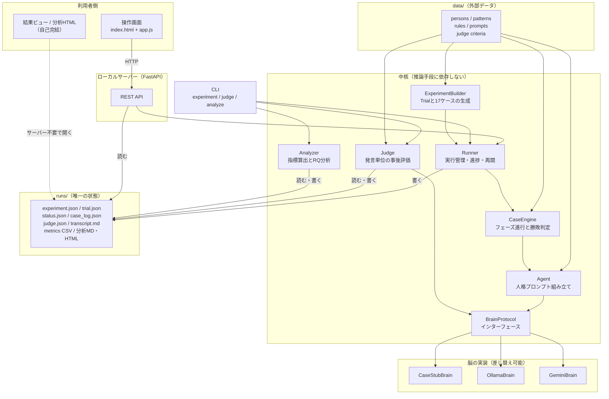

`Judge` と `Analyzer` が `Runner` を経由せず直接 `runs/` を読み書きする点がv1.1との構造上の違いである。ゲーム実行が終わったケースに対して、評価と分析だけを後から何度でも回せる（0.2の4番目の方針、F-41、F-45、NF-18）。

### 2.2 コンポーネントの責務

| コンポーネント | 責務 | 持たない責務 |
| --- | --- | --- |
| Web層（`web/app.py`。M6で作る） | HTTPの受け付け、`runs/` の読み取り、静的ファイル配信 | ゲームのルール、推論の呼び出し、分析の算出 |
| ExperimentBuilder（`experiment.py`） | 人物プールからのパターン選定、役職割当、Trialと17ケースの生成、条件固定の検査 | 実行、記録 |
| Runner（`runner.py`） | 実験・Trial・ケースの実行管理、seedの割り振り、進捗と出力の書き込み、失敗の記録、未完了ケースからの再開 | 発言の生成、勝敗の判定、評価、分析 |
| RuleSet（`engine/rules.py`） | ルールJSONの読み込み、検証、役職構成とフェーズ定義の提供 | 進行の制御 |
| CaseEngine（`engine/case.py`） | フェーズ進行、開始時処理の呼び出し、議論の呼び出し、投票集計、同数の決着、勝敗判定 | プロンプトの文面、HTTP通信 |
| NightResolver（`engine/night.py`） | 役職ごとの開始時処理と最終役職の確定 | 議論、投票 |
| DiscussionRunner（`engine/discussion.py`） | ラウンドの構成、問い合わせ順の決定、終了条件の判定、発言と見送りの記録 | 誰が発言するかの決定（各Agentが決める） |
| VoteResolver（`engine/vote.py`） | 投票の収集、検証、得票集計 | 勝敗判定 |
| CaseViewBuilder（`engine/view.py`） | プレイヤー視点で与えてよい情報だけを組み立てる | 推論、記録 |
| Agent（`agents/agent.py`） | 人格・役職・取得情報からプロンプトを作り、応答を解釈する | HTTP通信、リトライ制御 |
| PersonaBuilder（`agents/persona.py`） | MBTIタイプと心理機能スタックから人格設定文を組み立てる | ゲームのルール |
| Judge（`judge/judge.py`） | Transcriptの発言単位の評価、公開スタンス系列の導出 | ゲーム進行、指標の統計処理 |
| Brain実装（`brains/*.py`） | 推論手段への通信、応答形式の検証、リトライ、待機時間の計測 | ゲームのルール |
| Recorder（`record/*.py`） | `case_log.json` を組み立て、他の出力を導出する | 推論、進行、統計 |
| Analyzer（`analysis/*.py`） | 指標算出、Trial・実験・RQ別の集計と検定 | 推論、ゲーム進行 |

`DiscussionRunner` が「誰が発言するかを決めない」ことが要件F-20・F-21の担保点である。システムは問い合わせる順番と上限だけを管理し、発言するかどうかの判断はAgentの応答に置く。

### 2.3 依存の方向

依存は外から内へ一方向にする。`engine`、`agents`、`judge` は `brains` の具体実装を直接importしない。参照するのは `brains/base.py` のインターフェースだけである。`analysis` は `runs/` のファイルだけを入力にし、`engine` にも `brains` にも依存しない。

```text
web  ─→ runner ─→ experiment ─→ engine ─→ agents ─→ brains/base（インターフェース）
cli  ─→ runner                                            ↑
cli  ─→ judge   ───────────────────────────────────────────┤
cli  ─→ analysis ─→ runs/（ファイルのみ）                   │
                              brains/factory ──────────────┘（設定から実装を選んで注入する）
```

`analysis` が `engine` に依存しないため、指標の定義を変えてもゲーム進行のテストが壊れない。逆に、ゲーム進行を変えても分析コードは `case_log.json` のschemaが同じなら動く。この分離が、長時間実行したデータを保持したまま分析をやり直せる根拠である（NF-18）。

---

## 3. 処理シーケンス

### 3.1 実験からTrialと17ケースを生成する

要件のF-01〜F-12、NF-06にあたる。ここで条件固定を作り込み、実行前に検査する。

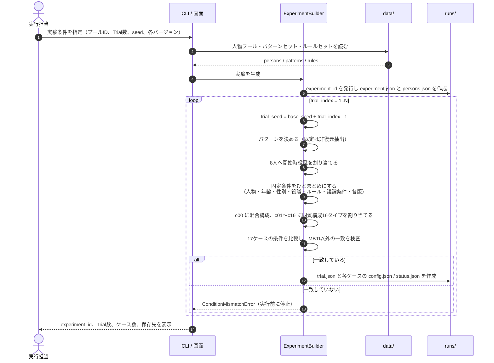

条件の一致検査を実行前に必ず通す理由は、17ケースの実行が終わってから条件のずれに気付いた場合、約4時間のTrialが丸ごと無駄になるためである。検査は脳を呼ばず設定の比較だけで済むので、コストがない（NF-06、AC-02）。

### 3.2 1ケースを進行する

要件のF-14〜F-19、F-24〜F-29にあたる。フェーズの順序と、個別判断を挟む位置をここで確定する。

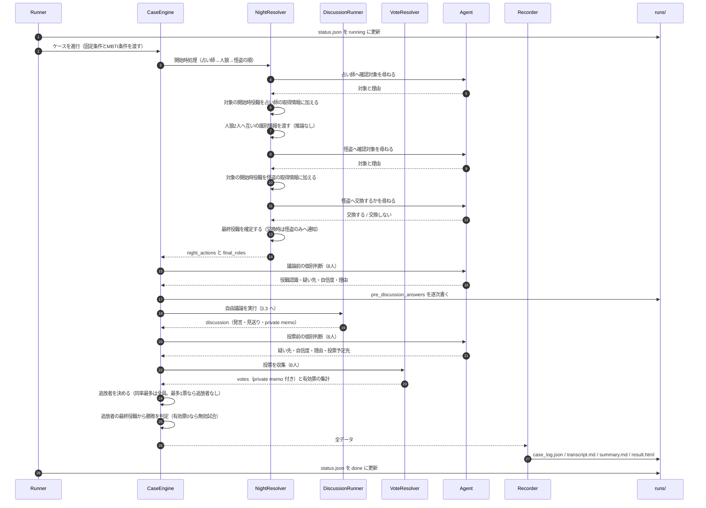

怪盗の処理が2回の推論に分かれている点がv1.1と違う。ルール文書v0.7 §2-4 が、対象の開始時役職を知ったうえで交換を判断すると定めているためである（4.2）。

個別判断を「議論前」と「投票直前」の2点に置く理由は要求定義書4.1に沿う。この2点では、疑い先・自信度・理由・投票予定先という構造化された項目を取る。これに加えて、発言ごと・投票ごとに1文のprivate memoを取る（5.3）。memoは発言や投票と同じ応答の中で返させるため、呼び出し回数を増やさない。

投票前の個別判断で「投票予定先」を聞いたうえで、別途「実際の投票」を取る理由は要件F-27である。同じ質問を2回するように見えるが、非公開の判断と公開の行動が一致しないケースを観察対象にしている。両者が常に一致するなら、その事実自体が結果になる。

### 3.3 自由議論の1ラウンド

要件のF-20〜F-23にあたる。発言順と発言回数を事前に固定せず、かつ呼び出し回数の上限を確定させる。

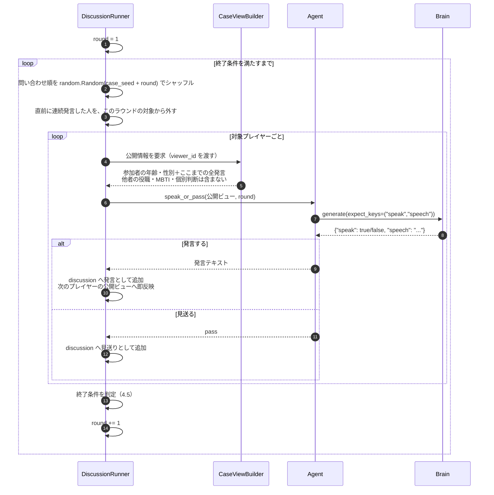

**なぜこの方式にしたか**

自由議論の実現方式には3つの候補があった。

| 候補 | 内容 | 採否 |
| --- | --- | --- |
| GMが次の発言者を指名する | ここまでの会話からGMが発言者を選ぶ | 却下。誰が話すかの判断がシステム側に入り、性格構成による主導・沈黙が観察できない（F-21の趣旨に反する） |
| 全員が毎ラウンド発言意欲を申告し、最も高い1人が話す | 意欲の申告と発言を2段階に分ける | 却下。1発言あたり8回の申告＋1回の発言で呼び出しが約9倍になり、1ケースが実行不能になる |
| **ラウンドごとに全員へ問い合わせ、各自が発言か見送りを選ぶ** | 1回の応答で意欲と発言本文を同時に返す | **採用** |

採用案の要点は、1回の呼び出しで「発言するか」と「発言内容」を同時に返させることである。見送りの場合は本文が空になるので生成が短く済み、発言する場合は追加の呼び出しがいらない。呼び出し回数は `8 × max_rounds` で上限が確定するため、1ケースの所要時間が予測できる（1.3）。

問い合わせ順をラウンドごとにシャッフルする理由は、順序を固定すると毎ラウンド同じ人が最初に文脈なしで話すことになり、発言量の偏りにシステム側の偏りが混ざるためである。シャッフルに使うseedを記録するので、進行制御は再現できる（F-57）。

ラウンド内で発言を即座に公開ビューへ反映する点が、会話として成立させるための条件である。同じラウンドの前半で出た発言に後半の人が反応できるので、ラウンドという単位は会話の流れには現れない。

### 3.4 Judgeによる事後評価

要件のF-40〜F-45にあたる。ゲーム実行とは別のコマンドで動く。

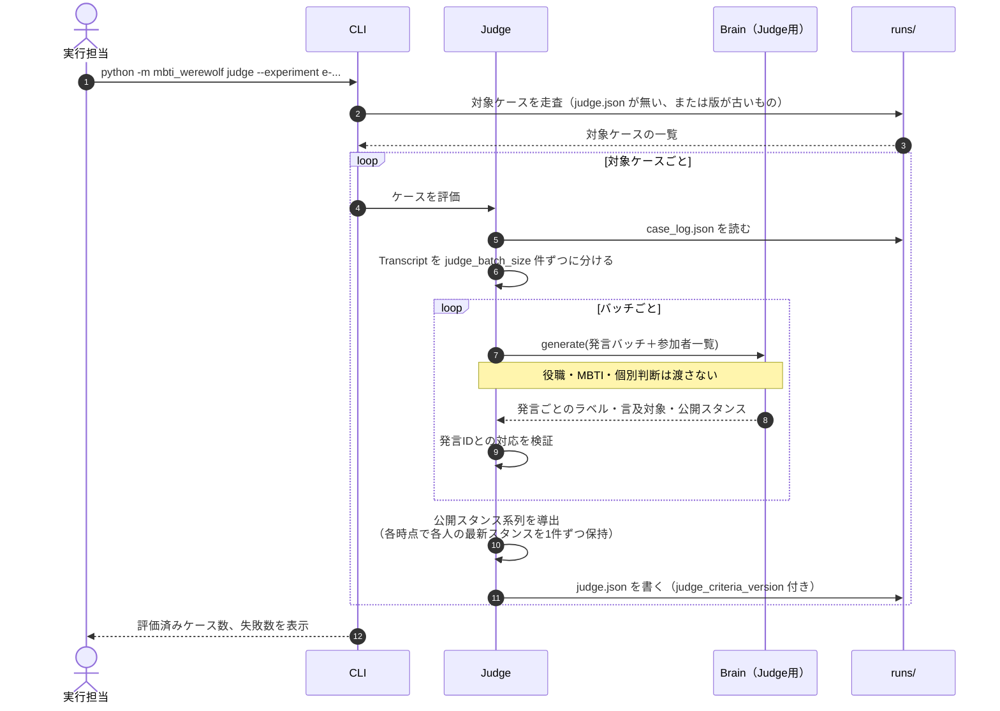

Judgeへ役職・MBTI・個別判断を渡さない理由は2つある。1つは、正解を知っていると「人狼の発言だから疑わしい」という後付けの評価になり、公開会話から読み取れる内容の評価にならないこと。もう1つは、Judgeの評価をMBTI条件から独立させることで、性格差の評価とMBTIラベルの循環参照を避けることである（F-46）。

公開スタンス系列を「各時点で各人の最新スタンスを1件ずつ保持する」形で導出する点が要件F-44の実現である。発言の多いプレイヤーの疑いが発言回数分だけ数えられると、疑念分布が発言量に引きずられる。各人1件に正規化することで、疑念分布は常に最大8件の分布になる。

### 3.5 実行が失敗した場合と再開

要件のF-38、F-51〜F-53、F-59、NF-09にあたる。1,700ケースの実行は途中で止まる前提にする。

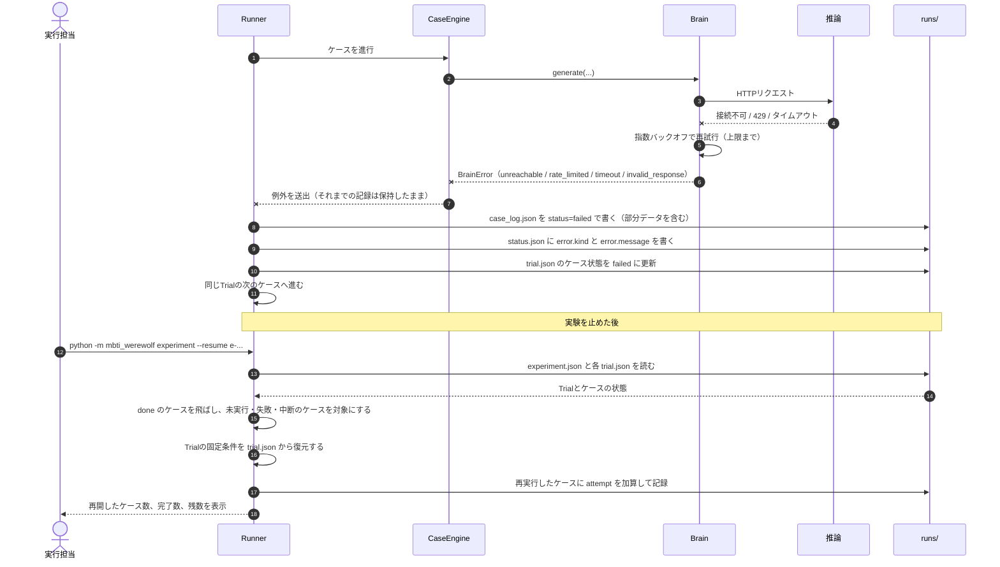

再開時にTrialの固定条件を `trial.json` から復元する点が重要である。再開のたびにパターン選定と役職割当をやり直すと、同じTrialの中で条件が変わり、対応あり比較が崩れる。固定条件は生成時に1度だけ決めてファイルに書き、以後は読むだけにする（F-53、AC-12）。

1ケースの失敗で実験を止めない。ただしTrialの17ケースのうち1つでも欠けると、そのTrialはRQ1の対応あり比較に使えない。そのため `trial.json` に `complete: true/false` を持たせ、分析側で不完全Trialを除外できるようにする（F-51、9.4）。

**失敗したケースの再実行**

1ケースあたりの実行回数に上限を置く（`--case-attempts`、既定2）。1回目が失敗したら、`CaseEngine` と脳を作り直して1回だけ試す。ケースの途中で失敗した場合、その時点までの内部状態は捨てて最初から実行する。ケースの途中から再開しないのは、夜の処理と議論の履歴が途中の状態から続けられる形になっておらず、続けられる形にすると再現性の担保が難しくなるためである。

上限まで失敗したケースは `status: failed` を残して次のケースへ進む。`--resume` は `done` のケースだけを飛ばすので、失敗したケースは次の再開で再び対象になる。

失敗として扱う範囲は、脳の生成とエンジンの生成も含める。ケースの実行中に起きた例外だけを捕まえる形にすると、モデル名の誤りや接続不能で脳を作れなかった場合に実験全体が止まり、「1ケースの失敗で実験を止めない」という決まりを満たせない。設定の誤りは17ケースすべてで同じように起きるので、結果として全ケースが `failed` になるが、その状態が `status.json` と失敗の記録に残る方が、例外で落ちて何も残らないよりも原因を追える。

**再開の単位と条件の扱い**

| 項目 | 決定 |
| --- | --- |
| 再開の単位 | ケース単位。`done` のケースを飛ばし、未実行・失敗・中断のケースを対象にする。Trial単位だと17ケースの16件目で止まったときに15件を捨てることになる |
| 出力先 | 同じ `experiment_id` のディレクトリへ書き足す。新しいIDを作ると、1つのTrialが2つのディレクトリに分かれて対応あり比較ができなくなる |
| 条件の正本 | `trial.json` の `fixed_conditions`。再開時に指定した設定と違っていたら、Trialの記録側を採用し、違っていた項目を実行担当へ表示する（5.7） |
| 読み直さないもの | 人物プールとパターンセット。座席は `trial.json` が持っているため、`data/` を差し替えた後でも座席が入れ替わらない |
| 読み直すもの | ルールセット。版が `experiment.json` の記録と違う場合は再開せず停止する。ルール改訂の前後を1つの実験に混ぜないため |
| 役職構成の検査 | 復元した座席の役職の枚数がルールセットの構成と一致することを確かめる。17ケースを見比べる条件固定の検査（3.1）は、全ケースへ同じ座席を配るこの経路では役職の誤りを検出できない |

`--cases c00` のように実行対象を絞れる。M5に入る前に1ケースだけ実モデルで動かして所要時間を実測し、`max_rounds` の既定値を決めるために使う（4.5、11章のM5）。

### 3.6 分析出力を生成する

要件のF-60〜F-67にあたる。生データを読むだけで、推論を呼ばない。

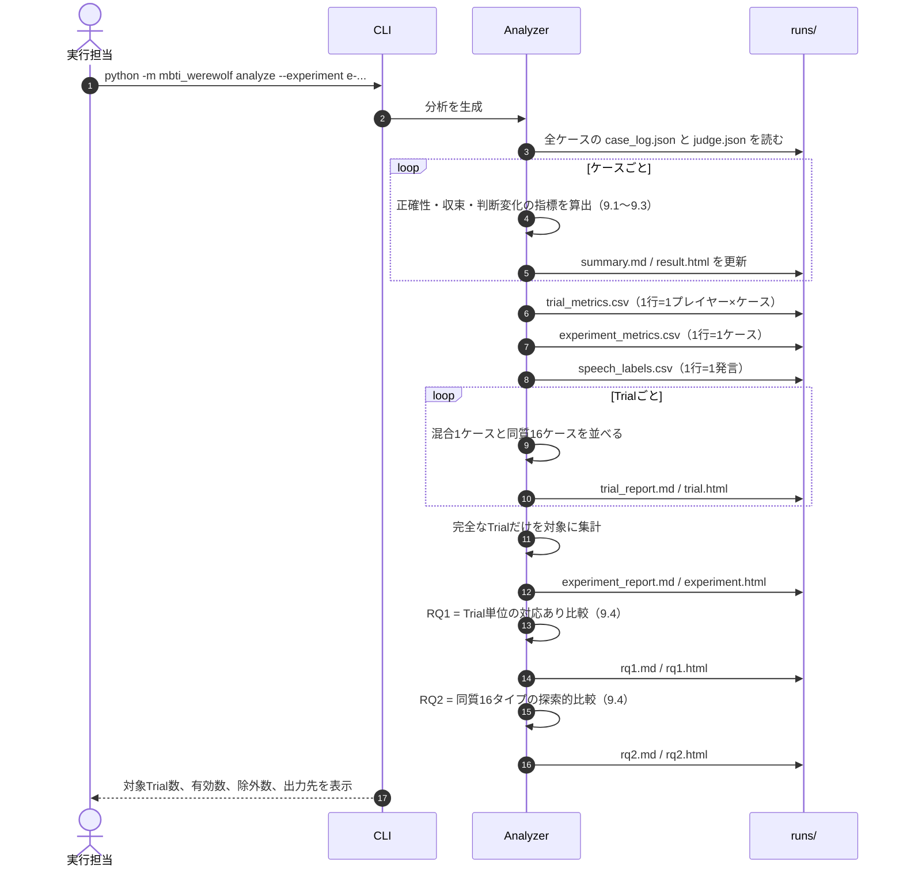

分析を独立コマンドにしたことで、指標の定義を変えたら `analyze` だけを回し直せる。生データは変わらないので、旧指標での結果と新指標での結果を比べられる。`indicator_version` を各出力に書き、どの定義で出した数字かを区別する（F-65、NF-18）。

### 3.7 実行環境を持たない閲覧者が結果を見る

要件のF-69、NF-15、NF-17、AC-18にあたる。Biz・Designerはサーバーを起動しない。

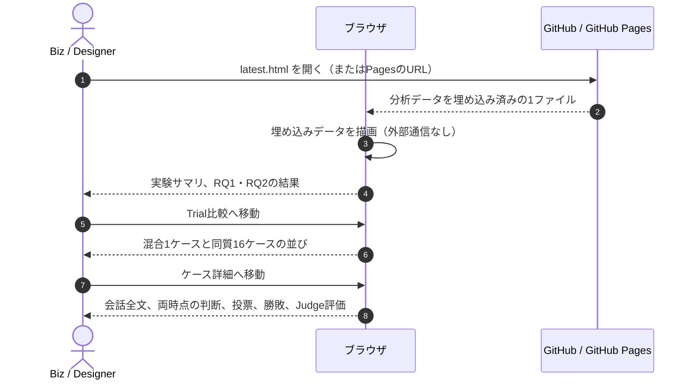

HTMLは結果データをファイル内に埋め込んだ自己完結形式で生成する。外部からデータを取得しないため、`file://` で直接開いてもGitHub Pages経由でも同じように表示される。ケース数が多いためファイルを階層に分け、上位のHTMLから下位のHTMLへ相対リンクで移動する（7.5）。

---

## 4. ゲーム進行の設計

### 4.1 ルールセットの外部化

ルールをコードに埋め込まず、JSONとして `data/rules/` に置く。ルール文書を改訂したときにコードを触らずに差し替えられる状態にする（0.5、NF-11）。

| 項目 | 決定 |
| --- | --- |
| 保存場所 | `data/rules/{rule_set_id}.json` |
| 識別 | `rule_set_id` と `rule_set_version` を全ケースに記録する |
| 検証 | 読み込み時に、役職構成の合計が参加人数と一致すること、フェーズ列に未知のフェーズがないことを検査する |
| コード側の対応 | フェーズ名と役職種別に対応する処理を `engine/night.py` などに実装する。ルールJSONは「どの処理をどの順で呼ぶか」と「各処理のパラメータ」を持つ |
| 未知の値 | ルールJSONに未実装のフェーズや役職があれば、実行前に `RuleSetError` で停止する |

ルールJSONの構造は以下とする。値は[ルール文書v0.7](./m-plus-experiment/01_werewolf-rules_v0.7.md)の内容をそのまま反映している。

```json
{
  "rule_set_id": "onenight-8p-v0.7",
  "rule_set_version": "0.7",
  "source_document": "docs/m-plus-experiment/01_werewolf-rules_v0.7.md",
  "player_count": 8,
  "center_cards": 0,
  "role_composition": {
    "werewolf": 2,
    "seer": 1,
    "thief": 1,
    "villager": 4
  },
  "max_response_attempts": 3,
  "night_phases": [
    { "phase": "seer_inspection", "actor_role": "seer", "requires_inference": true, "target": "other_player", "reveals": "initial_role", "on_exhausted_attempts": "skip_ability" },
    { "phase": "werewolf_recognition", "actor_role": "werewolf", "requires_inference": false },
    { "phase": "thief_inspection", "actor_role": "thief", "requires_inference": true, "target": "other_player", "reveals": "initial_role", "on_exhausted_attempts": "skip_ability" },
    { "phase": "thief_swap", "actor_role": "thief", "requires_inference": true, "choices": ["swap", "keep"], "effect": "swap_role", "notify_actor_final_role": true, "notify_target": false, "on_exhausted_attempts": "skip_ability" }
  ],
  "day_phases": ["pre_discussion_answer", "free_discussion", "pre_vote_answer", "vote"],
  "discussion": { "mode": "free" },
  "vote": {
    "rounds": 1,
    "self_vote": false,
    "revote": false,
    "on_exhausted_attempts": "abstain",
    "execute": "all_top_voted",
    "min_votes_to_execute": 2,
    "invalid_game_if": "no_valid_votes"
  },
  "win_condition": {
    "basis": "final_role",
    "village_wins_if": "any_executed_final_role_is_werewolf"
  }
}
```

`discussion` が `mode` しか持たない理由は、ルール文書v0.7が議論の上限値を実行条件として扱い、値そのものを定めていないためである（0.5）。`max_rounds` や発言数の上限は設定ファイル側が持つ（6.4）。ルールセットは「自由議論である」ことだけを固定し、上限値の見直しでルールの版が上がらない構造にしている。

### 4.2 ルール文書v0.7の採用内容

[ルール文書v0.7](./m-plus-experiment/01_werewolf-rules_v0.7.md)を正本として、以下を実装する。表の出典はすべてv0.7の節番号である。

| 項目 | 実装内容 | 出典 |
| --- | --- | --- |
| 参加人数 | 8人。全員がAIエージェント。GM役はシステムが担う | v0.7 §1 |
| 役職 | 人狼2人、占い師1人、怪盗1人、村人4人。中央カード・余りカードは使用しない | v0.7 §1 |
| 開始時役職の通知 | 8枚を無作為に1枚ずつ配り、各参加者へ**自分の開始時役職だけ**を個別に通知する | v0.7 §2-1 |
| 夜の順序 | **占い師の確認 → 人狼の相互確認 → 怪盗の確認と任意交換** | v0.7 §1、§2 |
| 夜の襲撃・脱落 | なし。夜の処理後、全員が議論と投票に参加する | v0.7 §1 |
| 占い師の確認 | 自分以外の1人を指定し、その人の**開始時役職**を知る | v0.7 §2-2 |
| 人狼の相互確認 | 人狼2人へ互いの識別情報を確定情報として通知する。推論を呼ばない。公開議論で疑う演技は認めるが、内部判断で仲間を人狼候補にしない | v0.7 §2-3、§3 |
| 怪盗の処理 | **2段階**。まず自分以外の1人を指定してその人の開始時役職を知り、**その結果を見てから**「交換する」「交換しない」を選ぶ | v0.7 §2-4 |
| 交換の効果 | 怪盗と対象の役職を入れ替える。以後の勝敗判定は最終役職で行う | v0.7 §1 |
| 交換後の通知 | 交換した場合、**怪盗本人には最終役職を通知する**。交換された側には交換の事実も最終役職も通知しない | v0.7 §2-4 |
| 昼の進行 | 議論前の個別判断 → **自由議論** → 投票前の個別判断 → 投票 | v0.7 §1、§2-5、4.5 |
| 発言機会 | ラウンドごとにGMが対象者へ順に問い合わせる。各自が発言か見送りを選ぶ。発言順・発言回数は事前に固定しない | v0.7 §1、§2-5 |
| 見送り | **本人が選んだ有効な回答**として扱い、再送の対象にしない。3回とも無効だった「スキップ」とは区別して記録する | v0.7 §2-5 |
| 問い合わせ順 | ラウンドごとに無作為化し、使用したseedを記録する | v0.7 §2-5 |
| 議論の終了条件 | 対象者全員が見送った、またはラウンド数・発言数・発言量のいずれかが上限に達した時点で投票へ進む | v0.7 §2-5、4.5 |
| 投票 | 全員が自分以外の1人へ1票。変更・棄権・複数投票はできない | v0.7 §1、§2-6 |
| 追放判定 | **最多得票者が2体以上いるときはその全員を追放する。最多得票が1票だけの場合は誰も追放しない** | v0.7 §1、§2-6 |
| 同数得票 | 乱数による決着を行わない。同率最多者は全員追放される | v0.7 §1 |
| 勝敗 | 追放者の中に最終役職が人狼の参加者が1体以上いれば村人陣営の勝利。人狼が1体も追放されなければ人狼陣営の勝利。怪盗は最終役職の陣営に属する | v0.7 §1、§2-7 |
| 回答機会 | 最初の指示＋再送2回＝**最大3回**。3回とも無効ならフェーズごとの扱いに従う | v0.7 §1 |
| 夜の能力の失敗 | 3回とも無効なら、その夜の能力を使用しなかったものとして次の処理へ進む | v0.7 §2-2、§2-4 |
| 発言の失敗 | 3回とも無効なら、そのラウンドの発言をスキップしたものとして記録する。空回答・無回答は正常な発言として数えない | v0.7 §2-5 |
| 投票の失敗 | 3回とも無効なら**棄権**として扱い、その票を集計に含めない | v0.7 §1、§2-6 |
| 無効試合 | **有効票が0票の場合**、追放判定と勝敗判定を行わず無効試合として終了する。ログに「有効票数：0」「結果：無効試合」「理由：有効投票なし」を記録する | v0.7 §1、§2-6 |
| 秘密情報の扱い | 参加者は自分に通知された秘密情報だけを根拠として使う。通知なしに他者の役職・夜の行動を知っている前提で発言させない | v0.7 §1、§3 |
| 発言の欺瞞 | 他者を欺くための主張は認める。ただしGMから得ていない秘密情報を捏造して「知っている」とは言わせない | v0.7 §1 |

**設計上の要点**

怪盗の処理が2段階である点は、推論の呼び出し回数と `CaseViewBuilder` の両方に影響する。1回目の呼び出しで対象を指定させ、その結果をビューへ加えてから2回目の呼び出しで交換の可否を判断させる。1回で「対象と交換可否」をまとめて答えさせると、対象の役職を知る前に交換を決めることになり、ルールと違う判断になる。

追放者が複数になりうる点、および追放者が0人になりうる点は、v1.1の設計にない分岐である。`result.executed` を単一の `player_id` ではなく配列で持つ（6.7）。

「最多得票が1票だけの場合は誰も追放しない」は、8票が8人へ1票ずつ散った場合に発生する。この場合は人狼が1体も追放されないため人狼陣営の勝利になる。追放者0人と無効試合は別の状態であり、前者は勝敗が付き、後者は付かない。

### 4.3 ゲームフェーズの状態遷移

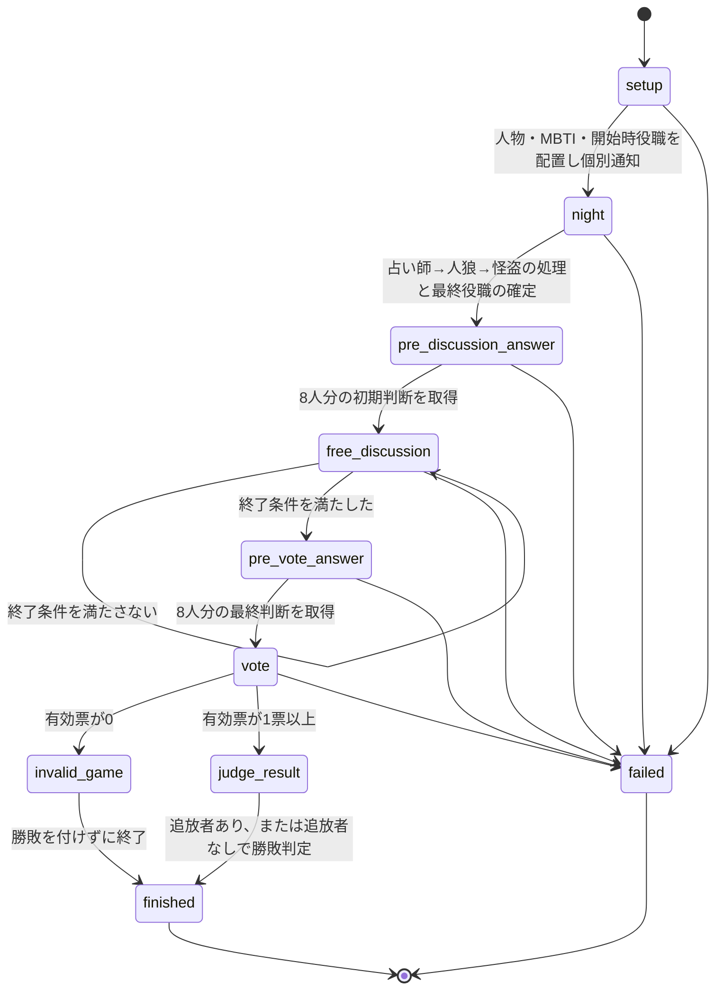

`judge_result` は勝敗判定のフェーズであり、5.5のJudge（会話の事後評価）とは別のものである。名前が近いため、記録上は勝敗判定を `judge_result`、事後評価を `judge_review` として区別する。

`invalid_game` は有効票が0票のときの終了で、勝敗を付けない（4.2）。`failed` は例外による終了で、両者は別の状態である。`invalid_game` で終わったケースは `status: "done"`、`result.valid: false` として記録し、分析対象から除外する（9.4）。

### 4.4 実行状態の遷移

`status.json` の `status` が取る値。操作画面はこの値だけで表示を切り替える（F-72）。ケース、Trial、実験の3階層で同じ値を使う。

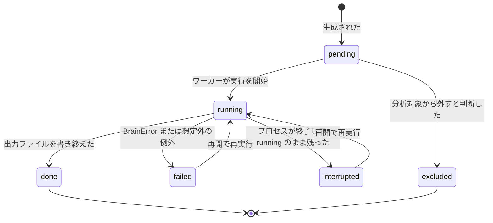

| 状態 | 意味 | 上位への影響 |
| --- | --- | --- |
| `pending` | 生成済みで未実行 | Trialは不完全 |
| `running` | 実行中 | Trialは不完全 |
| `done` | 完走し、出力が揃った | Trialの完了条件を満たす |
| `failed` | 例外で終了。部分データあり | Trialは不完全。再開の対象 |
| `interrupted` | 前回のプロセスが `running` のまま残った | 再開時に `failed` と同様に扱う |
| `excluded` | 人が分析対象から外した。理由を必須にする | Trialは不完全として扱い、除外理由を集計に残す |

Trialの `complete` は、17ケースすべてが `done` のときだけ `true` になる。実験の有効Trial数は `complete: true` の件数である（9.4）。

### 4.5 自由議論の終了条件と上限

要件F-23にあたる。4つの終了条件のいずれかを満たしたら議論を終える。すべての条件と実際に発動した条件を記録する。

| 設定名 | 既定値 | 意味 |
| --- | --- | --- |
| `max_rounds` | 6 | ラウンドの上限。1ラウンドで最大8回の問い合わせが発生する |
| `max_speeches` | 40 | 総発言数の上限 |
| `max_total_chars` | 6000 | 全発言の合計文字数の上限 |
| `max_speech_chars` | 200 | 1発言の文字数上限。超過分は切り詰める |
| `max_consecutive_speeches` | 2 | 同じプレイヤーが連続して発言できる回数。超えた人は次のラウンドの問い合わせ対象から外す |
| `stop_on_all_pass` | true | 1ラウンドで全員が見送ったら終了する |

| 終了条件 | 記録する値 |
| --- | --- |
| 1ラウンドで全員が見送った | `stop_reason: "all_pass"` |
| ラウンドが上限に達した | `stop_reason: "max_rounds"` |
| 総発言数が上限に達した | `stop_reason: "max_speeches"` |
| 合計文字数が上限に達した | `stop_reason: "max_total_chars"` |

**「見送り」と「スキップ」を区別する**

ルール文書v0.7 §2-5 は、3回とも有効な発言が得られなかった場合にそのラウンドの発言をスキップすると定めている。本書の自由議論では、これとは別に、エージェント自身が発言しないことを選ぶ「見送り」がある。両者は意味が違うため、記録上も分ける。

| 種別 | 意味 | 記録 |
| --- | --- | --- |
| 見送り（pass） | エージェントが「今は発言しない」と判断した。自由議論の観察対象そのもの | `spoke: false`、`skipped: false` |
| スキップ（skip） | 3回とも無効な応答で発言が得られなかった。実行上の失敗 | `spoke: false`、`skipped: true`、`parse_failed: true` |

見送りは9.2・9.3の分析対象に含め、スキップは含めない。両方を `spoke: false` にまとめると、性格構成による沈黙とモデルの応答失敗が同じ値になってしまう。

既定値の根拠は1.3の試算である。`max_rounds` = 6 は、ゲーム実行の呼び出しを75回に収めて1ケースを約14分に収めるための値であり、議論の質から決めた値ではない。段階2の実測で、6ラウンドの前に `all_pass` で終わることが多いか、逆に上限で打ち切られることが多いかを確認し、見直す。

`max_consecutive_speeches` は、1人が話し続けて他が見送るだけの議論を避けるための上限である。発言回数を全員へ揃える処理ではなく、上限を置くだけなので、発言量の偏りは残る。要件F-20の「発言順と発言回数を事前に固定しない」に反しないことを確認したうえで採用している。この値を無効化（`null`）した実行も段階2で試し、偏りの出方を比較する。

**全員が連続発言の上限に達したラウンドの扱い**

`max_consecutive_speeches` に達した参加者はそのラウンドの問い合わせ対象から外れる。全員が達した場合、そのラウンドは問い合わせ対象が0人になる。このラウンドも `max_rounds` に数え、対象者がいないまま次のラウンドへ進む。`transcript.md` にはそのラウンドの表が出ない。

数えない扱いにすると、上限を設けたことで議論のラウンド数が静かに減り、設定した `max_rounds` と実際のラウンド数が食い違う。上限を一時的に解除して全員に発言させる扱いにすると、連続発言の上限そのものが無意味になる。どちらも避けるため、ラウンドを消費した扱いにする。

対象者が0人のラウンドを `stop_on_all_pass` の対象にはしない。誰にも問い合わせていないため、全員が見送ったわけではない。ここを混ぜると、沈黙による終了と上限による空転が同じ `stop_reason` になる。

### 4.6 投票と追放判定

ルール文書v0.7 §1・§2-6 をそのまま実装する。

| 項目 | 決定 |
| --- | --- |
| 投票の収集 | 全員へ個別に1回ずつ問い合わせる。`choices` に自分以外の8人から自分を除いた7人を渡し、Brain側で候補外の値を弾く |
| 自分への投票 | 認めない。`choices` に自分を含めない |
| 回答機会 | 最初の指示＋再送2回＝最大3回。`max_response_attempts: 3` としてルールJSONに持つ |
| 3回とも無効 | **棄権**として扱い、その票を集計に含めない。`abstained: true` と `attempts` を記録する。乱数によるフォールバックは行わない |
| 再投票 | 行わない |
| 集計 | 有効票だけを数える |
| 有効票が0 | 追放判定・勝敗判定を行わず、無効試合として終了する。`result.valid: false`、`result.invalid_reason: "no_valid_votes"` を記録する |
| 最多得票が1票のみ | 誰も追放しない。`result.executed: []` |
| 最多得票が2票以上 | **同率最多者の全員を追放する**。`result.executed` に該当する全員の `player_id` を入れる |
| 勝敗 | 追放者の中に `final_role` が `werewolf` の参加者が1体以上いれば村人陣営の勝ち。1体もいなければ人狼陣営の勝ち |

**v1.1の設計から変えた点**

投票の解析失敗時に乱数でフォールバックしない。v1.1では試合を終了させるために乱数で投票先を決めていたが、ルールv0.7は棄権という扱いを定めている。棄権は集計から抜けるだけでゲームは終了するため、乱数を入れる必要がない。本人が決めた投票ではない値を投票先として記録すると、9.1の `vote_correct` に偽の値が混ざる。

同数得票の乱数決着を持たない。ルールv0.7が同率最多者の全員追放を定めているため、決着に乱数が不要になった。v1の `engine/tiebreak.py` はM3で削除した（0.4）。この変更により、追放が乱数で決まるケースがなくなり、9.2の収束指標の解釈が単純になる。

追放者の人数が0人、1人、2人以上のいずれにもなりうる。9.1の `village_correct` は「追放者の中に最終役職が人狼の者がいるか」で判定するため、人数によらず同じ式で計算できる。9.2では追放者数を `executed_count` として記録し、票が散った結果としての追放者0人を区別できるようにする。

### 4.7 情報の非対称性の担保

要件のF-16、F-17、F-26にあたる。v2.0では守るべき境界がv1より多いため、`CaseViewBuilder` を唯一の入力源にする構造とテストの両方で守る。

| 与える情報 | 与えない情報 |
| --- | --- |
| 本人の `player_id`、年齢、性別 | 他者のMBTIラベル、他者の行動傾向文 |
| 本人の行動傾向（ラベルを出さない形。5.2） | 他者の開始時役職・最終役職（ルールで取得した情報を除く） |
| 本人の開始時役職 | 他者の個別判断とprivate memo |
| 他者8人の `player_id`、年齢、性別 | 怪盗に交換された事実（交換された側へは知らせない） |
| 全員が初対面であり、追加プロフィールが設定されていないこと | 他者が見送ったかどうか |
| ここまでの全発言（発言者と順序を含む） | Judgeの評価結果 |
| 人狼の場合、仲間の人狼の識別情報 | 他のケース・Trialの情報 |
| 占い師の場合、確認した相手とその開始時役職 | WORLD区分に相当する構成種別（mixed / homogeneous） |
| 怪盗の場合、確認した相手の開始時役職、交換の有無、交換した場合の自分の最終役職 | 得票の途中経過 |
| ルール文書v0.7の本文（全員共通） | 自分がAI・LLMであること、この場が実験であること |

| 手段 | 内容 |
| --- | --- |
| 構造 | `CaseViewBuilder` が唯一のプロンプト入力源になる。Agentはゲームの内部状態を直接受け取らない |
| 検査（役職） | 自分と、ルール上知り得る相手以外の役職がプロンプト文字列に出現しないことをテストで検証する |
| 検査（MBTI） | 16タイプのラベル、日本語表示名、「MBTI」「心理機能」「16タイプ」の語がプロンプトに出現しないことをテストで検証する |
| 検査（個別判断） | 個別判断とprivate memoのテキストが他者へのプロンプトに出現しないことをテストで検証する |
| 検査（実験の存在） | 「実験」「シミュレーション」「AI」「エージェント」「WORLD」「構成種別」の語がプロンプトに出現しないことをテストで検証する |

4件の検査は10章の `test_isolation` に置く。検査対象がすべて「プロンプト全文に何が含まれていないか」であり、同じ道具を使うためである。

「他者が見送ったかどうか」を与えない理由は、見送りが公開情報になると「黙っていること」が場に見える行動になり、ルールに定めのない情報を議論へ持ち込むことになるためである。見送りは記録には残すが、エージェントへは渡さない。

自分がAIであることと、この場が実験であることを与えない条件は、[Agent設定文書v1](./m-plus-experiment/02_agent-settings_v1.md) §3 に定められている。MBTIの非開示と同じ扱いでテストの対象にする。この検査がないと、人格プロンプトやルール説明の文面を直したときに、うっかりメタ情報が混ざったことに気付けない。

---

## 5. エージェント設計

### 5.1 脳のインターフェース

`brains/base.py` に置く。v1.1から変更しない。ゲーム進行側とJudgeが知るのはこの形だけである。

```python
class BrainError(Exception):
    kind: str  # unreachable / rate_limited / timeout / invalid_response


class Request:
    system: str
    user: str
    expect_keys: tuple[str, ...]  # 例: ("speak", "speech") / ("suspect", "confidence", "reason")
    choices: tuple[str, ...]      # 投票先など、値が限られる項目の候補
    tag: str                      # 呼び出しの識別。Stubの出力切替と調査に使う


class Brain(Protocol):
    name: str          # ログに残す識別名。例: "ollama:gemma3:4b"
    endpoint_kind: str # "local" / "free_api" / "stub"

    def generate(self, request: Request) -> BrainResponse:
        """1回の推論。失敗時は BrainError を送出する。"""
```

`BrainResponse` は生成テキスト、待機時間、リトライ回数、`parse_failed` を持つ。JSONの解析とリトライはBrain側の責務とし、AgentとJudgeは解釈済みの結果だけを扱う。

v2.0では `tag` の値を増やす。`night_seer` / `night_thief` / `pre_discussion` / `speak` / `pre_vote` / `vote` / `judge` の7種とする。`CaseStubBrain` はこの `tag` で返す形を切り替えるので、Stubだけで全フェーズを完走できる。

`factory` はエージェント用とJudge用で別のBrainインスタンスを返せるようにする。設定は `brain` と `judge_brain` に分ける。Judgeだけ別のモデルにする、あるいはJudgeだけGeminiにする、といった構成が設定で成立する（IF-02）。

### 5.2 プロンプトの構成と行動傾向の付与

要件のF-16、F-17、F-46にあたる。[Agent設定文書v1](./m-plus-experiment/02_agent-settings_v1.md)と[行動傾向の記録](./m-plus-experiment/06_behavior-tendencies-used_v1.md)を正本として、プロンプトの構成を決める。

| 区分 | 内容 | 出典 |
| --- | --- | --- |
| system（ルール部） | ルール文書v0.7の本文、参加人数、出力形式（JSONのみ）、字数上限 | v0.7 |
| system（前提部） | 自分の `player_id`・年齢・性別、8人全員の `player_id`・年齢・性別、全員初対面、追加プロフィールなし、年齢・性別から性格を決めつけない、自伝的記憶なし、人狼経験なし、自分がAIであることを認識しない | Agent設定文書 §2 |
| system（役職部） | 自分の開始時役職と、ルール上知っている秘密情報 | v0.7 §2 |
| system（傾向部） | 行動傾向1文。タイプ名も理論名も出さない | 行動傾向の記録 |
| user | 公開ビュー（8人の年齢・性別、ここまでの全発言）、現在の状況、今回の指示 | — |

**MBTIに関する語をプロンプトに書かない**

傾向部には `INTJ` などのタイプ名、日本語表示名、「MBTI」「16タイプ」「心理機能」という語を書かない。Agent設定文書 §「MBTIに関する認識と管理条件」が、参加者はMBTIという概念そのものを知らないと定めているためである。

技術的な理由も2つある。1つは、モデルがMBTIタイプ名に対して学習済みのステレオタイプを持っている可能性があり、意図した人格説明ではなくモデルが持つタイプ像で振る舞ってしまうこと。もう1つは、タイプ名が入力にあると、エージェント自身が会話でタイプ名を口にする可能性があることである。

**行動傾向は1タイプ1文にする**

[行動傾向の記録](./m-plus-experiment/06_behavior-tendencies-used_v1.md)が、先行実験で実際に使用した文面を残している。形式は次のとおりである。

```text
会話では、{判断の仕方の説明}しやすい傾向があります。ただし自由に判断してください。
```

この形式を採用する。長い人格説明を作らない理由は3つある。

1つは、実行実績があること。先行実験のWORLD A・Bはこの1文で成立しており、発言内容にも傾向の差が現れている。2つは、「ただし自由に判断してください」という留保が、Agent設定文書の「絶対命令ではなく、判断や発言に自然に現れやすい傾向として扱い、Agent自身が自由に判断できる余地を残す」を文面として満たしていること。3つは、文が長くなるほど指示への追従が強まり、性格差ではなく指示追従を観察することになるためである（F-46）。

`PersonaBuilder` は、16タイプについてこの1文を保持する。先行実験で使われた8タイプ（ENFP、ISTJ、INFJ、ESTP、INTJ、ESFJ、ENTP、ISFP）は記録の文面をそのまま使い、残る8タイプ（ISFJ、INTP、ENFJ、ISTP、ESFP、ESTJ、INFP、ENTJ）は要求定義書6.2の人格説明と `agents/mbti_types.py` の機能スタックから同じ形式で作る。文面は `agents/prompts/v2/tendencies.json` に置き、コードから分離する。

既存の16タイプ分の文面が揃った時点で、8タイプは実績のある文、8タイプは新規作成の文という非対称が残る。段階1でこの非対称が観察に影響するかを確認し、影響がある場合は16タイプすべてを同じ手順で作り直して `v3` を発行する。

**Judgeの判定語を強制しない**

傾向部には、Judgeが判定する語や行動（「疑う」「同意する」「質問する」など）を書かない。書くのは判断の仕方（何を手がかりに考えるか）だけとし、どう発言するかは指示しない。これが要件F-46の担保である。行動傾向文とJudgeの評価基準（5.5のラベル定義）を並べて、判定語が傾向文に含まれていないことを実装時に確認する。

**バージョン管理**

プロンプトは `agents/prompts/v2/` に置き、`persona_prompt_version: "v2"` をケースごとに記録する。文面を変えたら `v3` として新しいディレクトリを作り、古い版を残す（F-07）。全ケースで使用モデル、ルール記述、前提部、出力形式を揃え、タイプ間の変更点を傾向部の1文だけに限定する（要求定義書6.5）。

ファイル構成は次のとおり。

| ファイル | 用途 |
| --- | --- |
| `system_rules.md` | ルール文書v0.7の本文と出力形式（全タイプ共通） |
| `system_context.md` | 前提部。年齢・性別、初対面、記憶なし、人狼経験なし、AI非認識（全タイプ共通） |
| `system_role.md` | 役職部のテンプレート。役職と秘密情報を埋める |
| `tendencies.json` | 16タイプの行動傾向文。`PersonaBuilder` が読む |
| `user_night_seer.md` | 占い師の確認対象の選択 |
| `user_night_thief_inspect.md` | 怪盗の確認対象の選択（1段階目） |
| `user_night_thief_swap.md` | 怪盗の交換判断（2段階目） |
| `user_pre_discussion.md` | 議論前の個別判断 |
| `user_speak.md` | 発言するかどうか、発言内容、private memo |
| `user_pre_vote.md` | 投票前の個別判断 |
| `user_vote.md` | 実際の投票とprivate memo |

### 5.3 個別判断とprivate memoの設計

要件のF-24、F-25にあたる。非公開の内面情報を、次の4時点で取得する。

| 時点 | 名称 | 内容 | 出典 |
| --- | --- | --- | --- |
| 議論前 | 議論前の個別判断 | 役職認識、疑い先、自信度、理由 | 要求定義書F-24 |
| 発言ごと | private memo | その発言をした短い判断理由（1文） | 実験計画文書「観察用ログ」 |
| 投票前 | 投票前の個別判断 | 疑い先、自信度、理由、投票予定 | 要求定義書F-25 |
| 投票ごと | private memo | その投票先を選んだ短い判断理由（1文） | 実験計画文書「観察用ログ」 |

**発言ごと・投票ごとのprivate memoを取る理由**

[実験計画文書v1](./m-plus-experiment/03_experiment-plan_v1.md)の「観察用ログ」が、各Agentが明示的に出力した短い判断理由を保存項目に挙げている。先行実験のWORLD A・Bの結果は、発言と投票の両方にmemoを付けて記録している。

呼び出し回数は増えない。発言や投票と同じ1回の応答の中に `memo` フィールドを持たせ、同時に返させる（5.4）。1.3の試算に影響しない。

実験計画文書の注記どおり、モデルの隠れた思考過程（chain-of-thought）を要求しない。取得するのは、実験用に明示的に生成させた短い判断理由だけである。プロンプトでは1文・40字以内を指示する。

この設計は、当初の要件定義書F-28「発言ごとの非公開心理状態は取得しない」および要求定義書の課題A5の対応方針「発言ごとのprivate stateは取得しない」と矛盾していた。取得する方針が受け入れられたため、要求定義書v2.2-draftの課題A5と要件定義書v2.1のF-28を「発言ごと・投票ごとに短い判断理由を1文で取得する」へ変更した（12.1）。

memoは9章の指標の入力にしない。指標の計算に使わず、集計CSVとJudgeの入力にも含めない。ただし人が読む出力には出す。memoを取る目的が「1ケースを読んで挙動を説明できるようにするため」なので、人が読めない場所にしか置かないと取る意味がなくなる。`transcript.md` に発言と横並びで載せる（6.10）。

memoを取ること自体が応答形式とプロンプトを変えるため、実験条件の一部として扱い、`persona_prompt_version` で識別する。memoの有無が異なる結果を混ぜて分析しない。

**自信度の尺度**

1〜5の5段階とする。0〜100の連続値を使わない理由は、小型モデルが返す値が特定の数（70、80）へ偏り、刻みも安定しないためである。5段階なら選択肢としてプロンプトに列挙でき、`Request.choices` で値を検証できる。

| 値 | 意味 |
| --- | --- |
| 1 | まったく自信がない |
| 2 | あまり自信がない |
| 3 | どちらとも言えない |
| 4 | やや自信がある |
| 5 | 強く自信がある |

**議論前の個別判断（`tag: pre_discussion`）**

```json
{
  "role_awareness": "自分は占い師で、p5の役職を確認した。",
  "suspect": "p3",
  "confidence": 2,
  "reason": "まだ発言がないため、確認した情報以外の手がかりがない。"
}
```

`suspect` は自分以外の `player_id`、または判断できない場合の `"unknown"` を許す。議論前は情報がほぼないため、`"unknown"` が多く出ることを想定する。`"unknown"` を許さない設計にすると根拠のない指名を強制することになり、判断変化の分析が歪む。

**投票前の個別判断（`tag: pre_vote`）**

```json
{
  "suspect": "p3",
  "confidence": 4,
  "reason": "序盤と終盤で主張が変わり、根拠を聞かれたときに答えを変えた。",
  "planned_vote": "p3"
}
```

投票直前では `suspect` に `"unknown"` を許さない。議論を終えた時点で最も疑っている相手を1人挙げてもらう。`planned_vote` は `suspect` と一致しなくてよい。一致しない場合、その不一致自体が分析対象になる（9.3）。

### 5.4 応答形式と失敗時の扱い

出力はJSONのみを要求する。フェーズごとの期待形は以下である。

| 用途 | `tag` | 期待する形 |
| --- | --- | --- |
| 占い師の確認 | `night_seer` | `{"target": "p5", "reason": "..."}` |
| 怪盗の確認（1段階目） | `night_thief_inspect` | `{"target": "p2", "reason": "..."}` |
| 怪盗の交換判断（2段階目） | `night_thief_swap` | `{"swap": true, "reason": "..."}` または `{"swap": false, "reason": "..."}` |
| 議論前の判断 | `pre_discussion` | `{"role_awareness": "...", "suspect": "p3", "confidence": 2, "reason": "..."}` |
| 発言 | `speak` | `{"speak": true, "speech": "...", "memo": "..."}` または `{"speak": false, "memo": "..."}` |
| 投票前の判断 | `pre_vote` | `{"suspect": "p3", "confidence": 4, "reason": "...", "planned_vote": "p3"}` |
| 投票 | `vote` | `{"target": "p3", "memo": "..."}` |
| Judge | `judge` | 5.5を参照 |

**解析と再送**

ルール文書v0.7 §1 が「最初の指示を含めて回答機会は最大3回」と定めている。`max_response_attempts: 3` をルールJSONに持ち（4.1）、実装はこの値に従う。

| 段階 | 処理 |
| --- | --- |
| 1 | `json.loads` で解析する |
| 2 | 失敗したら最初の `{` から最後の `}` までを切り出して再解析する（前置きを付ける小型モデル向け） |
| 3 | それでも失敗したら、temperatureを下げて同じ指示を再送する。**再送は最大2回**（1回目の指示と合わせて最大3回） |
| 4 | 3回とも無効だった場合、フェーズごとの扱いに従う（下表） |

内容の検証も解析の失敗と同じ扱いにする。自分自身の指定、存在しない `player_id`、`choices` に含まれない値は無効な回答として再送の対象になる（v0.7 §2-2、§2-4、§2-6）。

| フェーズ | 3回とも無効だった場合の扱い |
| --- | --- |
| `night_seer` | **その夜の能力を使用しなかったものとして扱う**。`ability_used: false`、`skip_reason: "exhausted_attempts"` を記録する |
| `night_thief_inspect` | 同上。確認も交換も行わず、怪盗の最終役職は怪盗のままになる |
| `night_thief_swap` | 同上。交換は実行されず、最終役職は怪盗のままになる |
| `pre_discussion` | `suspect: "unknown"`、`confidence: null`、`parse_failed: true` として記録する |
| `speak` | **そのラウンドの発言をスキップしたものとして記録する**。`spoke: false`、`skipped: true`、`parse_failed: true`。空回答・無回答を発言として数えない |
| `pre_vote` | `parse_failed: true` として記録し、`suspect` と `planned_vote` は `null` にする |
| `vote` | **棄権として扱い、その票を集計に含めない**。`abstained: true`、`parse_failed: true` を記録する |

**v1.1の設計から変えた点**

乱数によるフォールバックをすべて廃止した。v1.1は夜の役職処理と投票で、ゲームを終了させるためにseed付き乱数で値を埋めていた。ルールv0.7は、夜については能力の未使用、投票については棄権という扱いを明示しており、どちらも乱数を必要としない。

これは分析の正確さの面でも望ましい。乱数で埋めた投票先を記録すると、9.1の `vote_correct` に本人が選んでいない値が混ざる。乱数で埋めた占い先を記録すると、性格構成による確認先の選び方の分析に偽の値が混ざる。`fallback` フィールドは廃止し、失敗は `parse_failed`、`skipped`、`abstained`、`ability_used` で表す。

`speak` の扱いも変えた。v1.1は生テキストが空でなければ切り詰めて発言として採用していたが、v0.7 §2-5 が「空回答または無回答は正常な発言として数えない」と定めているため、JSON解析に3回失敗した場合はスキップとして記録する。ただしJSONの解析だけが失敗し `speech` に相当する生テキストが取れている場合は、2段目の切り出しで救えるため実際のスキップは稀になる。

発言の字数上限は `max_speech_chars`（4.5）で持つ。小型モデルは長文になりやすく、待機時間が伸びてTranscriptも読みにくくなるため、プロンプトでの指示と実装側の切り詰めの二重で抑える。

### 5.5 Judgeの設計

要件のF-40〜F-45にあたる。

| 項目 | 決定 |
| --- | --- |
| 呼び出し | `judge_brain` として、エージェントとは別のBrainインスタンスを使う。設定で別モデルを指定できる |
| 入力 | 発言バッチ（既定8件）、参加者一覧（`player_id`、年齢、性別）、その発言までのTranscript要約なし全文 |
| 渡さない情報 | 役職、最終役職、MBTI、個別判断、投票、勝敗（3.4の理由） |
| 出力 | 発言ごとのラベル、言及対象、公開スタンス |
| 評価基準の保存 | `judge/criteria/v1/` に置き、`judge_criteria_version: "v1"` を記録する |
| 再実行 | `judge.json` が無いケース、または `judge_criteria_version` が指定と違うケースを対象にする |
| 旧評価の保持 | 版が違う評価は `judge.{version}.json` として別ファイルに保存し、上書きしない（F-45） |

**発言ラベル（9種）**

| ラベル | 定義 |
| --- | --- |
| `suspect` | 特定の相手を疑う、または人狼だと主張する |
| `defend` | 特定の相手をかばう、または人狼でないと主張する |
| `claim` | 自分の役職や自分が得た情報を主張する |
| `question` | 特定の相手または全体へ問いを投げる |
| `rebut` | 直前までの主張へ反論する |
| `agree` | 他者の主張に同意する |
| `hypothesis` | 複数の可能性や仮定を並べる |
| `intent` | 自分の投票先や方針を表明する |
| `other` | 上記に当てはまらない |

1つの発言に複数のラベルが付くことを許す。`suspect` と `hypothesis` が同時に付く発言は普通にありうるため、単一選択にすると情報が落ちる。

**公開スタンス**

| 項目 | 内容 |
| --- | --- |
| `target` | スタンスの対象の `player_id`。対象がない発言は `null` |
| `direction` | `suspect` または `defend` |
| `strength` | 1（弱い）/ 2（中）/ 3（強い） |

1発言に複数のスタンスが含まれる場合は配列で持つ。強度を3段階にした理由は、自信度と同じく小型モデルの安定性を優先したためである。

**公開スタンス系列の導出**

Judgeの出力から、`speech_id` の順に次の処理を行う。

1. 各プレイヤーの「現在の公開スタンス」を保持するテーブルを持つ。初期値は全員 `null`。
2. 発言を1件処理するたびに、その発言者のスタンスを最新の値で置き換える。同じ発言に複数のスタンスがある場合は `strength` が最大のものを採用し、同値なら最後に現れたものを採用する。
3. その時点のテーブルから疑念分布を作る。`direction` が `suspect` のスタンスについて、対象ごとに人数を数える。1人1件なので、分布の合計は最大8になる。
4. 各発言時点の分布を `stance_series` として保存する。

この処理により、発言回数の多いプレイヤーの疑いが分布へ重複して数えられない（F-44）。分布はJudgeの出力から機械的に導出するので、Judgeを呼び直さずに算出方法を変えられる。

### 5.6 脳の実装

| 実装 | 通信先 | 備考 |
| --- | --- | --- |
| `CaseStubBrain` | なし | `tag` ごとの固定テンプレートに乱数で語を差し込む。`speak` は一定間隔で見送りを返し、発言回数が偏る実行例を作る。待機時間は0 |
| `OllamaBrain` | `http://localhost:11434/api/generate` | モデル名は設定値。Ollamaが起動していない場合は `unreachable` を返す |
| `GeminiBrain` | Gemini APIのHTTPエンドポイント | APIキーは環境変数 `GEMINI_API_KEY` から読む。未設定なら選択できない。429は `rate_limited` に分類する |

`CaseStubBrain` の `speak` に見送りを混ぜる点は、v2.0で追加した挙動である。全員が毎回発言するStubでは、発言回数の偏りを扱う分析コード（9.2、9.3）と、`all_pass` による終了条件（4.5）をテストできない。

`brains/factory.py` が `brain.provider` と `judge_brain.provider` の値から実装を返す。使用した脳は `case_log.json` の `brain` と `judge.json` の `judge_brain` に、`provider`、`model`、`endpoint_kind` として残す（F-35、AC-14）。

### 5.7 無料枠が尽きた場合

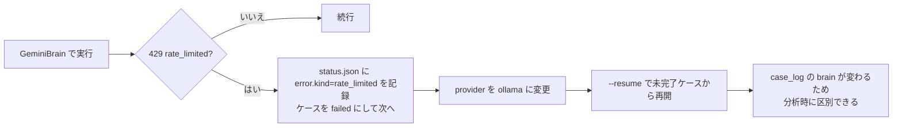

無料枠の上限に達したときは、自動で別の脳に切り替えない。切り替わったことに気付かないまま結果を比較すると、品質差の原因が分からなくなるためである。失敗として明示的に記録し、人が設定を変えて再開する（NF-10）。

同一Trialの17ケースが違うモデルで実行された場合、そのTrialはMBTI構成以外の条件が揃っていないことになる。分析側で、Trial内のモデルが一致しないTrialを検出して警告する（9.4、NF-06）。

---

## 6. データ設計

### 6.1 ディレクトリ構成

```text
playgrounds/mbti-werewolf/
  README.md
  requirements.txt
  pyproject.toml
  data/                           # 外部データ（実行結果ではない）
    persons/
      pool-001.json               # 人物プール100人
    patterns/
      pattern-set-001.json        # 8人パターンの集合
    rules/
      onenight-8p-v0.7.json       # ルールセット（4.1、4.2）
  src/mbti_werewolf/
    __main__.py                   # experiment / masterdata / judge / analyze / pages のサブコマンド
    config.py                     # 実験条件の読み込みと検証。既定値はこのファイルが持つ
    experiment.py                 # 人物選定、役職割当、Trialと17ケースの生成、条件固定の検査
    masterdata.py                 # 人物プールとパターンセットの生成（6.3）
    runner.py                     # 実行管理、進捗、逐次保存、再開
    engine/
      rules.py                    # ルールセットの読み込みと検証
      case.py                     # CaseEngine（フェーズ進行）
      roles.py                    # 役職割当と最終役職
      night.py                    # 開始時の役職処理
      discussion.py               # 自由議論のラウンド制御
      vote.py                     # 投票の収集と集計
      view.py                     # CaseViewBuilder（4.7）
    agents/
      agent.py                    # 移行期間は case_agent.py（0.4）
      persona.py                  # PersonaBuilder（行動傾向文の組み立て）
      mbti_types.py               # 16タイプと機能スタック
      functions.py                # 心理機能の説明。実行経路からは読まない（0.4）
      prompts/
        v2/
          system_rules.md
          system_context.md
          system_role.md
          tendencies.json         # 16タイプの行動傾向文（5.2）
          user_night_seer.md
          user_night_thief_inspect.md
          user_night_thief_swap.md
          user_pre_discussion.md
          user_speak.md
          user_pre_vote.md
          user_vote.md
    judge/
      judge.py
      stance.py                   # 公開スタンス系列の導出
      criteria/
        v1/
          system_judge.md
          user_judge.md
          labels.json             # ラベル定義（5.5）
    brains/
      base.py                     # Brain / BrainError / Request
      stub.py
      ollama.py
      gemini.py
      factory.py
    analysis/
      indicators.py               # ケース単位の指標算出（9.1〜9.3）
      stats.py                    # 順位ベースの検定（9.4）
      trial_report.py
      experiment_report.py
      rq_report.py
    record/
      case_log.py
      transcript.py
      summary.py                  # 移行期間は case_summary.py（0.4）
      case_metrics.py             # ケース単位の指標算出（9.1〜9.3）
      metrics_csv.py              # 集計CSVの列と書き出し（6.9）
      result_view.py              # 移行期間は case_result_view.py（0.4）
      pages.py
    web/                          # M6で作り直す。M3でv1を削除した（0.4）
  tests/
    conftest.py                   # ScriptedBrain とケース実行のfixture
    test_experiment.py
    test_condition_fixation.py
    test_rules.py
    test_night.py
    test_discussion.py
    test_private_answers.py
    test_vote.py
    test_execution.py
    test_isolation.py
    test_brain_parse.py
    test_judge.py
    test_stance.py
    test_resume.py
    test_transcript.py
    test_case_metrics.py
    test_case_outputs.py
    test_run_outputs.py
    test_analysis.py
    test_cli.py

runs/
  latest.html                     # 最新結果への転送（7.6）
  e-20260901-210000/              # 実験
    experiment.json
    persons.json                  # 使用したプールのスナップショット
    experiment_metrics.csv         # 1行 = 1ケース
    speech_labels.csv              # 1行 = 1発言
    experiment_report.md
    experiment.html
    rq1.md / rq1.html
    rq2.md / rq2.html
    manipulation_check.md         # MBTI条件の操作確認（9.4）
    t001/                         # Trial
      trial.json
      trial_metrics.csv           # 1行 = 1プレイヤー × ケース
      trial_report.md
      trial.html
      c00-mixed/                  # ケース
        config.json
        status.json
        case_log.json
        judge.v1.json
        transcript.md
        summary.md
        result.html
      c01-ISTJ/
      c02-ISFJ/
      ...
      c16-ENTJ/
```

人物プールとパターンを `data/` に置き、`runs/` には使用したスナップショットを置く。`data/` を後から書き換えても、過去の実験結果が指す人物定義は変わらない（F-03、F-09）。

### 6.2 識別子の命名

| 識別子 | 形式 | 例 |
| --- | --- | --- |
| `experiment_id` | `e-YYYYMMDD-HHMMSS` | `e-20260901-210000` |
| `trial_id` | `{experiment_id}-t{trial_index:03d}` | `e-20260901-210000-t001` |
| `case_id` | `{trial_id}-c{case_index:02d}` | `e-20260901-210000-t001-c00` |
| `person_id` | `pe{index:03d}` | `pe042` |
| `pool_id` | `pool-{index:03d}` | `pool-001` |
| `pattern_id` | `pt{index:03d}` | `pt007` |
| `player_id` | `p{seat:d}`（1〜8） | `p3` |
| `speech_id` | `{case_id}-s{order:03d}` | `e-20260901-210000-t001-c00-s012` |

`case_index` は構成種別に対応させる。`00` が混合構成、`01`〜`16` が同質構成で、順序は `agents/mbti_types.py` の `TYPE_STACKS` の定義順（ISTJ, ISFJ, INFJ, INTJ, ISTP, ISFP, INFP, INTP, ESTP, ESFP, ENFP, ENTP, ESTJ, ESFJ, ENFJ, ENTJ）に固定する。ケースIDから構成種別が分かるため、ディレクトリ名にもタイプ名を含める（`c01-ISTJ`）。

`case_id` が `trial_id` と `experiment_id` を含むため、`case_id` だけを受け取れば保存先を特定できる。

`player_id` は座席番号であり、人物IDとは別に持つ。Trial内では `player_id` と `person_id` の対応を固定するので、17ケースを通じて `p3` は同じ人物を指す。エージェントへは `player_id` だけを見せ、`person_id` は見せない。

### 6.3 マスタデータ

**人物プール（`data/persons/pool-001.json`）**

```json
{
  "pool_id": "pool-001",
  "count": 100,
  "generated_at": "2026-09-01T12:00:00+09:00",
  "composition": {
    "mbti": {
      "ISTJ": 8, "ISFJ": 8, "INFJ": 2, "INTJ": 2,
      "ISTP": 4, "ISFP": 5, "INFP": 5, "INTP": 4,
      "ESTP": 6, "ESFP": 7, "ENFP": 10, "ENTP": 8,
      "ESTJ": 12, "ESFJ": 12, "ENFJ": 4, "ENTJ": 3
    },
    "age_gender": {
      "15-19": { "male": 4, "female": 4 },
      "20-29": { "male": 8, "female": 8 },
      "30-39": { "male": 9, "female": 9 },
      "40-49": { "male": 11, "female": 11 },
      "50-59": { "male": 13, "female": 13 },
      "60-64": { "male": 5, "female": 5 }
    }
  },
  "composition_source": {
    "mbti": "日本版MBTIマニュアルの標準サンプル比率",
    "age_gender": "総務省統計局の日本人人口（15〜64歳）"
  },
  "assignment_mode": "seeded_random_independent",
  "seed": 1001,
  "persons": [
    { "person_id": "pe001", "mbti": "ENTP", "age": 34, "gender": "male" }
  ]
}
```

人数構成は要求定義書8.2（v2.1-draft）が定めた値をそのまま使う。MBTIは16タイプの合計が100人、年代・性別は男女それぞれ50人で合計100人になる。読み込み時に両方の合計が `count` と一致することを検査し、一致しなければ `PoolError` で停止する。

`age_gender` を `age` と `gender` に分けず1つの表として持つ理由は、要求定義書が年代と性別を組にした人数で定めているためである。分けて持つと、40代男性が11人という条件を保証できない。年代の幅は一定ではない（`15-19` と `60-64` が5歳幅、他が10歳幅）ため、コード側で年代を計算せず、この表のキーをそのまま使う。個々の `age` は年代の範囲内から `seed` で決める。

`composition_source` に根拠資料を残す理由は、この配分が人口比に寄せた値であり、日本人全体の人口比率そのものではないためである（要求定義書8.2の注記）。後から結果を読む人が、配分の性質を出力ファイルだけから確認できる状態にする。

`assignment_mode: "seeded_random_independent"` は、MBTIの人数構成と年齢・性別の人数構成をそれぞれ満たしたうえで、両者を独立にランダムに対応付けることを示す。要求定義書8.2の「MBTIと年齢・性別の間に根拠のない関係を持たせない」を実装で表す値である。

この配分は人口比に寄せているため、混合構成のケースでは同じタイプが複数人入りうる。ESTJとESFJが各12人、ENFPが10人いる一方、INFJとINTJは各2人であるため、100人から8人を無作為に選ぶと出現しやすいタイプに偏る。混合構成を「4指標が2:2に揃った構成」とは定義していないため、これは仕様どおりの挙動である。混合構成の実際のMBTI内訳は `trial.json` に記録し、Trialごとに確認できるようにする（6.6）。

同質構成の16ケースは、選んだ8人のMBTIを `homogeneous_type` で置き換える（6.6）。プール内にINFJが2人しかいなくても8人INFJのケースは作れるため、配分がケース生成を妨げることはない。

**パターンセット（`data/patterns/pattern-set-001.json`）**

```json
{
  "pattern_set_id": "pattern-set-001",
  "pool_id": "pool-001",
  "selection_mode": "seeded_random_without_replacement",
  "seed": 2001,
  "patterns": [
    { "pattern_id": "pt001", "person_ids": ["pe003", "pe011", "pe024", "pe037", "pe049", "pe058", "pe072", "pe090"] }
  ]
}
```

| 選定方式 | 内容 |
| --- | --- |
| `seeded_random_without_replacement` | 100人から8人を復元なしで選ぶ。同じ人物が1パターン内に重複しない。既定 |
| `fixed` | あらかじめ列挙したパターンをそのまま使う |

パターンをファイルとして保存する理由は、同じ8人の組み合わせを別の実験で再利用できるようにするためと、Trialごとにどの8人を使ったかを実験結果から独立して確認できるようにするためである（F-06、F-09）。

**役職割当**

役職は `engine/roles.py` が `trial_seed` から割り当てる。ルール文書v0.7 §1 の「8枚を無作為に1枚ずつ配る」に合わせ、`[人狼, 人狼, 占い師, 怪盗, 村人, 村人, 村人, 村人]` の配列を `random.Random(trial_seed)` でシャッフルし、`p1` から `p8` の順に配る。先行実験の[WORLD A結果](./m-plus-experiment/04_world-A-result_v1.md)が記録している手順と同じである。Trialごとに1回だけ決め、`trial.json` に保存する。17ケースはこれを読むだけで、再計算しない。

| 項目 | 決定 |
| --- | --- |
| 方式 | `random.Random(trial_seed)` で8人をシャッフルし、ルールセットの `role_composition` の順に割り当てる |
| 記録 | `role_assignment_mode: "seeded_random"` と `trial_seed` を `trial.json` に残す |
| 再現性 | 同じ `trial_seed` なら、パターン選定と役職割当が一致する（F-57） |
| 固定 | 開始時役職はTrial内で固定する。最終役職はケースごとの結果として記録する（4.2） |

### 6.4 設定（config/default.json と experiment.json）

```json
{
  "pool_id": "pool-001",
  "pattern_set_id": "pattern-set-001",
  "rule_set_id": "onenight-8p-v0.7",
  "trial_count": 1,
  "trial_range": null,
  "base_seed": 42,
  "pattern_selection_mode": "seeded_random_without_replacement",
  "discussion": {
    "max_rounds": 6,
    "max_speeches": 40,
    "max_total_chars": 6000,
    "max_speech_chars": 200,
    "max_consecutive_speeches": 2,
    "stop_on_all_pass": true
  },
  "persona_prompt_version": "v2",
  "judge_criteria_version": "v1",
  "judge_batch_size": 8,
  "indicator_version": "v1",
  "indicator_frozen_at": "2026-09-01T18:00:00+09:00",
  "brain": {
    "provider": "stub",
    "model": "",
    "temperature": 0.8,
    "timeout_seconds": 120,
    "max_transport_retries": 3
  },
  "judge_brain": {
    "provider": "stub",
    "model": "",
    "temperature": 0.2,
    "timeout_seconds": 180,
    "max_transport_retries": 3
  },
  "machine_name": "yuujirou-mba-m2"
}
```

| 項目 | 意味 |
| --- | --- |
| `trial_range` | `[開始, 終了]` の形でTrial範囲を指定する。分割実行に使う（F-55）。`null` なら1から `trial_count` まで |
| `base_seed` | Trialごとのseedの元の値。`trial_seed = base_seed + trial_index - 1` とする。Trial 1は `base_seed` そのままになる |
| `brain.max_transport_retries` | 接続失敗やタイムアウトの再試行回数。**応答内容の無効による再送とは別**である（下の注記） |
| `judge_brain.temperature` | エージェントより低くする。評価は揺れない方がよいため |
| `indicator_version` | 9章の指標定義の版。分析出力に記録する |
| `indicator_frozen_at` | その指標版を確定した日時。実験の開始日時より前であれば、RQ1を確認的分析として扱える（9.4）。段階1・段階2の試行では `null` にする |
| `machine_name` | 環境変数または設定で与える。どのPCで回した結果かを後から比較するために使う（F-35） |

再送の回数を2種類に分けている。接続失敗やタイムアウトによる再試行は `brain.max_transport_retries` が持ち、これは通信の都合なのでルールとは無関係である。一方、応答が空・解析不能・候補外だった場合の再送は、ルール文書v0.7 §1 が定める最大3回に従うため、ルールセットの `max_response_attempts`（4.1）が持つ。この2つを1つの設定にまとめると、通信環境を変えたときにルールの回答機会も変わってしまう。

**設定の重ね方と `null` の扱い**

既定値 → 設定ファイル → 上書きの順に重ねる。上書きの多くはCLI由来で、指定がなかった引数は `null` として届く。そのため、既定では `null` を「未指定」とみなして無視する。この扱いがないと、CLIで触っていない項目が毎回既定値ごと消える。

ただし次の3項目は `null` 自体が有効な設定値なので、`null` を通す。

| 項目 | `null` の意味 |
| --- | --- |
| `trial_range` | Trialの範囲を絞らない（1から `trial_count` まで） |
| `indicator_frozen_at` | 指標版を確定していない。RQ1を確認的分析として扱わない（9.4） |
| `discussion.max_consecutive_speeches` | 連続発言の上限を設けない（4.5） |

`max_consecutive_speeches` をこの一覧に入れているのは、4.5で「無効化した実行も段階2で試して偏りの出方を比較する」と決めているためである。通せないままだと、設定ファイルに `null` と書いても既定値の2が使われ、比較したい条件が実行できない。

既定の `provider` は `stub` である。Ollamaが未導入でもclone直後に1 Trialが完走し、出力と分析を確認できる。実際の観察は `--brain ollama --judge-brain ollama` で行う。

ケースごとの `config.json` は、上記からそのケースに関係する値だけを確定した形で持つ。どの経路で実行しても同じ形で保存される（F-56、IF-08）。

### 6.5 実行状態（status.json）

ケース、Trial、実験のそれぞれに置く。画面が短い間隔で読むファイルなので小さく保つ。

ケースの `status.json`:

```json
{
  "case_id": "e-20260901-210000-t001-c00",
  "trial_id": "e-20260901-210000-t001",
  "experiment_id": "e-20260901-210000",
  "composition": "mixed",
  "homogeneous_type": null,
  "status": "running",
  "phase": "free_discussion",
  "round": 3,
  "max_rounds": 6,
  "speech_count": 14,
  "inference_calls": 41,
  "attempt": 1,
  "started_at": "2026-09-01T21:00:00+09:00",
  "updated_at": "2026-09-01T21:07:12+09:00",
  "error": null
}
```

Trialの `status.json` は17ケースの件数と `complete` を持つ。分析側が不完全Trialを除外する判断に使う（9.4）。

```json
{
  "trial_id": "e-20260901-210000-t001",
  "experiment_id": "e-20260901-210000",
  "trial_index": 1,
  "status": "running",
  "case_total": 17,
  "case_done": 12,
  "case_failed": 1,
  "case_pending": 4,
  "complete": false,
  "updated_at": "2026-09-01T22:14:08+09:00"
}
```

実験の `status.json` は、Trial単位とケース単位の件数だけを持つ。ここは実験全体の進み具合を出す場所なので、`case_done` には前回までに完了していたケースも含める。再開のたびに0から数え直すと、100 Trialの実行で全体のどこまで終わったかが読めなくなる。`case_skipped` は `--cases` で対象外にしたケースだけを数える。

```json
{
  "experiment_id": "e-20260901-210000",
  "status": "running",
  "trial_total": 100,
  "trial_done": 3,
  "trial_complete": 3,
  "case_total": 1700,
  "case_done": 58,
  "case_failed": 1,
  "case_skipped": 0,
  "case_pending": 1641,
  "current_trial_id": "e-20260901-210000-t004",
  "current_case_id": "e-20260901-210000-t004-c07",
  "started_at": "2026-09-01T21:00:00+09:00",
  "updated_at": "2026-09-02T09:41:03+09:00",
  "error": null
}
```

失敗時は `error` に `{"kind": "rate_limited", "message": "..."}` が入る。`kind` は `unreachable` / `rate_limited` / `timeout` / `invalid_response` / `internal` の5種とする（F-59）。

進行として返すのはフェーズ、ラウンド、発言数、呼び出し回数だけで、発言そのものは返さない。会話を1発言ずつ流さないという要件（要件定義書1章）を、APIの返す情報の範囲で担保している。

### 6.6 Trial（trial.json）

Trialの固定条件の正本。再開時はこのファイルから条件を復元する（3.5）。

```json
{
  "schema_version": "2",
  "trial_id": "e-20260901-210000-t001",
  "experiment_id": "e-20260901-210000",
  "trial_index": 1,
  "trial_seed": 42,
  "pool_id": "pool-001",
  "pattern_set_id": "pattern-set-001",
  "pattern_id": "pt001",
  "rule_set_id": "onenight-8p-v0.7",
  "rule_set_version": "0.7",
  "fixed_conditions": {
    "seats": [
      { "player_id": "p1", "person_id": "pe003", "age": 34, "gender": "male", "pool_mbti": "ENTP", "initial_role": "villager" },
      { "player_id": "p2", "person_id": "pe011", "age": 47, "gender": "female", "pool_mbti": "ISFJ", "initial_role": "werewolf" }
    ],
    "role_assignment_mode": "seeded_random",
    "discussion": { "max_rounds": 6, "max_speeches": 40, "max_total_chars": 6000, "max_speech_chars": 200, "max_consecutive_speeches": 2, "stop_on_all_pass": true },
    "persona_prompt_version": "v2",
    "judge_criteria_version": "v1",
    "brain": { "provider": "ollama", "model": "gemma3:4b" },
    "judge_brain": { "provider": "ollama", "model": "gemma3:4b" }
  },
  "cases": [
    { "case_id": "...-c00", "composition": "mixed", "homogeneous_type": null, "status": "done" },
    { "case_id": "...-c01", "composition": "homogeneous", "homogeneous_type": "ISTJ", "status": "done" }
  ],
  "complete": false,
  "condition_check": { "passed": true, "checked_at": "2026-09-01T21:00:00+09:00", "varying_keys": ["mbti"] }
}
```

`condition_check.varying_keys` に `["mbti"]` だけが入ることが、Trial内でMBTI構成以外が変わっていないことの記録である。検査に失敗した場合は実行前に停止する（3.1、NF-06、AC-02）。

`pool_mbti` は混合構成のケースで使うMBTIである。同質構成のケースでは、これを `homogeneous_type` で置き換える。

### 6.7 ケースログ（case_log.json）

出力の正本。Judgeと分析以外の出力はすべてこのファイルから導出する。

```json
{
  "schema_version": "2",
  "case_id": "e-20260901-210000-t001-c00",
  "trial_id": "e-20260901-210000-t001",
  "experiment_id": "e-20260901-210000",
  "case_index": 0,
  "composition": "mixed",
  "homogeneous_type": null,
  "status": "done",
  "attempt": 1,
  "versions": {
    "rule_set_id": "onenight-8p-v0.7",
    "rule_set_version": "0.7",
    "persona_prompt_version": "v2",
    "judge_criteria_version": "v1",
    "pool_id": "pool-001",
    "pattern_id": "pt001"
  },
  "brain": { "provider": "ollama", "model": "gemma3:4b", "endpoint_kind": "local" },
  "config": { "...": "6.4 のケース確定値" },
  "players": [
    {
      "player_id": "p1",
      "person_id": "pe003",
      "age": 34,
      "gender": "male",
      "mbti": "ENTP",
      "initial_role": "villager",
      "final_role": "villager"
    }
  ],
  "night_actions": [
    { "phase": "seer_inspection", "actor": "p4", "target": "p7", "revealed_initial_role": "villager", "reason": "...", "ability_used": true, "attempts": 1, "parse_failed": false, "wait_seconds": 8.9 },
    { "phase": "werewolf_recognition", "actor": "p2", "partners": ["p6"], "requires_inference": false },
    { "phase": "thief_inspection", "actor": "p5", "target": "p2", "revealed_initial_role": "werewolf", "reason": "...", "ability_used": true, "attempts": 1, "parse_failed": false, "wait_seconds": 9.4 },
    { "phase": "thief_swap", "actor": "p5", "target": "p2", "swapped": true, "actor_final_role": "werewolf", "target_final_role": "thief", "target_notified": false, "reason": "...", "attempts": 1, "parse_failed": false, "wait_seconds": 8.1 }
  ],
  "pre_discussion_answers": [
    {
      "player_id": "p1",
      "role_awareness": "自分は村人で、確認できる情報はない。",
      "suspect": "unknown",
      "confidence": 1,
      "reason": "まだ発言がない。",
      "parse_failed": false,
      "wait_seconds": 7.7
    }
  ],
  "discussion": {
    "rounds": 4,
    "stop_reason": "all_pass",
    "limits": { "max_rounds": 6, "max_speeches": 40, "max_total_chars": 6000, "max_speech_chars": 200, "max_consecutive_speeches": 2 },
    "events": [
      {
        "speech_id": "e-20260901-210000-t001-c00-s001",
        "order": 1,
        "round": 1,
        "poll_position": 1,
        "player_id": "p4",
        "spoke": true,
        "skipped": false,
        "speech_text": "占い師です。p7を見て村人でした。",
        "memo": "確定情報を早く出して整合性を確認させたい。",
        "chars": 24,
        "truncated": false,
        "attempts": 1,
        "parse_failed": false,
        "wait_seconds": 10.2
      },
      {
        "order": 2,
        "round": 1,
        "poll_position": 2,
        "player_id": "p1",
        "spoke": false,
        "skipped": false,
        "memo": "情報が少ないので他の発言を待つ。",
        "attempts": 1,
        "parse_failed": false,
        "wait_seconds": 5.1
      }
    ]
  },
  "pre_vote_answers": [
    {
      "player_id": "p1",
      "suspect": "p3",
      "confidence": 4,
      "reason": "主張が途中で変わった。",
      "planned_vote": "p3",
      "parse_failed": false,
      "wait_seconds": 8.3
    }
  ],
  "votes": [
    {
      "voter": "p1",
      "target": "p3",
      "memo": "主張の変化が説明できていない。",
      "abstained": false,
      "attempts": 1,
      "parse_failed": false,
      "wait_seconds": 7.9
    }
  ],
  "result": {
    "vote_tally": { "p3": 4, "p2": 2, "p6": 2 },
    "valid_vote_count": 8,
    "abstain_count": 0,
    "top_vote_count": 4,
    "executed": ["p3"],
    "executed_count": 1,
    "executed_roles": [
      { "player_id": "p3", "initial_role": "seer", "final_role": "seer" }
    ],
    "no_execution_reason": null,
    "winner": "werewolf",
    "valid": true,
    "invalid_reason": null
  },
  "timing": {
    "started_at": "2026-09-01T21:00:00+09:00",
    "ended_at": "2026-09-01T21:13:48+09:00",
    "elapsed_seconds": 828.4,
    "ai_wait_seconds": 819.7,
    "inference_calls": 62,
    "machine_name": "yuujirou-mba-m2"
  },
  "failure": null
}
```

`discussion.events` が発言と見送りの両方を1つの配列に持つ点が設計上の要点である。別々の配列にすると、見送りが会話のどの位置で起きたかが失われる。`spoke: false` のイベントには `speech_id` を振らない。発言だけに連番の `speech_id` を振るので、Judgeの評価対象と1対1に対応する。

`order` は発言と見送りを通した通し番号、`speech_id` の連番は発言だけの通し番号である。両方を持つ理由は、前者が議論の進行を、後者がJudgeの評価対象を表すためである。

**v1.1のschemaから変えた項目**

出力形式の変更なので、v1の出力とは互換にならない。既存の `runs/` は `schema_version` で読み分ける（F-37）。

| 項目 | v1.1 | v2.0 | 理由 |
| --- | --- | --- | --- |
| `night_actions` の夜の順序 | 人狼 → 占い師 → 怪盗 | 占い師 → 人狼 → 怪盗の確認 → 怪盗の交換 | ルールv0.7 §2 |
| 怪盗のイベント | `thief_swap` の1件 | `thief_inspection` と `thief_swap` の2件 | 2段階になったため（4.2） |
| `revealed_role` | — | `revealed_initial_role` に改名 | 見えるのが開始時役職であることを明示（v0.7 §2-2） |
| `ability_used` | なし | 追加 | 3回失敗で能力未使用になるため（5.4） |
| `attempts` | `invalid_retry_count` | `attempts`（1〜3） | ルールv0.7の「回答機会は最大3回」と対応させる |
| `fallback` | あり | **削除** | 乱数フォールバックを廃止した（5.4） |
| `memo` | なし | `discussion.events` と `votes` に追加 | 実験計画文書の観察用ログ（5.3） |
| `skipped` | なし | `discussion.events` に追加 | 見送りとスキップを区別する（4.5） |
| `votes[].reason` | あり | `memo` に改名 | 実験計画文書の名称に合わせる |
| `result.executed` | 単一の `player_id` | **配列** | 追放者が0人・複数人になりうる（4.6） |
| `result.tie_break` | あり | **削除** | 同数得票の乱数決着を廃止した（4.6） |
| `result.executed_roles` | `executed_initial_role` / `executed_final_role` | 追放者ごとの配列 | 追放者が複数になりうるため |
| `result.valid_vote_count` / `abstain_count` | なし | 追加 | 棄権と無効試合の判定に必要（4.6） |
| `result.invalid_reason` | なし | 追加 | 無効試合の理由を残す。有効票0なら `"no_valid_votes"` |
| `result.no_execution_reason` | なし | 追加 | 追放者0人のとき `"top_vote_count_is_one"` を入れる |

`result.executed` を配列にしたことで、追放者0人（`[]`）、1人、2人以上を同じ形で表せる。`winner` は追放者の `final_role` に `werewolf` が含まれるかで決まるため、人数によらず同じ判定式になる。

`schema_version` を持たせる理由は、実装途中でschemaを変えたときに古い実行結果を読み分けられるようにするためである（F-37）。

`ai_wait_seconds` は各推論呼び出しの待機時間の合計、`elapsed_seconds` は実行全体の所要時間とする。`inference_calls` を加えたのは、1.3の試算を実測で更新するために回数が必要になるためである（NF-07）。

### 6.8 Judge評価（judge.v1.json）

```json
{
  "schema_version": "2",
  "case_id": "e-20260901-210000-t001-c00",
  "judge_criteria_version": "v1",
  "judge_brain": { "provider": "ollama", "model": "gemma3:4b", "endpoint_kind": "local" },
  "judge_batch_size": 8,
  "evaluated_at": "2026-09-02T10:00:00+09:00",
  "speeches": [
    {
      "speech_id": "e-20260901-210000-t001-c00-s001",
      "labels": ["claim"],
      "mentions": ["p7"],
      "stances": [],
      "parse_failed": false
    },
    {
      "speech_id": "e-20260901-210000-t001-c00-s002",
      "labels": ["suspect", "hypothesis"],
      "mentions": ["p4", "p7"],
      "stances": [{ "target": "p4", "direction": "suspect", "strength": 2 }],
      "parse_failed": false
    }
  ],
  "stance_series": [
    {
      "at_speech_id": "e-20260901-210000-t001-c00-s002",
      "current_stances": { "p4": null, "p1": { "target": "p4", "direction": "suspect", "strength": 2 } },
      "suspicion_distribution": { "p4": 1 },
      "entropy": 0.0
    }
  ],
  "timing": { "elapsed_seconds": 64.2, "ai_wait_seconds": 61.8, "inference_calls": 3 }
}
```

ファイル名に版を含める（`judge.v1.json`）ため、評価基準を `v2` にしても `v1` の評価が残る（F-45）。分析は `indicator_version` とあわせて、どの評価版を使ったかを出力する。

### 6.9 集計CSV

3つの粒度を出す（要件4.7）。列を追加する場合は末尾に足し、既存列の意味を変えない。

**`trial_metrics.csv`（1行 = 1プレイヤー × 1ケース）**

```text
experiment_id,trial_id,case_id,composition,homogeneous_type,player_id,person_id,age,gender,mbti,initial_role,final_role,speech_count,pass_count,skip_count,total_chars,avg_chars,pre_suspect,pre_confidence,final_suspect,final_confidence,planned_vote,actual_vote,abstained,suspect_changed,confidence_delta,pre_correct,final_correct,vote_correct,plan_vote_match,executed,win,decided_from_unknown,suspect_vote_match,corrected,deteriorated
```

**`experiment_metrics.csv`（1行 = 1ケース）**

```text
experiment_id,trial_id,case_id,case_index,composition,homogeneous_type,status,valid,invalid_reason,rule_set_version,persona_prompt_version,judge_criteria_version,indicator_version,brain_provider,brain_model,rounds,stop_reason,total_speeches,total_passes,total_skips,total_chars,valid_vote_count,abstain_count,top_vote_count,executed,executed_count,executed_final_roles,no_execution_reason,winner,village_correct,vote_concentration,final_entropy,convergence_round,correction_rate,deterioration_rate,mean_confidence_delta,plan_vote_mismatch_rate,elapsed_seconds,ai_wait_seconds,inference_calls,machine_name,village_vote_accuracy,pass_rate,speech_count_gini,decided_from_unknown_count
```

どちらの列名も9.1〜9.3の指標定義と同じ名前にしている。列の並びの後半は、M3の実装で「9章に定義があるのにCSVへ出ていない指標」を末尾へ足した分である。`village_vote_accuracy`・`pass_rate`・`speech_count_gini` は自由議論を選んだ判断の妥当性を確認する指標（9.2）なので、Judgeを待たずに出せる。プレイヤー側の `decided_from_unknown`・`suspect_vote_match`・`corrected`・`deteriorated` は、ケース単位の `correction_rate` などの内訳にあたる。

`executed` と `executed_final_roles` は追放者が複数になりうるため、セル内で `|` 区切りの複数値にする。追放者0人の場合は空文字にし、`executed_count` が `0` になる。`executed_count` は `executed` の要素数から数え直す。`case_log.json` に記録された件数をそのまま書き写すと、CSVの中で一覧と件数が食い違う行を作れてしまう。

**分母が0のときの扱い**

`correction_rate` と `deterioration_rate` は、分母にあたる人が0人のとき空欄にする。議論前に誤っていた人が0人の状態を「修正率0」と書くと、全員が正しく判断していたケースと、誰も修正しなかったケースが同じ値になる。同じ理由で `speech_count_gini` は誰も発言しなかったケースで空欄にする（偏りが0なのではなく、偏りを測る対象がない）。

この扱いはCSVだけの決まりではなく、指標算出（`record/case_metrics.py`）が `null` を返し、CSVがそれを空欄として書く形にしている。`summary.md` と `result.html` は同じ `null` を `—` と表示する。3つの出力で「算出できなかった」の表し方を1か所から決めるためである。

`tie_break_used` 列は持たない。同数得票の乱数決着を廃止したため、記録する対象がなくなった（4.6）。同数得票そのものは `executed_count` が2以上であることで判別できる。

**`speech_labels.csv`（1行 = 1発言）**

```text
experiment_id,trial_id,case_id,speech_id,order,round,player_id,mbti,initial_role,final_role,chars,labels,mentions,stance_target,stance_direction,stance_strength,judge_criteria_version
```

`labels` と `mentions` は複数値を取るため、セル内で `|` 区切りにする。CSVをそのまま表計算ソフトで開いたときに列がずれないよう、カンマは使わない。

`speech_labels.csv` に `mbti` と役職を含める理由は、Judgeへは渡さないが分析では必要になるためである。Judgeの入力と分析の入力を混同しないよう、この列は分析側で `case_log.json` から結合して付ける。

**Judgeが揃う前のCSV**

`trial_metrics.csv` と `experiment_metrics.csv` はM3で出す。`speech_labels.csv` はJudgeの出力そのものなのでM4で出す。

M3の時点では、`experiment_metrics.csv` の `final_entropy` と `convergence_round` が空欄になる。この2つは疑念分布から算出し、疑念分布は公開スタンス系列（5.5）から作るため、Judge（M4）が動くまで値が出ない。列を後から足すのではなく最初から空欄で置く理由は、既存列の位置を動かさない決まりを守るためである。M3で列を省くと、M4で足すときに列順が変わり、M3のCSVを開いていた表計算ソフトの参照がずれる。

空欄と「値が0」を区別できるようにする。`final_entropy` が `0` は完全に集中した分布を意味し、空欄はまだ算出していないことを意味する。分析側は空欄の行をRQ分析から除外する（9.4）。

### 6.10 人が読む出力

| ファイル | 単位 | 構成 |
| --- | --- | --- |
| `transcript.md` | ケース | 先行実験の[WORLD A結果](./m-plus-experiment/04_world-A-result_v1.md)・[WORLD B結果](./m-plus-experiment/05_world-B-result_v1.md)と同じ構成の1ファイル。実行条件、開始時役職、夜処理、公開議論（ラウンドごとの表）、投票、結果をこの順で置く（下記） |
| `summary.md` | ケース | 構成種別、8人の人物・MBTI・開始時役職・最終役職、議論前と投票前の判断の対比表、指標値、実行条件、所要時間。会話は載せない（`transcript.md` と重複させない） |
| `trial_report.md` | Trial | 固定条件、17ケースを行に並べた比較表（構成種別、勝敗、追放者、正答、収束、判断変化）、混合構成と同質構成16タイプの差、補助分析である旨の注記 |
| `experiment_report.md` | 実験 | Trial数、有効Trial数、ケース数、完了・失敗・除外の件数と理由、構成種別ごとの集計、実行時間の実測、使用した各バージョン |
| `rq1.md` | 実験 | 混合構成と同質構成の比較。指標ごとの対応あり比較の結果、検定結果、効果量、根拠Trialの一覧 |
| `rq2.md` | 実験 | 同質構成16タイプの比較。指標ごとの記述統計と順位、探索的分析である旨の注記 |
| `manipulation_check.md` | 実験 | MBTI条件が発言傾向の差として現れているかの操作確認。RQ分析とは別に出す（9.4） |

**`transcript.md` の構成**

先行実験の結果文書と同じ形にする。先行実験と本システムの出力を並べて読めることを優先し、章の順序と表の列を揃える。

```markdown
# ケース {case_id}

## 実行条件（固定記録）
- ルール正本、Agent設定正本、seed、役職配布手順、使用モデル、Agent生成条件
- 参加者属性: P1 22歳・女性、P2 31歳・男性、…
- 構成種別: 混合構成 / 同質構成（{タイプ}）
- 議論方式: 自由議論。上限は max_rounds=6、max_speeches=40、…
- 夜処理順: 占い師 → 人狼 → 怪盗
- 異常処理: なし

## 開始時役職割当
| ID | 開始時役職 |

## 夜処理
1. 占い師P4はP1を確認。結果は「P1の開始時役職は村人」。
2. 人狼P6とP7は互いを人狼仲間として確認。
3. 怪盗P2はP1を確認。結果は「P1の開始時役職は村人」。P2は「交換しない」を選択。

## 公開議論
### 第1ラウンド
| ID | 公開発言 | private memo |

## 投票
| ID | 投票先 | private memo |

## 結果
- 得票: P4 5票、P6 3票
- 追放者: P4
- 最終役職: P1 村人、P2 怪盗、…
- 勝敗: 人狼陣営の勝利
- 判定理由: 最終役職が人狼の参加者は追放されなかったため。
- 異常処理: なし
```

| 項目 | 決定 |
| --- | --- |
| 参加者の表記 | 人が読む出力では `P1`〜`P8` の大文字にする。内部の `player_id` は `p1`〜`p8` のまま変えない |
| 見送り | 行として残し、公開発言の欄を `（見送り）` とする。memoは本人が返した1文を載せる |
| スキップ | 行として残し、公開発言の欄を `（応答が得られず記録なし）`、memoを `—` とする |
| 追放者0人 | 追放者の欄を `なし（最多得票が1票のため）` とする |
| 無効試合 | 結果の章を `- 結果: 無効試合`、`- 理由: 有効投票なし` に差し替え、勝敗行を出さない |
| MBTIの表記 | `transcript.md` には書かない。先行実験の結果文書がMBTI名を結果側に出していないため、形式を揃える。MBTIは `summary.md` と `case_log.json` で確認する |

見送りを行として残す理由は、自由議論を採用した目的が沈黙と発言量の偏りの観察である（0.5）ためである。表から消すと、誰が黙っていたかが `transcript.md` から読めなくなる。本人が選んだ見送りと、応答が得られなかったスキップを別の文言にするのは、前者が観察対象、後者が実行上の失敗であり、混ぜると沈黙の解釈を誤るためである（4.5）。

`transcript.md` にMBTIと役職の扱いが分かれる点を補足する。開始時役職と最終役職は先行実験の結果文書が載せているので載せる。MBTIは載せない。エージェントへの入力（公開ビュー）とは別物であり、人が結果を読むためのファイルであることは変わらないが、先行実験と形式を揃える方を優先した。混同を避けるため、エージェント入力を組み立てるのは `engine/view.py` だけに限定する（4.7）。

**リポジトリへ含める範囲**

| 対象 | 扱い |
| --- | --- |
| `data/` 配下 | commitする。人物プールとパターンは実験条件の一部である |
| ケースの `case_log.json` / `judge.v1.json` / `status.json` / `config.json` | commitする。生データの正本 |
| ケースの `transcript.md` / `summary.md` / `result.html` | commitする |
| Trial・実験の分析出力とCSV | commitする |
| GitHub Pages用の `site/` | commitしない（gitignore） |

1 Trial（17ケース）の出力容量は段階2で実測する。1,700ケース換算で運用が厳しい場合は、`result.html` をケース単位で持たず、Trial単位のHTMLからケースデータを参照する形へ変更する。判断は実測後に行う（NF-12、14章）。

---

## 7. 画面設計

### 7.1 前提

画面は完成後にブラッシュアップする前提で作る。本書では、後から作り直しても実行側に手を入れずに済む状態を確保することを目的とし、見た目は規定しない。

| 方針 | 内容 |
| --- | --- |
| API契約を先に固定する | 画面はAPIの上の薄い層にする。画面を作り直してもAPIとファイル形式は変えない |
| ビルド工程を持たない | npm、バンドラ、フレームワークを使わない。`index.html` と `app.js` と `style.css` の3ファイル |
| 状態を画面に持たない | 実行状態の正本は `runs/` 配下のファイル。画面を再読み込みしても表示が復元できる |
| 分析は画面で計算しない | 指標と検定は `analyze` が算出済みの値を読むだけにする。画面とCLIで数字が違う事態を作らない |

4番目がv2.0で追加した方針である。RQの分析値を画面のJavaScriptで計算すると、CLIの出力と画面の表示で数字が食い違う可能性が出る。算出は `analysis/` の1か所に閉じる。

### 7.2 やらないこと

初回では以下を作らない。ブラッシュアップの候補として残す。

- レスポンシブ対応、デザインシステム、コンポーネント分割（結果ビュー側のスマートフォン対応は7.6で扱う）
- 発言を1つずつ流すライブ表示（要件のスコープ外）
- 実行の中断ボタン、同時複数実行
- 人物プールの画面上での編集
- ログイン、権限管理

### 7.3 画面構成

実行と確認で4つのビューを持つ。1画面で完結させるv1.1の方式は、実験 → Trial → ケースの3階層になるため成立しない。

| ビュー | 内容 | 対応要件 |
| --- | --- | --- |
| 実行ビュー | 実験条件の設定パネル（人物プール、パターンセット、ルールセット、Trial数、Trial範囲、議論条件と上限、各バージョン、seed、脳）、実行ボタン、状態表示、進行位置、再開ボタン | F-70〜F-72、F-76 |
| 実験ビュー | 実験一覧と、選んだ実験のTrial一覧（状態、完了・失敗・除外）、全体分析の要約、RQ1・RQ2へのリンク | F-62、F-68 |
| Trialビュー | 固定条件、17ケースを並べた比較表、各ケースへのリンク | F-61、F-74 |
| ケースビュー | 8人の一覧（人物・MBTI・開始時役職・最終役職）、夜の処理、会話全文、議論前と投票前の判断の対比、投票、勝敗、Judge評価、指標値、実行条件 | F-60、F-74、F-75 |

失敗時は、ケースビューに原因の種別と、その時点までの記録を表示する（F-75）。

### 7.4 API

| Method | Path | 用途 | 応答 |
| --- | --- | --- | --- |
| `GET` | `/api/config/default` | 設定パネルの初期値 | `config/default.json` の既定値 |
| `GET` | `/api/data/pools` | 選択できる人物プールの一覧 | `pool_id`、件数、構成の配列 |
| `GET` | `/api/data/rules` | 選択できるルールセットの一覧 | `rule_set_id`、版、`status` の配列 |
| `POST` | `/api/experiments` | 実験を開始する | `202` `{experiment_id, status}` |
| `GET` | `/api/experiments` | 実験の一覧（`runs/` を走査） | `experiment_id`、状態、Trial数、開始時刻の配列 |
| `GET` | `/api/experiments/{experiment_id}` | 実験の状態と進行 | 実験の `status.json` |
| `POST` | `/api/experiments/{experiment_id}/resume` | 未完了ケースから再開する | `202` `{experiment_id, status}` |
| `GET` | `/api/experiments/{experiment_id}/trials` | Trialの一覧と状態 | `trial_id`、`complete`、ケース状態の配列 |
| `GET` | `/api/trials/{trial_id}` | Trialの固定条件と17ケース | `trial.json` |
| `GET` | `/api/cases/{case_id}` | ケースの状態と進行 | ケースの `status.json` |
| `GET` | `/api/cases/{case_id}/log` | ケースの全データ | `case_log.json` |
| `GET` | `/api/cases/{case_id}/judge` | ケースのJudge評価 | `judge.{version}.json` |
| `GET` | `/api/experiments/{experiment_id}/analysis/{kind}` | 分析結果（`kind` = `experiment` / `rq1` / `rq2`） | 算出済みの分析データ |
| `GET` | `/health` | 起動確認 | `{"status": "ok"}` |

一覧をディレクトリの走査で作るため、コマンドから実行した結果も画面の一覧に現れる。要件のAC-20が求める「両経路で同じ実行と出力」を、別々の登録処理を持たない形で満たしている。

分析APIが算出を行わず、`analyze` が書いたファイルを読むだけである点が7.1の4番目の方針の実装上の表れである。`analyze` を実行していない実験では、分析APIは「未生成」を返す。

### 7.5 結果ビューと分析HTML

操作画面とは別に、自己完結HTMLを生成する。

| 項目 | 決定 |
| --- | --- |
| 生成タイミング | ケースの `result.html` は実行完了時および失敗時にRunnerが書き出す。Trial・実験・RQのHTMLは `analyze` が書き出す |
| データの持ち方 | ケースの `result.html` は生成時にPython側でHTMLへ書き出す。JavaScriptを使わない。Trial・実験・RQのHTMLは集計値を `<script type="application/json">` として埋め込む |
| 外部依存 | なし。CSSもインラインに含める |
| 階層 | `experiment.html` → `trial.html` → `result.html` を相対リンクで結ぶ |
| 開き方 | `file://` で直接開く、またはGitHub Pages経由 |
| ケースの生データ | 同じディレクトリの `case_log.json`・`transcript.md`・`summary.md` へ相対リンクを張る |

ケースの `result.html` だけ「埋め込んだJSONをJavaScriptで描く」形をとらない理由は3つある。1つ目は、同じ内容をJSONとHTMLで二重に持つとファイルが約2倍になり、1,700ケース分では無視できない量になることである。2つ目は、描画をPython側に置くとテストで出力文字列を直接検査でき、表示崩れやエスケープ漏れを実行前に捕まえられることである。発言はモデルの出力なので、`<` や `&` がそのまま入りうる。3つ目は、JavaScriptが動かない環境（アプリ内ブラウザの制限設定など）でも読めることである。

生データへ相対リンクを張るのは、埋め込みをやめた分をここで補うためである。`file://` から `fetch` で読むのはブラウザに拒否されるが、リンクを開くこととダウンロードは拒否されない。

上位のHTML（Trial・実験・RQ）は集計値だけなので埋め込みでよい。並べ替えや絞り込みを画面上で行いたい対象であり、そのときJSONが手元にある形が扱いやすい。

階層を相対リンクで結ぶ理由は、1,700ケース分のデータを1ファイルへ埋め込むと開けない大きさになるためである。上位のHTMLには集計値だけを埋め込み、会話全文はケースの `result.html` に置く。

**ケースの `result.html` の構成**

| 章 | 内容 |
| --- | --- |
| 結果 | 勝敗、追放者、得票、有効票と棄権、議論ラウンドと終了理由、推論呼び出し回数 |
| 参加者 | ID、MBTI、人物ID、年齢と性別、開始時役職、最終役職と陣営、発言回数、見送り回数、追放されたか |
| 夜処理 | `transcript.md` と同じ文章。文言の組み立ては `record/transcript.py` の1か所に置き、両方から呼ぶ |
| 公開議論 | ラウンドごとに、ID・公開発言・private memo |
| 投票 | ID・投票先・private memo |
| 個別判断 | 議論前と投票前の疑い・自信、投票予定、実際の投票、正答 |
| 指標 | 9.1〜9.3の主な指標と、非エンジニア向けの1行説明 |
| 実行条件 | 各バージョン、seed、使用モデル、議論の上限、実行時間、実行機 |

失敗したケースにも同じ名前で `result.html` を置く。中身は失敗の種別・内容・試行回数と、`--resume` で再実行できることの案内にする。失敗したケースだけHTMLが無い形にすると、一覧から開いたときに、失敗したのか未実行なのかが区別できない。

**狭い画面での表**

画面幅640px以下では、3列以上の表を「1行 = 1ブロック」に折り返す。各セルに項目名を `data-label` として持たせ、CSSがそこから見出しを出す。横スクロールのままにすると、private memoの列が画面外に出る。要求定義書が最新結果を電話から開くことを重視項目に挙げており、memoは今回追加した観察対象（0.5）なので、スマートフォンで読めない状態は避ける。

7.6でスマートフォン対応を分析HTMLに限ると書いていたが、ケースの `result.html` も対象に含める。「ケースの会話全文は横に長い表を持たない」という前提が、private memoの列を足した時点で成り立たなくなったためである。

### 7.6 GitHub Pages

公開するのは分析結果と結果ビューである。実験の実行そのものはFastAPIをローカルで動かす。

| 項目 | 決定 |
| --- | --- |
| URL | https://ziriss8120121.github.io/hackathon-test/ |
| 最新の実験 | `runs/latest.html`（最新の実験の全体分析へ転送する。M3の時点では直近に完了したケースの `result.html` へ転送する） |
| 中身 | 実験の全体分析、RQ1・RQ2、Trial比較、ケース詳細、それらを選ぶ一覧 |
| 生成 | `python -m mbti_werewolf pages` |
| 公開 | 生成物を `gh-pages` ブランチへ載せる。リポジトリの Pages 設定は `gh-pages` / ルート |
| 生成物 | `site/`（gitignore。リポジトリの `main` には置かない） |
| スマートフォン | 全体分析、RQ1・RQ2、Trial比較の3種は、幅の狭い画面で表が縦に折り返る形にする |

スマートフォン対応を分析HTMLに限る理由は、要求定義書の「最新結果のHTMLリンクを電話から開ける」という要求が、結果の確認を対象にしているためである。操作画面はローカル起動が前提なのでスマートフォンから使えず、対応する意味がない。ただしケースの `result.html` は例外として対応する（7.5）。private memoの列を足したことで横に長い表になったためである。

`latest.html` の転送先はM3とM4で変わる。M4で `experiment.html` が出るまでは実験の全体分析が存在しないため、M3では直近に完了したケースの `result.html` を指す。1ケース終えるごとに書き換えるので、長時間の実行中でも、いま何が出ているかをスマートフォンから確認できる。全ケースが失敗した実行では書き換えない。前回の正常な結果へのリンクを、失敗しか出ていない実行で壊さないためである。

`latest.html` はメタリフレッシュによる転送に加えて、手動リンクを必ず添える。メタリフレッシュに対応しないアプリ内ブラウザがあるためで、これはv1で実際に必要になった対応である。

---

## 8. 実行方式

### 8.1 起動コマンド

ゲーム実行、Judge評価、分析生成を別のサブコマンドにする（IF-09）。

| 目的 | コマンド |
| --- | --- |
| 人物プールと8人パターンを生成する | `python -m mbti_werewolf masterdata --patterns 100` |
| 生成と条件固定の検査だけを行う | `python -m mbti_werewolf experiment --dry-run` |
| 1 Trialを実行する | `python -m mbti_werewolf experiment --trials 1 --seed 42` |
| Trial範囲を指定して実行する | `python -m mbti_werewolf experiment --trials 100 --trial-range 26-50 --seed 42` |
| 1ケースだけ実測する | `python -m mbti_werewolf experiment --cases c00 --brain ollama` |
| 中断した実験を再開する | `python -m mbti_werewolf experiment --resume e-20260901-210000` |
| 脳を切り替える | `python -m mbti_werewolf experiment --brain ollama --model gemma3:4b` |
| Judge評価だけを実行する | `python -m mbti_werewolf judge --experiment e-20260901-210000` |
| 分析だけを生成する | `python -m mbti_werewolf analyze --experiment e-20260901-210000` |
| GitHub Pages用サイトを生成する | `python -m mbti_werewolf pages` |

人物プールと8人パターンは1つの `masterdata` サブコマンドで作る。パターンはプールから選ぶため、別のコマンドに分けるとプールを指定し直す手間だけが増える。

操作画面の `ui` はM3でv1と一緒に削除した。M6でv2.0向けに作り直したときに、この表へ戻す（0.4）。

`judge` と `analyze` を分けた効果は、Judgeの評価基準や指標定義を変えたときに、ゲームを再実行せずに評価と分析だけを回し直せることである。段階2で4時間かけて取った1 Trialのデータに対し、評価基準を何度でも試せる（F-41、F-45、NF-18）。

`--trial-range` は分割実行に使う。複数のMacで同じ `--seed` と同じプール・パターンセットを指定し、範囲だけを分けると、同じ実験の一部として実行できる。`experiment_id` は台ごとに別になるため、集約は `analyze` に複数の実験IDを渡す形で行う（14章で手順を定める）。

### 8.2 設定の優先順位

後のものが前を上書きする。

```text
config.py の既定値  →  --config で指定したファイル  →  コマンド引数
```

既定値はコードが持つ。設定ファイルを既定の読み込み先として置かない理由は、17ケースの条件固定をコード側で保証しているため、外部ファイルの編集だけで条件が静かに変わる経路を作りたくないためである。M6で画面を作り直したときは、フォーム入力をコマンド引数と同じ層に置く。

どの経路で実行しても、確定した設定は実験の `experiment.json`、Trialの `trial.json`、ケースの `config.json` に同じ形で保存される（F-56、IF-08）。

Trialの固定条件は生成時に1度だけ確定し、以後は設定の優先順位の対象から外れる。再開時にコマンド引数で議論条件を変えても、既存Trialの条件は変わらない。変えたい場合は新しい実験を作る。これがないと、再開のたびにTrial内の条件が変わりうる（3.5、6.6）。

### 8.3 非同期実行の方式

| 項目 | 決定 | 理由 |
| --- | --- | --- |
| 実行の場所 | `ThreadPoolExecutor(max_workers=1)` のワーカースレッド | 推論待ちが大半を占めるためスレッドで足りる。同時実行を1本に絞る |
| 同時実行 | 1本のみ。実行中の再要求は `409` を返す | ローカルLLMを並列に叩くとメモリを食い潰し、待機時間の計測も汚れる |
| 進捗の共有 | ケース・Trial・実験の `status.json` への書き込み | プロセスをまたいでも読めるため、CLI実行の進捗も画面から見える |
| 応答 | `POST` は即座に `202` を返す | 画面を待たせない（NF-16） |
| ポーリング間隔 | 実験ビューは5秒、ケースビューは2秒 | 1ケースが十数分かかるため、v1.1の1秒間隔は不要に細かい |

進捗をメモリ上の辞書ではなくファイルに書く判断が、CLI実行と画面の一覧を統合できている理由である。数日にわたる実行では、途中で画面を閉じたりPythonのプロセスが変わったりするため、状態をプロセスの外に置く必要がある。

### 8.4 長時間実行

| 条件 | 推奨する経路 |
| --- | --- |
| 1ケース、条件を変えながら試す | 操作画面 |
| 1 Trial（約4時間）、夜間に回す | コマンド起動（IF-09）。`nohup` などでシェルから切り離す |
| 複数Trial、数日にわたって回す | コマンド起動 + `--trial-range` による分割 + 定期的な `--resume` |
| メモリ16GB以上の実機で回す | `qwen3.5:9b` などの中型モデルも選択可 |
| メモリに余裕がない実機で回す | `gemma3:4b`。他アプリを閉じる |

夜間実行を画面から行わない理由は、ブラウザやスリープの影響を受けるためである。数日規模の実行では、macOSのスリープ設定を無効にし、`caffeinate` などでスリープを抑止する。Judgeと分析は実行の後で別コマンドとして回せるため、夜間はゲーム実行だけに絞る。これにより、夜間実行が途中で止まっても、取れたケースの分だけを翌日に評価・分析できる。

---

## 9. 分析と指標算出の設計

要件のF-63〜F-67、4.6にあたる。指標の定義は `indicator_version` で管理し、変更したら版を上げる。既定は `v1`。

### 9.1 正確性の指標

「誰が人狼か」を当てられたかを測る。判定の基準は最終役職とする（4.2）。

| 指標 | 単位 | 算出方法 |
| --- | --- | --- |
| `village_correct` | ケース | 追放者の中に `final_role` が `werewolf` の者が1人以上いれば1、いなければ0。追放者0人なら0 |
| `pre_correct` | プレイヤー | 議論前の `suspect` の `final_role` が `werewolf` なら1。`suspect` が `"unknown"` または欠損なら `null` |
| `final_correct` | プレイヤー | 投票前の `suspect` の `final_role` が `werewolf` なら1。欠損なら `null` |
| `vote_correct` | プレイヤー | 実際の投票先の `final_role` が `werewolf` なら1。棄権なら `null` |
| `village_vote_accuracy` | ケース | 人狼以外の6人について `vote_correct` の平均。`null` は除外する |

`village_correct` を「追放者の中に1人以上いれば1」とする理由は、ルールv0.7が同率最多者の全員追放と追放者0人を認めているためである（4.6）。追放者が2人以上のときは、片方が人狼なら村人陣営の勝利になるため、勝敗と同じ判定になる。

`pre_correct` で `"unknown"` を0にせず `null` にする理由は、判断していないことと誤って判断したことを区別するためである。9.3の判断変化では、`null` から正しい判断へ変わった場合を「修正」と別に数える。

`vote_correct` で棄権を0にせず `null` にする理由も同じである。棄権は本人が投票先を選べなかった実行上の失敗であり（5.4）、誤った投票と混ぜると正確性の指標が実行品質に汚染される。

`village_vote_accuracy` を人狼以外に限る理由は、人狼本人の投票は正解を知った上での行動であり、推論の正確性ではないためである。

### 9.2 収束の指標

疑いが特定の人物へ集まる速さと強さを測る。仮説H1が対象にする指標である。

| 指標 | 単位 | 算出方法 |
| --- | --- | --- |
| `vote_concentration` | ケース | 最多得票数 ÷ 有効票数。棄権があった場合、分母は8より小さくなる |
| `final_entropy` | ケース | 最終発言時点の疑念分布の正規化エントロピー。0が完全な集中、1が完全な分散 |
| `convergence_round` | ケース | 疑念分布の最頻対象が最終的な最多得票者と一致し、以後の全時点で変わらなくなった最初のラウンド。一致しない場合、または追放者が0人の場合は `null` |
| `stance_change_count` | プレイヤー | 公開スタンスの対象が変わった回数 |
| `executed_count` | ケース | 追放者の人数。0なら票が散った、2以上なら同率最多だった |
| `pass_rate` | ケース | 見送り回数 ÷ 問い合わせ回数。スキップは分子・分母から除く（4.5） |
| `speech_count_gini` | ケース | 8人の発言回数のジニ係数。0が完全に均等、1に近いほど1人へ偏った |

エントロピーの計算は、疑念分布の各対象の比率を `p_i` として `H = -Σ(p_i × log p_i) / log n` とする。`n` は分布に現れた対象の数ではなく8（参加人数）で固定する。対象の数で正規化すると、2人にしか疑いが向いていない分布と8人に分散した分布が同じ値になりうる。

`convergence_round` は「早く収束したか」を表すが、正しく収束したかは表さない。要求定義書3.2のH1が収束の速さ・強さに関する仮説であり、正確性とは分けて確認する必要があるため、9.1と別の指標群にしている。

`executed_count` を持つ理由は、`vote_concentration` の解釈が追放者の人数で変わるためである。追放者0人（8票が8人へ1票ずつ散った）と追放者2人（同率最多）は、どちらも収束していない状態だが値の出方が違う。RQ分析では `executed_count` の分布を併記する。

`pass_rate` と `speech_count_gini` を持つ理由は、自由議論を採用した目的が「性格構成による主導、沈黙、発言量の偏り」の観察である（要求定義書A6、0.5）ためである。ルール文書v0.6の3ラウンド固定ではこの2つの指標が定数になり、意味を持たない。自由議論を選んだ判断が妥当だったかを、この2指標の分散で確認する。段階2の実測で両指標がほぼ一定だった場合、自由議論の追加コスト（1.3で呼び出しが約1.5倍）を払う根拠が弱いことになるため、3ラウンド固定へ戻す判断材料として使う。

### 9.3 判断変化の指標

議論前から投票直前までに判断がどう変わったかを測る。仮説H2が対象にする指標である。

| 指標 | 単位 | 算出方法 |
| --- | --- | --- |
| `suspect_changed` | プレイヤー | 議論前と投票前の `suspect` が違えば1。議論前が `"unknown"` の場合は別に数える |
| `confidence_delta` | プレイヤー | 投票前の `confidence` − 議論前の `confidence` |
| `corrected` | プレイヤー | 議論前が誤り（`pre_correct` = 0）で、投票前が正しい（`final_correct` = 1）なら1 |
| `deteriorated` | プレイヤー | 議論前が正しく、投票前が誤りなら1 |
| `decided_from_unknown` | プレイヤー | 議論前が `"unknown"` で、投票前に対象を決めたなら1。うち正しかった件数も数える |
| `plan_vote_match` | プレイヤー | 投票前の `planned_vote` と実際の投票先が一致すれば1 |
| `suspect_vote_match` | プレイヤー | 投票前の `suspect` と実際の投票先が一致すれば1 |
| `correction_rate` | ケース | `pre_correct` が0だった人のうち `corrected` の割合 |
| `deterioration_rate` | ケース | `pre_correct` が1だった人のうち `deteriorated` の割合 |
| `mean_confidence_delta` | ケース | 8人の `confidence_delta` の平均。欠損は除外 |

`decided_from_unknown` を `corrected` と分ける理由は、議論前に判断していない状態から判断へ至ることと、誤った判断を正しい判断へ変えることが違う現象であるためである。議論前は情報がほぼないため `"unknown"` が多く出ると想定しており、両者をまとめると `correction_rate` の分母が小さくなりすぎる。

`plan_vote_match` と `suspect_vote_match` を両方持つ理由は、投票前の判断が「最も疑っている相手」と「投票予定先」の2項目に分かれているためである（5.3）。3者が一致しないケースは、非公開の判断と公開の行動のずれとして分析対象になる。

### 9.4 RQ分析の統計方法

**対象の絞り込み**

| 条件 | 扱い |
| --- | --- |
| Trialの17ケースすべてが `done` | 分析対象にする |
| 1ケースでも `done` でない | そのTrialをRQ1・RQ2の対象から除外し、除外理由を記録する |
| ケースの `valid` が false | そのTrialを除外する。無効試合（有効票0。4.6）と実行失敗の両方を含む。`invalid_reason` で区別して記録する |
| Trial内でモデル・各バージョンが一致しない | そのTrialを除外し、警告として記録する（5.7） |
| `schema_version` または `indicator_version` が指定と違う | 対象から除外する |

除外したTrialの件数と理由は `experiment_report.md` と `rq1.md` / `rq2.md` に必ず載せる。有効Trial数が分析の検出力を決めるため、これを隠すと結果の読み方を誤る。

**RQ1: 混合構成と同質構成の比較（確認的分析）**

要求定義書3.1（v2.1-draft）がRQ1を「主研究（確認的寄り）」と位置づけている。RQ2の探索的分析と扱いが違うため、次の制約を置く。

| 制約 | 内容 |
| --- | --- |
| 指標を先に確定する | RQ1で使う指標、算出式、検定方法を段階3の本実行前に確定し、`indicator_version` を固定する |
| データを見てから指標を変えない | 本実行の結果を見た後に指標を追加・変更した場合、その分析は探索的として別ファイルへ出す |
| 変更した場合の記録 | `indicator_version` を上げ、`rq1.md` に「本実行前に確定した版か」を明記する |
| 仮説の方向 | 要求定義書3.2のH1・H2の方向をそのまま使い、分析時に方向を決め直さない |

「データを見てから指標を変えない」を設計上の制約として書く理由は、指標の算出が `analyze` コマンドで何度でも回せる構造になっているためである（0.2）。再実行が容易であることは利点だが、同時に、結果を見ながら指標を選び直せてしまうという危険も生む。確認的分析としての意味を保つには、いつ確定した指標かを記録で残すしかない。

`indicator_version` の確定時期を `experiment.json` に `indicator_frozen_at` として記録し、分析出力に「本実行の開始より前に確定した版である」ことを示す。段階1・段階2の試行では自由に指標を変えてよい。

**算出方法**

Trialを分析の単位にする。各Trialについて、混合構成1ケースの指標値と、同質構成16ケースの指標値の中央値をペアにする。要求定義書9.2の「混合構成と同質構成16条件をまとめた条件」の比較を、中央値による集約で実装する。

| 項目 | 決定 |
| --- | --- |
| 単位 | Trial（対応あり） |
| 混合側の値 | `c00` の指標値 |
| 同質側の値 | `c01`〜`c16` の指標値の中央値 |
| 検定 | Wilcoxon符号付順位検定（両側） |
| 効果量 | 対応ありの順位相関 r |
| 併記する記述統計 | 両側の中央値、四分位範囲、有効Trial数、追放者数の分布 |
| 補助表示 | 混合構成と同質構成16タイプそれぞれを並べた比較（Trial分析の集約） |

標本数は有効Trial数であり、ケース数ではない。同じTrial内の17ケースは条件を共有しているため独立ではなく、1,700ケースを1,700標本として扱えない。

同質側を中央値にした理由は、16ケースのうち1つのタイプが極端な値を出した場合に平均が引っ張られるためである。中央値と平均の両方を出力し、`rq1.md` には中央値を検定に使ったことを明記する。

Wilcoxon符号付順位検定を選んだ理由は3つある。1つは指標が比率や順序尺度を含み、正規分布を仮定できないこと。2つは17ケースを1組とする対応あり構造をそのまま使えること。3つは順位計算だけで実装できるため、SciPyを追加せずに済むこと（1.1）。

この比較には限界がある。混合側は1ケース、同質側は16ケースの中央値なので、両側の測定誤差の大きさが違う。この点を `rq1.md` の注記に書き、混合構成を複数ケース実行する案を今後の改善候補として残す。

**RQ2: 同質構成16タイプの比較**

探索的分析として扱う。あらかじめ方向を決めた仮説を置かない（要求定義書3.2）。

| 項目 | 決定 |
| --- | --- |
| 単位 | Trial × タイプ（16条件の対応あり） |
| 主な出力 | タイプごとの中央値、四分位範囲、有効Trial数、順位 |
| 検定 | Friedman検定（16条件の差があるかの全体検定のみ） |
| 事後比較 | 行わない。タイプ間の個別比較は順位の提示にとどめる |
| 注記 | 探索的分析であること、16条件の多重比較の問題を明示する |

事後比較を行わない理由は、16タイプの総当たりが120通りになり、多重比較の補正をかけると有効Trial数では何も検出できないためである。順位と分布を示し、解釈はチームの議論に委ねる（要求定義書5.3のStep 6）。

**操作確認（F-47）**

RQ分析とは別に、MBTI条件が発言の傾向差として現れているかを確認する出力を作る。同質構成16ケースについて、タイプごとの平均発言数、平均発言文字数、`pass_rate`、Judgeのラベル分布を並べる。差が出ない場合、行動傾向文（5.2）が効いていない可能性を示す材料になる。これはRQ1・RQ2の結果とは別のファイル（`manipulation_check.md`）に出す。

先行実験で使われた8タイプと、本書で新規に作る8タイプ（5.2）を分けて集計する。新規作成分だけ差が出ない場合、文面の作り方に問題があることになり、傾向文そのものを見直す判断材料になる。

### 9.5 指標定義のバージョン管理

| 項目 | 決定 |
| --- | --- |
| 保存場所 | `analysis/indicators.py` に定数と算出関数を置く。定義の文章は本書9.1〜9.3が正本 |
| 版の記録 | 全分析出力に `indicator_version` と `indicator_frozen_at` を書く |
| 版を上げる条件 | 指標の算出方法を変えた場合、指標を追加・削除した場合、除外条件を変えた場合 |
| 旧版の扱い | 旧版で出した分析出力は削除せず、`indicator_version` で区別する |
| 確定の記録 | 段階3の本実行を始める前に指標を確定し、`indicator_frozen_at` に日時を入れる |

指標の算出はJudgeの出力と `case_log.json` から機械的に行うため、推論を呼ばない。定義を変えても `analyze` を回し直すだけで済む（NF-18）。

**確認的分析であることを保つための扱い**

RQ1は確認的分析であるため（9.4）、指標をいつ確定したかが結果の意味を左右する。分析出力の生成時に `indicator_frozen_at` と実験の `started_at` を比較し、次のいずれかを `rq1.md` の冒頭へ自動で出す。

| 条件 | 出力する注記 |
| --- | --- |
| `indicator_frozen_at` < 実験の `started_at` | 本実行前に確定した指標による確認的分析である |
| `indicator_frozen_at` >= 実験の `started_at`、または `null` | 実行後に定義された指標を含むため、探索的分析として読む必要がある |

この判定を人の記憶ではなくファイルの日時で行う理由は、数日かかる実行と分析のあいだに指標を触ったかどうかを、後から思い出せる保証がないためである。RQ2は探索的分析なので、この判定を適用しない。

---

## 10. テスト設計

`CaseStubBrain` があるため、推論なしで受入基準の大半を検証できる。下表は19ファイルである。M3までに16ファイルを作り、残る3ファイル（`test_judge`・`test_stance`・`test_analysis`）はM4で作る。

下表の「テスト」はテストファイル名である。1ファイルに複数のテスト関数を置く。M3の時点で、v1の47本を削除し、テスト関数は269本が緑である（0.4）。

| v2.0のファイル名 | 事情 |
| --- | --- |
| `test_isolation.py` | 情報隔離の4件（役職・MBTI・メタ・個別判断）を1ファイルにまとめる。検査対象がすべて「プロンプト全文に何が含まれていないか」であり、同じ道具を使うため |
| `test_brain_parse.py` | 移行期間は `test_case_brain.py`。M3でv1を削除して改名した（0.4） |

| テスト | 内容 | 対応要件 |
| --- | --- | --- |
| `test_experiment` | 実験・Trial・ケースのIDとディレクトリ名の形。設定を既定値→ファイル→上書きの順に重ねる。`null` の扱い（6.4）。不正な設定で実行前に停止する。`trial_seed = base_seed + trial_index - 1` になり、`--trial-range` で範囲を絞ってもseedが変わらない | F-10、F-50、F-55、NF-05、AC-01 |
| `test_condition_fixation` | 17ケースの条件を比較し、MBTI以外が一致する。意図的に条件をずらすと実行前に停止する | F-11、F-12、NF-06、AC-02 |
| `test_rules` | ルールJSONの検証。役職構成の合計不一致、未知のフェーズ、未知の役職で `RuleSetError` になる | F-14、NF-11 |
| `test_night` | 夜が占い師→人狼→怪盗の順に進む。占い師と怪盗が見るのが開始時役職である。怪盗が確認結果を得た後に交換を判断する2段階になる。交換すると怪盗に最終役職が通知され、交換された側には通知されない。3回失敗で `ability_used: false` になる | F-15、4.2、4.7 |
| `test_discussion` | 4つの終了条件がそれぞれ発動する。全員が連続発言の上限に達したラウンドもラウンド数に数える（4.5）。上限に達した人が次のラウンドで対象へ戻る。`max_consecutive_speeches: null` で上限なしにできる。見送り（`skipped: false`）とスキップ（`skipped: true`）が区別される。見送った人の行が公開発言ログへ出ない。問い合わせ順が同じseedとラウンドで再現し、17ケースで一致する | F-20〜F-23、4.5、4.7、NF-05、AC-04 |
| `test_private_answers` | 両時点の個別判断が8人分記録される。`"unknown"` が議論前だけで許される。欠損が `null` で残る。発言と投票に `memo` が付く | F-24、F-25、5.3、AC-05 |
| `test_vote` | 自分への投票が候補に入らない。候補外の応答が3回まで再要求される。3回失敗で棄権になり集計から抜ける | F-18、4.6、5.4 |
| `test_execution` | 最多得票2票以上の同率最多者が全員追放される。最多得票が1票だけなら追放者0人になる。有効票0なら無効試合になり勝敗が付かない。追放者の中に人狼が1人でもいれば村人陣営の勝利になる | 4.6、F-19 |
| `test_isolation` | 4件をまとめる。(1) ルール上知り得ない役職がプロンプトに出現せず、人狼は仲間を知る。(2) 16タイプのラベル、表示名、「MBTI」「心理機能」「16タイプ」の語が出現しない。混合構成と同質構成でsystemプロンプトの差が行動傾向の1文だけになる。(3)「実験」「シミュレーション」「AI」「エージェント」「構成種別」「勝率」「指標」の語が出現しない。(4) 他者の個別判断と `memo` のテキストが出現せず、自分の `memo` も次の問い合わせへ戻らない | F-16、F-17、F-26、4.7、5.2、5.3、Agent設定文書 §3 |
| `test_brain_parse` | 前置き付き応答、コードブロック囲み、JSON崩れ、候補外の値を与える。回答機会が3回で止まり、4回目を呼ばない。`swap: false` と `speak: false` を空値と誤判定しない。実Brainの内部再送が0で、Agentの3回と二重に掛からない | F-29、5.4、6.4、AC-17 |
| `test_transcript` | `transcript.md` が先行実験のWORLD A / B結果文書と同じ章順・表の列になる。参照先の文書を読んで突き合わせる。参加者表記がP1〜P8になり、MBTIが出ない。見送りとスキップが別の文言になる。無効試合で勝敗行が出ない | 6.10、要求定義書の重視項目 |
| `test_case_metrics` | 指標の算出。棄権と `"unknown"` が0ではなく `null` になる。追放者に人狼が1人でもいれば `village_correct` が1になる。`village_vote_accuracy` が人狼本人の投票を除く。エントロピーを対象の数ではなく参加人数で正規化する。ジニ係数が全員無発言のとき `null` になる。判断していない状態からの決定を修正と別に数える。分母が0の割合が `null` になる | 9.1〜9.3 |
| `test_case_outputs` | `summary.md` に会話が載らずMBTIが載る。CSVのJudge依存2列が空欄で、他の列が埋まる。複数値のセルが `|` 区切りになる。`result.html` が自己完結でスクリプトを持たず、発言のHTMLがエスケープされ、章が揃い、狭い画面用の `data-label` が付く。`latest.html` が相対パスと手動リンクを持つ | 6.9、6.10、7.5、7.6 |
| `test_run_outputs` | 完了したケースに6ファイルが揃う。`--cases` で外したケースのディレクトリを作らない。集計CSVの行数が17ケース×8人と17ケースになり、再開後も前回までの完了分を含む。ケースが0件でもヘッダだけのCSVを書く。`latest.html` が直近の完了ケースを指し、転送先が実在する。全ケース失敗の実行では書き換えない。失敗したケースにも `result.html` が残る | 6.9、7.5、7.6、F-51 |
| `test_judge` | Judgeが発言単位の評価を返し、`speech_id` と1対1に対応する。評価基準版を変えると別ファイルになる | F-40、F-42、F-45、AC-06 |
| `test_stance` | 公開スタンス系列の導出。同じ人が繰り返し疑っても疑念分布の合計が参加人数を超えない | F-44、5.5 |
| `test_resume` | 中断後の再開で、`done` のケースを再実行せず、Trialの固定条件が復元される。途中で止めて再開した17ケースの記録が、一気に実行した記録と一致する。通信失敗を模して、`error.kind` が種別ごとに残りTrialが不完全になる。失敗したケースは既定で1回作り直して再実行し、再開の対象にも残る。再開時の設定がTrialの記録と違う場合はTrialの記録が優先され、違いが表示される。ルール版が違う実験は再開しない。`--cases` で対象を絞れる | F-38、F-51〜F-53、F-59、5.7、6.5、AC-12、AC-17 |
| `test_analysis` | 指標算出と、不完全Trialの除外。除外理由が出力に載る | F-63〜F-65、9.4 |
| `test_cli` | 各サブコマンドの起動。`--dry-run` が推論を呼ばず条件固定の検査まで通り、出力を作らない。`--cases` で1ケースだけ実測できる。`--trial-range` による分割実行。不正な範囲指定で終了コード2になる | F-55、IF-09、AC-16、AC-20 |

画面のAPIを検査する `test_web_api` は、上表から外してM6へ移した。v1の画面をM3で削除したため、検査する対象が存在しない期間ができる（0.4）。M6で画面を作り直したときに上表へ戻す。

`test_condition_fixation` と `test_resume` がv2.0で最も重要なテストである。前者が壊れると研究結果が無効になり、後者が壊れると数日かけた実行データを失う。どちらもStubで完全に検証できるため、実モデルでの実行前に必ず通す。

再現性の対象は、人物選定、役職割当、ケース生成、議論の問い合わせ順に限る。実際のLLMは同じseedでも出力が揺れるため、発言内容は対象にしない（NF-05）。乱数フォールバックを廃止したため（5.4）、v1.1にあった「フォールバック先が同じseedで一致する」という検証項目はなくなった。

CIで動かす場合もStubのみを使う。GitHub Actions上でLLMを呼ばないため、無料枠の消費もモデルのダウンロードも発生しない。

---

## 11. 実装順序

段階実行（1.3）と対応させる。M0からM4までを推論なしで作り、M5で初めて実モデルを使う。

| 段階 | 作るもの | 完了条件 | 対応する実行段階 |
| --- | --- | --- | --- |
| M0 | 設定の3層化、ルールセット読み込み、人物プールとパターンの生成、`ExperimentBuilder`、条件固定の検査 | Stubなしで1 Trialの17ケースが生成され、条件検査が通る | — |
| M1 | `CaseEngine`、`NightResolver`、`DiscussionRunner`、`VoteResolver`、`case_log.json` | Stubで1ケースが完走する | 段階0 |
| M2 | `Runner` の3層管理、逐次保存、`status.json`、再開 | Stubで1 Trialが完走し、中断・再開が動く | 段階0 |
| M3 | `transcript.md`、`summary.md`、`result.html`と最新結果リンク、`trial_metrics.csv`、`experiment_metrics.csv`、v1の削除と5モジュールの改名 | ケースの出力が揃い、スマホから結果を開ける | 段階0 |
| M4 | `Judge`、公開スタンス系列、`Analyzer`、Trial・実験・RQの分析出力、`speech_labels.csv`、集計CSVのJudge依存列 | Stubで分析まで通り、10章のテスト19ファイルが揃って緑になる | 段階0 |
| M5 | `PersonaBuilder`、プロンプトv2、Ollamaでの実行 | 実モデルで自由議論と個別判断が成立する。1ケースの実測が取れる | 段階1 |
| M6 | Web層と4ビュー、`test_web_api` | 画面から1 Trialを実行し、3階層をたどれる | — |
| M7 | 1 Trialと5 Trialの実測、既定値の見直し | 所要時間と出力容量の実測から本実行の規模を決められる | 段階2、段階3 |
| M8 | `GeminiBrain` での比較、GitHub Pages公開、本実行 | 品質比較ができ、URLで共有でき、決めた規模で実行できる | 段階4 |

M0からM4までを推論なしで作る理由は、条件固定と再開という「壊れると取り返しがつかない」部分を、LLMの品質や待機時間と切り離して先に固めるためである。ここが固まっていれば、M5でモデルの品質が期待に届かなかった場合も、実行管理と分析を作り直さずにモデルとプロンプトだけを差し替えて再実行できる。

M4でJudgeと分析までStubで通す点がv1.1と違う。Judgeと分析の不具合は、実モデルで数時間かけたデータが揃ってから見つかると、修正して再分析するまで結果が読めない。Stubのデータは議論として無意味だが、schemaと算出経路の検証には足りる。

M6のWeb層をM5より後に置いた理由は、実行の主経路が長時間のコマンド実行になるためである。v1.1では画面が主経路だったが、v2.0では画面は確認用であり、実行の成立を先に確かめる。

---

## 12. 要件トレーサビリティ

| 要件 | 本書の該当箇所 |
| --- | --- |
| F-01〜F-09 人物・実験条件の管理 | 3.1、6.1、6.2、6.3 |
| F-10〜F-13 Trial生成と条件固定 | 3.1、6.2、6.6 |
| F-14、F-15 ルールに基づく進行 | 4.1、4.2、4.3、3.2 |
| F-16、F-17 入力情報の制限 | 4.7、5.2 |
| F-18、F-19 投票と勝敗 | 4.6、6.7 |
| F-20〜F-23 自由議論 | 3.3、4.5、6.7 |
| F-24、F-25、F-27 個別判断 | 3.2、5.3、6.7 |
| F-26 個別判断の非開示 | 4.7 |
| F-28 発言ごと・投票ごとの短い判断理由を取得する | 5.3、5.4、6.7、10章 |
| F-29 想定外応答の継続 | 5.4、10章 |
| F-30〜F-33 記録 | 6.7、6.8、6.9、6.10 |
| F-34、F-35 時間・環境の記録 | 6.5、6.7 |
| F-36 相互追跡 | 6.2、6.6、6.7、6.9 |
| F-37 schemaバージョン | 0.6、6.6、6.7 |
| F-38 失敗時の部分記録 | 3.5、6.5 |
| F-39 生データ・評価・分析の分離 | 0.2、2.1、2.3、6.1 |
| F-40〜F-45 Judge | 3.4、5.5、6.8 |
| F-46 判定語の非強制 | 5.2 |
| F-47 操作確認 | 9.4 |
| F-50〜F-55 実行と再開 | 3.1、3.5、4.4、6.4、6.5、8.1 |
| F-56 設定の外部指定 | 6.4、8.2 |
| F-57 再現性 | 6.3、6.4、10章 |
| F-58 脳の差し替え | 1.2、2.3、5.1、5.6 |
| F-59 失敗種別の記録 | 5.4、6.5 |
| F-60〜F-67 分析 | 3.6、6.9、6.10、9章 |
| F-68 進行状況の一覧 | 6.5、7.3、7.4 |
| F-69 閲覧者向け表示 | 3.7、7.5、7.6 |
| F-70〜F-77 操作画面 | 7.3、7.4、8.1、8.3 |
| F-78、F-79 共有と公開 | 6.10、7.6 |
| NF-01、NF-02 コスト | 1.1、1.4 |
| NF-03、NF-04 可搬性と導入 | 1.1、8.1、8.4 |
| NF-05 再現性 | 6.3、10章 |
| NF-06 実験の妥当性 | 3.1、6.6、9.4、10章 |
| NF-07 性能可視化 | 1.3、6.7（`timing`） |
| NF-08 実行規模 | 1.3、11章 |
| NF-09 耐障害性 | 3.5、5.4、6.5 |
| NF-10 継続性 | 5.6、5.7 |
| NF-11 拡張性 | 0.2、2.3、4.1、9.5 |
| NF-12 データ量 | 6.10、14章 |
| NF-13 秘密情報 | 1.4、5.6（環境変数から読む） |
| NF-14 倫理 | 6.10（`summary.md` の注記）、14章 |
| NF-15 可読性 | 6.10、7.3 |
| NF-16 操作性 | 6.5、7.3、8.3 |
| NF-17 二経路の維持 | 0.2、3.7、7.5 |
| NF-18 分析の追跡性 | 0.2、2.3、3.6、9.5 |
| IF-01〜IF-10 | 1.1、5.1、5.6、6.1、7.4、8.1 |
| AC-01〜AC-21 | 10章、11章 |

### 12.1 上位文書へ提案する変更

本書の設計と上位文書が一致していなかった箇所が2つあった。どちらも反映済みで、未反映の提案は残っていない。

| 対象 | 変更前の記述 | 反映内容 |
| --- | --- | --- |
| ルール文書 §1・§2-5（公開議論） | 3ラウンド固定。各ラウンドで8体全員に1回ずつ発言機会を与える | 自由議論へ差し替え、[v0.7](./m-plus-experiment/01_werewolf-rules_v0.7.md)として発行した。要求定義書FR-15・課題A6を優先した判断である（0.5） |
| 要求定義書の課題A5（対応方針）と要件定義書F-28 | 発言ごとのprivate stateは取得しない | 発言ごと・投票ごとに短い判断理由を1文で取得する、へ変更した。要求定義書はv2.2-draft、要件定義書はv2.1になっている（5.3） |

課題A5とF-28の変更を受け入れた判断の根拠は3つである。実験計画文書v1の「観察用ログ」が保存項目に挙げており、先行実験のWORLD A・Bも取得している。呼び出し回数が増えないため実行規模の試算に影響しない（1.3、5.3）。そして自由議論の観察対象が沈黙と発言量の偏りであるため、見送りの理由が残らないと`transcript.md`上で沈黙の中身が空白になる（4.5、6.10）。

受け入れた副作用も記録しておく。memoを取ることは「理由の言語化を強制する」介入であり、発言そのものを変える可能性がある。memoは指標の入力ではないが、実験条件の一部である（5.3）。memoの有無が異なる結果を混ぜて分析しない。

どちらもConfluence正本への反映は別途必要である。

---

## 13. リスクと設計上の対処

| リスク | 設計上の対処 |
| --- | --- |
| 全1,700ケースの所要時間が現実的でない | 呼び出し回数を試算し、段階実行で実測して規模を決める。短縮手段を効果の大きい順に用意する（1.3、11章）。 |
| 自由議論が終わらない、または呼び出し回数が予測できない | 1回の応答で発言意欲と発言本文を同時に返させ、`8 × max_rounds` で上限を確定させる（3.3、4.5）。 |
| 誰も発言せず議論が成立しない | `all_pass` で終了させ、`stop_reason` を記録する。発言数0のケースを分析側で区別できるようにする（4.5、9.4）。 |
| Trial内の条件固定が実装のミスで崩れる | 生成時に検査して実行前に停止する。固定条件を `trial.json` に書き、再開時も再計算しない（3.1、3.5、6.6）。 |
| 途中中断でTrialの17ケースの組が崩れる | ケース単位の状態を持ち、未完了から再開する。不完全Trialを分析から除外し、件数と理由を出力する（3.5、4.4、9.4）。 |
| 無料枠の上限に達する | 自動切り替えをせず失敗として明示する。本実行はローカルで回す（1.2、5.7）。 |
| Trial内で脳が切り替わり条件が崩れる | Trial内のモデル不一致を検出して警告し、そのTrialを除外する（5.7、9.4）。 |
| Judgeの評価が変わると分析をやり直せない | Judgeをゲーム実行と分離し、版ごとに別ファイルで保存する。旧評価を残す（3.4、5.5、6.8）。 |
| 行動傾向文がJudgeの判定語を強制してしまう | 傾向部には判断の仕方だけを書き、発言の仕方を指示しない。実装時に判定語の一致を確認する（5.2）。 |
| モデルの学習済みMBTI像で振る舞ってしまう | プロンプトにタイプ名・表示名・「MBTI」「心理機能」の語を書かず、1文の行動傾向だけを渡す。テストで語の不在を検査する（5.2、4.7、10章）。 |
| エージェントが自分を実験参加者だと認識してしまう | AI・実験・シミュレーション・WORLDに関する語をプロンプトへ入れず、テストで検査する（4.7、10章）。 |
| 小型モデルが自信度や強度の値を安定して返さない | 尺度を5段階・3段階に絞り、`choices` で検証する（5.3、5.5）。 |
| 応答形式が安定せず集計できない | 段階的な解析と最大3回の再送を持ち、失敗の扱いをフェーズごとに定める。`parse_failed`、`skipped`、`abstained`、`ability_used` を区別して残す（5.4）。 |
| 判断を測る項目に乱数の値が混ざる | 乱数フォールバックを全廃し、失敗は欠損・棄権・能力未使用として残して分析で除外する（5.4、9.1、9.3）。 |
| 疑念分布が発言量に引きずられる | 各人1件の最新スタンスへ正規化して分布を作る（5.5）。 |
| 画面とCLIで分析の数字が食い違う | 算出を `analysis/` の1か所に閉じ、画面と分析APIは算出済みの値を読むだけにする（7.1、7.4）。 |
| 出力が増えてリポジトリが重くなる | 1 Trialで容量を実測し、共有対象と除外対象を分ける。厳しい場合はケース単位のHTMLをやめる（6.10）。 |
| ルール文書と要求定義書が矛盾したまま実装が進む | 差分を0.5に一覧化する。公開議論の矛盾はルール文書v0.7の発行で、private memoの矛盾は課題A5とF-28の変更で解消した。未反映の矛盾は残っていない（0.5、4.2、12.1）。 |
| private memoが発言そのものを変え、RQ1の数字に影響する | memoを指標の入力にせず、`persona_prompt_version` で実験条件として識別する。memoの有無が異なる結果を混ぜて分析しない。段階1でmemoの中身が読む価値のあるものになっているかを確認する（5.3、12.1）。 |
| 自由議論の追加コストに見合う観察が得られない | `pass_rate` と `speech_count_gini` を指標に持ち、段階2で分散を確認する。差が出なければ3ラウンド固定へ戻す判断材料にする（1.3、9.2）。 |
| 有効Trial数が少なく差が検出できない | 除外Trialの件数と理由を分析出力に必ず載せ、検出力の限界を明示する。RQ2は事後比較を行わない（9.4）。 |
| 混合1ケースと同質16ケースの測定誤差が違う | 検定に中央値を使い、限界を注記する。混合を複数ケース実行する案を改善候補に残す（9.4）。 |

---

## 14. 本書でも決めないこと

| 項目 | 決める時期 |
| --- | --- |
| 100人プールから8人を選ぶ方法と、同じパターンを再利用するか | Bizが決定する。本書は既定を復元なしのseed付き無作為選定とし、`fixed` も選べる形にした（6.3） |
| 実験で固定するエージェント用モデルとJudge用モデル | 段階1・段階2の品質確認後に決定する |
| 実際に実行するTrial数 | 段階3の実測後に上位文書へ反映する |
| `max_rounds`、`max_speeches`、`max_total_chars`、`judge_batch_size` の最終値 | 段階2の実測後に見直す。本書の既定値は試算から置いた暫定値（1.3、4.5） |
| ルール文書v0.7のConfluence正本への反映 | 依頼者がチームへ共有して反映する。リポジトリ側はv0.7を正本として実装を進める（0.5） |
| private memoを本番のTrialでも取り続けるか | 段階1でmemoの中身を確認して判断する。小型モデルで無内容な1文が並ぶ場合は、取得をやめる判断もありえる（5.3、12.1） |
| 新規作成する8タイプの行動傾向文の妥当性 | 段階1で先行実験の8タイプと並べて確認する（5.2） |
| 1ケースの所要時間の許容上限 | 段階2の実測後に上位文書へ反映する |
| 1,700ケースの出力容量とリポジトリ運用方針 | 段階2で1 Trialを実測して判断する（6.10） |
| 複数Macへの分散実行の手順 | 段階3で必要と判断した場合に定める（1.3） |
| Judgeの評価が妥当かの検証方法 | 段階2のデータを人が読んで判断する。必要なら評価基準を `v2` にする |
| RQ1・RQ2の統計結果の解釈 | チーム3人で議論する。本書は算出方法までを定める（9.4） |
| 画面のレイアウトと配色 | 動くものを見てからDesignerと調整する |
| 倫理の注記の文面 | 出力に載せる文面をチームで確認する（NF-14） |
