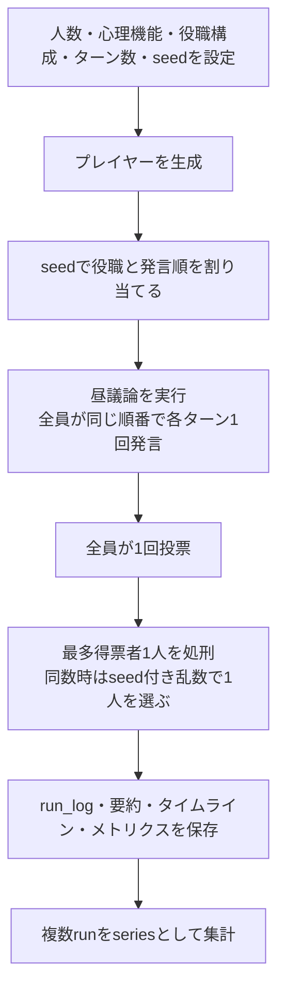
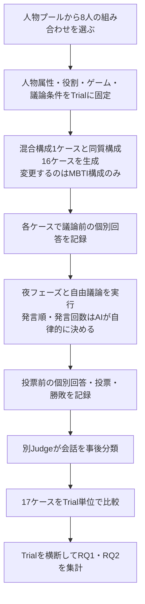

# AIテスト_要求定義書

> このファイルはConfluenceの[AIテスト_要求定義書](https://mayuun2.atlassian.net/wiki/spaces/hackathon/pages/524353/AI+_)（正本）をリポジトリ内で参照するためのマークダウン版です。v2.0刷新中は本ファイルで章ごとにドラフトを作成・確認し、承認後にConfluenceの正本へ反映します。

**本書のスコープ**: MBTI構成の異なるAIエージェント集団が、ワンナイト人狼でどのような集団意思決定を行うかを検証するための要求を整理する。v1.2までのAI先行テストを土台とし、v2.0では研究目的、実験条件、ゲームルール、記録・評価方法を再整理する。

**作業開始メモ**: v2.0刷新中。章ごとに変更内容を確認し、承認後にcommitする。本ファイルは刷新作業中のドラフトであり、合意後にConfluenceの正本へ反映する。

---

## 0. 文書情報

| 項目 | 内容 |
| --- | --- |
| バージョン | 2.0-draft |
| 最終更新 | 2026-08-27 |
| 作成者 | しらまゆ（Biz） / Codex |
| 関連文書 | 会話決定事項のトピック別Markdown（01〜05） / チーム管理のゲームルール文書 / AIテスト_要件定義書 / AIテスト_シミュレーション設計書 / AIテスト_画面設計書 |
| 正本 | Confluenceの該当ページ（v2.0承認前は本ファイルをドラフトとして扱う） |
| 補足 | v2.0の変更は章ごとにdiffを確認し、承認後にcommitする。決定済み・仮置き・未決・WANTを区別して記載する。 |

### 0.1 v2.0刷新で扱う主な変更

- 異なるMBTIタイプが混在する「混合構成（Mixed）」と、全員が同じMBTIタイプの「同質構成（Homogeneous）」を定義する。
- 主研究を混合構成と同質構成の比較（RQ1）、探索的研究を同質構成の16タイプ比較（RQ2）として整理する。
- 1 Trialは、同じ人物・年齢・性別・役割を固定した混合構成1ケースと同質構成16ケースの全17ケースで構成する。
- 8人ゲームのルールは、チーム管理のゲームルール文書を参照し、要求として採用する範囲を各章で確認する。実験時には、使用したルールのバージョンまたは識別情報を記録する。
- 人物、役割、8人の組み合わせを識別し、同じ実験条件を再現・比較できることを要求として整理する。実現案として、人物テーブル、役割テーブル、パターンテーブルが提示されている。
- 会話ログ、議論前・投票前の個別回答、投票結果など、研究に必要な記録・評価方法を再整理する。

---

## 1. 背景

集団での意思決定は、個人の知識や能力だけでなく、異なる意見の出方、情報共有、合意形成など、メンバーの性格構成によって変化する可能性がある。

しかし、人間を対象とした比較では、経験、関係性、知識量など多くの要因が同時に変わるため、性格構成だけの影響を切り分けることが難しい。

その結果、異なる性格が混在する集団と同じ性格で構成される集団で、意思決定の過程や結果がどのように異なるかを、共通条件のもとで比較しにくい。

そこで本プロジェクトでは、AIエージェントの人物条件とゲーム条件を揃え、MBTI構成だけを変えたワンナイト人狼実験を行い、集団の性格構成と意思決定の関係を検証する。

---

## 2. 現状の課題

本章では、v1.2の[要件定義書](./system-requirements.md)、[シミュレーション設計書](./design.md)、実装および実行結果を基準に、v2.0の研究を行うために不足している条件を整理する。以下はv1.2の不具合ではなく、AI先行テストから研究用システムへ目的を変更することで生じる差分である。

### 2.1 As-Is 実験フロー

現行設計は、4人の簡略版人狼を自動実行し、AIの行動差、実行時間、ログ・画面・エラー処理を確認する先行テストとして作られている。心理機能の構成は設定で固定し、役職と発言順はrunごとのseedで変更する。発言順はゲーム開始時に1回決まり、そのrunの全ターンで同じ順番を使う。

### 2.2 実行結果から確認できたこと

| 確認対象 | 観測事実 | v2.0での読み方 |
| --- | --- | --- |
| 自動実行と記録 | 10試合の連続実行は10試合すべて完了し、役職、発言順、全発言、投票、勝敗、実行条件、時間を保存できた。 | 自動進行、ログ保存、seedによる割当再現、複数試合集計はv2.0でも活用できる。 |
| ゲーム条件 | 実行例は4人、10ターン、人狼3人・村人1人、心理機能4種である。10試合の勝敗は人狼9勝、村人1勝だった。 | v2.0の8人ワンナイト人狼とは人数・役職・進行が異なるため、この勝率を研究結果として引き継ぐことはできない。 |
| 発言 | 各runでは、全プレイヤーが設定ターン数と同じ回数だけ発言した。10ターンの実行では4人全員が各10回発言している。 | `speech_count` は性格差ではなく、現行進行が予定どおり動いたことを示す値になっている。 |
| 所要時間 | 10試合で4,112.731秒、うちAI待機時間は4,111.853秒だった。 | 所要時間のほぼすべてがAI応答待ちであり、17ケースを含むTrial数と取得項目を決める際の実行制約になる。 |
| 中断時の記録 | 3試合を指定した別seriesでは、1試合完了後に中断され、残る2試合が`interrupted`として保存された。 | 部分結果は残せる。一方、17ケースを1組とするv2.0では、Trialの完了判定とケース単位の再開方法が必要になる。 |

### 2.3 v2.0に向けた課題

| 課題ID | 現状と原因 | 研究への影響 | v2.0で必要な状態 |
| --- | --- | --- | --- |
| A1 比較単位 | 現行の`series`は、seedを変えた独立したrunの集合であり、役職などの実験条件もrunごとに変わる。 | 混合構成と同質構成の差に役割など他条件の差が混ざり、MBTI構成だけを比較できない。 | 同じ人物、年齢、性別、役割、ゲーム・議論条件を共有し、MBTI構成だけが異なる17ケースを1 Trialとして識別・実行・集計できる。 |
| A2 ゲームルール | 現行は昼議論と投票だけの4人用簡略版で、役職は人狼・村人のみである。夜フェーズ、占い師、怪盗、役職交換、チーム管理ルールの同数処刑・処刑なし判定はない。 | 研究で採用する8人ワンナイト人狼と情報条件・意思決定・勝敗条件が異なる。 | チーム管理のゲームルール文書で合意した8人用ルールを実行でき、使用したルールのバージョンまたは識別情報を記録できる。 |
| A3 人物と条件の管理 | 現行プレイヤーはrun内のID、MBTI・心理機能、役割で表され、人物プール、年齢、性別、8人の組み合わせを継続して識別する情報がない。 | Trial内で同じ8人を使ったことや、Trial間の組み合わせを再現・検証できない。 | 人物、人物属性、役割、8人の組み合わせを識別し、各Trial・ケースから追跡できる。人物テーブル、役割テーブル、パターンテーブルは実現案として要件・設計段階で具体化する。 |
| A4 性格条件と評価指標 | 現行プロンプトは「可能性を複数挙げる」「同意を示す」などの行動を直接指示し、メトリクスは「可能性」「同意」などの語を数えている。 | 性格構成による集団意思決定の差と、指示された表現への追従を区別できない。 | 性格条件の与え方と評価指標を分離し、定義・判定方法・バージョン・根拠箇所を記録する。会話の事後分類は、発言者とは別のJudgeが行う。 |
| A5 判断変化の記録 | 現行ログには公開会話、最終投票、投票理由はあるが、議論前と投票前の非公開回答がない。 | 会話によって誰の疑い・確信がどう変わったか、公開発言と個人判断がどう異なるかを分析できない。 | 全会話に加え、議論前と投票前の個別回答を記録し、同一人物の判断変化を比較できる。発言ごとのprivate stateは取得しない。 |
| A6 自由議論 | 現行ではseedで決めた発言順を全ターンで使い、全員に毎ターン1回の発言を要求する。 | 誰がいつ、何回発言するかがシステム側で決まるため、性格構成による主導、沈黙、割り込み、発言量の偏りが生まれない。 | 個人の発言順・発言回数を事前に固定せず、AIエージェントが会話状況に応じて自律的に発言する。議論全体の終了条件だけを共通化し、実際の発言順・発言回数を結果として記録する。 |
| A7 実行規模と再開 | 実行時間の大部分はAI待機であり、現行の中断記録はrun単位である。 | 17ケースを複数Trial実行すると長時間化し、途中中断や一部ケース欠損が研究データの組を崩す。 | 所要時間と利用上限を確認し、Trial・ケースの状態、再開、欠損、除外理由を記録できる。 |

### 2.4 To-Be 実験フロー

---

## 3. 目的とゴール

**目的**: MBTI構成の異なるAIエージェント集団を同一条件下で比較し、ワンナイト人狼における集団意思決定の過程と結果に、性格構成によってどのような違いが生じるかを明らかにする。

**本プロジェクトのゴール**:

- 混合構成と同質構成の違いを、同一Trial内の対応する条件から比較できる。
- 同質構成について、16タイプごとの違いを探索的に比較できる。
- 議論前の判断、公開会話、投票前の判断、投票、勝敗を一連の記録として追い、性格構成と集団意思決定の関係を評価できる。

混合構成と同質構成のどちらかが常に優れているとはあらかじめ仮定せず、正確性だけでなく、意見の収束や判断の変化を含めて違いの現れ方を確認する。

---

## 4. 成功指標・評価観点

本プロジェクトの成功は、特定のMBTI構成が勝つことではなく、性格構成以外の条件を揃えた比較実験を実行し、意思決定の過程と結果を検証できるデータが残ることとする。

| ID | 成功条件 | 確認方法 |
| --- | --- | --- |
| S-01 | 1 Trialとして、混合構成1ケースと同質構成16ケースの全17ケースを関連付けて実行できる。 | Trialに属する17ケースと各ケースの状態を確認する。 |
| S-02 | 同一Trial内では、人物、年齢、性別、役割、ゲーム・議論条件が一致し、MBTI構成だけが異なる。 | 各ケースに記録された条件を比較する。 |
| S-03 | チーム管理のゲームルール文書に従い、8人のAIエージェントだけでゲーム開始から勝敗判定まで進行できる。 | 適用ルールの識別情報とゲームログを確認する。 |
| S-04 | 公開議論では、個人の発言順・発言回数を事前に固定せず、実際に生じた発言順・発言回数を記録できる。 | 全文の会話ログと参加者別の発言記録を確認する。 |
| S-05 | 各プレイヤー本人から、議論前と投票直前の2時点で非公開の判断を取得し、公開会話、投票、勝敗とあわせて追跡できる。 | 議論前は役職・取得情報の認識、疑っている人物または判断不能、自信度、理由を確認する。投票直前は最も疑っている人物、自信度、理由、投票先を確認する。 |
| S-06 | 全文の会話ログを、発言者とは別のJudgeが発言単位で評価し、分析に使える構造化データとして保存できる。 | 各評価値が元発言に紐づき、使用したJudgeと評価基準のバージョンを確認できる。 |
| S-07 | 人物、役割、8人の組み合わせ、Trial、ケース、適用ルール、評価方法を識別し、結果の根拠まで遡れる。 | 各ID、設定、バージョン、元発言または回答を確認する。 |
| S-08 | 各ケースについて、全文の会話、議論前・投票前の判断、投票、勝敗、発言評価と、そのケースの分析結果を確認できる。 | ケース単位の詳細データと、人が読める分析結果を確認する。 |
| S-09 | 各Trialについて、同じ条件を共有する17ケースの違いを補助的に確認できる。 | 混合構成1ケースと同質構成16ケースを並べたTrial分析を確認する。 |
| S-10 | 100 Trialで実行した全1,700ケースの結果をまとめた全体分析を確認できる。 | 全ケースの実行数、有効数、欠損・除外と、実験全体の分析結果を確認する。 |
| S-11 | 同じ100 Trialの結果から、RQ1とRQ2の分析結果をそれぞれ確認できる。 | RQ1では混合構成と同質構成、RQ2では同質構成16タイプの分析結果を確認する。 |
| S-12 | ケースの中断・失敗・欠損が記録され、完了済みケースを失わずに残りを再開できる。 | 中断後の状態、再開結果、欠損・除外理由を確認する。 |

### 4.1 成功と研究結果の区別

混合構成と同質構成の間に差が出ない場合や、想定と反対の傾向が出た場合も、上記の条件を満たして比較できていれば有効な研究結果として扱う。研究結果の方向を、システムや実験の成功条件にはしない。

S-05の非公開回答は、議論前から投票直前までの判断変化を見るために取得する。発言のたびに心理状態を聞く処理は、会話への介入と実行負荷を避けるため行わない。

---

## 5. 利用者・ステークホルダー

| ステークホルダー | 主な責任 | 主に確認するもの |
| --- | --- | --- |
| しらまゆ（Biz / Project Owner / 実行担当） | 研究目的、RQ、要求、優先順位を整理し、実験を実行して要求定義と分析結果を確認する。 | 要求定義書、実行状況、ケース・Trial・全体・RQ別の分析結果 |
| ケンティー（Designer） | 実行状況と分析結果を、チームが比較・確認できる見せ方にする。 | ケース詳細、比較画面、分析結果の表示 |
| ゆうじろう（Engineer） | 要求を要件・設計・実装へ落とし込み、実行、保存、再開、集計が成立するようにする。 | 要件定義書、設計書、設定、実行ログ、エラー・再開状態 |
| チーム3人 | ゲームルール、重要な仕様変更、分析結果の解釈、次の判断に合意する。 | チーム管理のゲームルール文書、差分、全体・RQ別の分析結果 |

### 5.1 利用文脈

| 場面 | 行うこと |
| --- | --- |
| 実行前 | 要求、ゲームルール、人物・役割・組み合わせ、実行条件、使用する各バージョンを確認する。 |
| 実行中 | Trial・ケースの進行、完了、失敗、中断を確認し、必要に応じて残りを再開する。 |
| ケース確認 | 会話全文、議論前・投票前の判断、投票、勝敗、Judgeによる発言評価、ケース分析を確認する。 |
| Trial確認 | 同じ人物・役割・ゲーム条件を共有する17ケースの違いを補助的に確認する。 |
| 全体確認 | 100 Trial、全1,700ケースの全体分析と、RQ1・RQ2ごとの分析結果を確認する。 |
| 仕様変更 | Confluenceの正本とGitHubの関連文書を更新し、実装へ影響する変更はEngineerと確認する。 |

### 5.2 システム内の役割

| 役割 | 責務 |
| --- | --- |
| AIエージェント | 8人の参加者として、自分に与えられた人物属性、MBTI設定、役職、取得情報をもとに、自律的に判断・発言・投票する。 |
| GM | チーム管理のゲームルール文書に従い、役職と秘密情報を管理し、夜処理、議論の終了管理、投票、勝敗判定を行う。 |
| Judge | ゲーム終了後に会話を発言単位で評価し、元発言に紐づく構造化データとケース分析を生成する。ゲーム中の発言には介入しない。 |
| 実行・集計機能 | Trialとケースを実行・保存・再開し、ケース、Trial、実験全体、RQ別の分析結果を生成する。 |
| 閲覧者 | 実行環境を持たなくても、保存された会話詳細と分析結果を確認する。 |

### 5.3 進め方

| Step | やること | 主担当 | 出力 |
| --- | --- | --- | --- |
| 1 | 研究目的、RQ、要求、ゲームルールを確認する。 | Biz / チーム | 要求定義書、ゲームルール文書 |
| 2 | 要求を満たす要件、データ、実行・分析方式を設計する。 | Engineer / Biz / Designer | 要件定義書、設計書、画面設計書 |
| 3 | ゲーム進行、自由議論、記録、Judge、再開、分析出力を実装・確認する。 | Engineer | 実装、テスト、確認結果 |
| 4 | 人物・役割・組み合わせと実行条件を確定し、100 Trialを実行する。 | しらまゆ（実行担当） / Engineer支援 | 実行設定、ケース記録、状態記録 |
| 5 | 会話を事後評価し、ケース、Trial、全体、RQ別の分析結果を生成する。 | Judge / 実行・集計機能 | 構造化データ、分析結果 |
| 6 | チームで分析結果と根拠を確認し、研究上の解釈と次の判断を整理する。 | チーム3人 | 結果まとめ、判断記録 |

---

## 6. 前提ナレッジ：MBTIと心理機能の扱い

この章では、今回のテストでMBTIと心理機能をどう扱うかを整理する。

今回の目的は、MBTIや心理機能の正しさを証明することではない。AIエージェントに行動傾向を持たせ、人狼の発言、疑い方、投票、勝敗、実行ログにどんな差が出るかを見るための前提として扱う。

### 6.1 MBTIの4文字と心理機能の違い

| 軸 | 見ること |
| --- | --- |
| E / I | 外の世界に向かうか、内側の思考や感覚に向かうか。 |
| S / N | 具体的な事実を重視するか、可能性やつながりを重視するか。 |
| T / F | 論理や一貫性を重視するか、価値や人への影響を重視するか。 |
| J / P | 早く整理・決定したいか、選択肢を残して探索したいか。 |

`ENTP`、`INFP`、`ISTJ` のような4文字はタイプ名として分かりやすい。一方で、最初から16タイプを作ると、行動の違いが「E/Iの違い」なのか「N/Sの違い」なのか「心理機能の違い」なのかが分かりにくくなる。

そのため、今回の初期テストでは16タイプを直接作るよりも、心理機能を単体の行動ルールとして使う方針にする。

### 6.2 なぜ心理機能で始めるか

心理機能で始める理由は、AIエージェントの発言ルールに落とし込みやすいからである。

たとえば「Neなら可能性を広げる」「Tiなら発言の矛盾を見る」「Feなら場の空気を見る」「Siなら過去ログを見る」のように、行動として書きやすい。

今回見たいのは「どのMBTIタイプが本当に強いか」ではなく、行動ルールの違いがログや勝敗、疑われ方に現れるかである。そのため、初回MVPでは心理機能ベースで始め、必要に応じて後続で16タイプ風に拡張する。

### 6.3 16タイプと4つの心理機能の関係

一般的なタイプ論では、16タイプは複数の心理機能の組み合わせとして説明されることがある。たとえば、ENTPは `Ne / Ti / Fe / Si`、INFPは `Fi / Ne / Si / Te` のような並びで説明されることがある。

| 呼び方 | 意味 | 今回の扱い |
| --- | --- | --- |
| 主機能 | そのタイプで中心になりやすい働き | 初回MVPでエージェントの主な行動ルールとして使う候補。 |
| 補助機能 | 主機能を支える働き | 初回MVPでは必須にしない。後続で複雑化する時の候補。 |
| 第三機能 | 補助的・未成熟に出ることがある働き | 初回MVPでは扱わない。 |
| 劣等機能 | 苦手さやストレス時の反応として語られることがある働き | 初回MVPでは扱わない。 |

初回MVPでは、4つの機能スタックを全部持たせるのではなく、まずは1エージェントにつき1つの心理機能を行動ルールとして持たせる。これにより、ログを見た時に「どの行動ルールがどう出たか」を追いやすくする。

### 6.4 今回使う心理機能の行動ルール案

| 心理機能 | 人狼での振る舞い案 |
| --- | --- |
| Ne | 可能性を広げる。複数の仮説を出す。 |
| Ni | ひとつの核心仮説に寄せる。流れから結論を読む。 |
| Se | 直近の発言、態度、反応を見る。 |
| Si | 過去ログ、前回発言、ルールとのズレを見る。 |
| Te | 効率よく結論、手順、投票先を決める。 |
| Ti | 発言の論理矛盾を細かく見る。 |
| Fe | 場の空気、反応、協調性を見る。 |
| Fi | 個人の信念、違和感、納得感を見る。 |

### 6.5 扱わないこと

| 扱い | 今回の使い方 |
| --- | --- |
| ENTP / INFPなどの16タイプ | 初回MVPでは使わない。16人テストまで広げる時の候補にする。 |
| Ne / Ni / Se / Si / Te / Ti / Fe / Fi | 初回から使う。AIエージェントの行動ルールとして扱う。 |
| 実在人物のタイプ診断 | やらない。診断、評価、ラベリングに使わない。 |

### 6.6 参考リンク

| 目的 | 参照先 |
| --- | --- |
| MBTIの基本的な説明 | [The Myers-Briggs Company: MBTI Facts](https://www.themyersbriggs.com/en-us/support/mbti-facts) |
| MBTI結果の読み方 | [The Myers & Briggs Foundation: Understanding My MBTI Results](https://myersbriggs.org/my-mbti-personality-type/my-mbti-results/home.htm) |
| Jung系の心理機能の前提 | [APA Dictionary of Psychology: functional types](https://dictionary.apa.org/functional-types) |
| Thinking / Feeling / Sensation / Intuitionの説明 | [Jung Room: Thinking, feeling, sensation, and intuition](https://www.jungroom.com/en/jung-says/thinking-feeling-sensation-intuition) |

---

## 7. 機能要求

### 7.1 入力要件

| 入力項目 | 必須/任意 | 形式・制約 |
| --- | --- | --- |
| 参加人数 | 必須 | 初回MVPは4人。後続で8人、16人を想定。 |
| 参加者設定 | 必須 | 各プレイヤーに心理機能を割り当てる。初回4人にどの心理機能を出すかはEngineerに任せてよい。 |
| 役職設定 | 必須 | 初回MVPは人狼1、村人3。割り当て方法はEngineerに任せてよいが、seedまたは設定を必ずログに残す。 |
| ターン数 | 必須 | 初回MVPは昼議論3ターン。 |
| 試合回数 | 必須 | 初回MVPは1回。後続で10回、100回、1000回を想定。 |
| ランダムseed | 任意 | ランダム組み合わせや役職割当を再現するために記録する。 |
| 実行環境 | 必須 | 誰のPCで実行したかを記録する。 |

### 7.2 機能（Must）

| FR-ID | ユーザーストーリー | 受け入れ基準 | 関連課題ID |
| --- | --- | --- | --- |
| FR-01 | Bizとして、4人のAI人狼を1回実行したい。なぜなら、本番テーマ選定に使う前に最小の実現可能性を確認したいから。 | 4人、人狼1、村人3、昼3ターン、投票1回で勝敗が出る。 | A1, A3 |
| FR-02 | Engineerとして、設定を変えるだけで人数や試合回数を切り替えたい。なぜなら、実験条件ごとの負荷と結果を比較したいから。 | 参加人数、試合回数、組み合わせ、人狼役、seedを設定として扱える。 | A2, A3 |
| FR-03 | チームとして、実行結果を全員で見たい。なぜなら、同じ結果を見ながら本番テーマ選定に活かしたいから。 | summary、timeline、metrics、HTMLプロト画面のいずれかから結果を確認できる。 | A1, A4 |
| FR-04 | Bizとして、実行時間や待機時間を知りたい。なぜなら、本番ハッカソン中に現実的に回せる規模を判断したいから。 | 開始時刻、終了時刻、所要時間、AI待機時間、実行環境が記録される。 | A3 |

### 7.3 Want（あると良い・後続フェーズ）

| FR-ID | 内容 | 受け入れ基準 |
| --- | --- | --- |
| FR-10 | 8人版で心理機能8種を1人ずつ出す | 8機能の比較結果を見られる。 |
| FR-11 | 16人版でMBTI16タイプ風に拡張する | 16人分の行動傾向を設定できる。 |
| FR-12 | 複数試合をまとめて実行する | 10回、100回、1000回などの実行結果を集計できる。 |
| FR-13 | GitHub Pagesで結果を共有する | 開発環境なしで全員が結果画面を見られる。 |

---

## 8. 実験条件・変数

この章に書いている条件は、現時点の案である。初回MVPでは、Engineerが実装しやすい形を優先してよい。ただし、後から比較できるように、実際に使った条件は設定ファイルまたは実行ログに必ず残す。

このテストでは、単発の勝敗だけでなく、人間が同じメンバー周辺で人狼を複数回遊ぶ時のように、過去回の発言・疑われ方・役職時の変化を参照したふるまいも観察対象にする。

ここでいう「過去の記録を元に」は、人間だけがあとで比較するという意味ではなく、**AIエージェントに過去ログまたは過去サマリを入力として渡し、前回までのふるまいを踏まえて発言・疑い・投票を変えられるかを見る**という意味で扱う。

ただし、過去ログ参照を初回MVPに含めると実装が重くなる可能性があるため、初回MVPでは「過去ログ参照なし」で1ゲームを動かす。複数回検証では、過去ログ参照モードを追加し、参照あり/なしの差を比較できるようにする。

| 変数 | 候補 | 初回MVP | 備考 |
| --- | --- | --- | --- |
| 1回あたりの参加人数 | 4人 / 8人 / 16人 | 4人 | 8人は心理機能8種比較、16人はMBTIタイプ風拡張。 |
| 初回4人の心理機能 | Engineerが実装しやすい4種 / ランダム4種 / 固定4種 | Engineerに任せる | Biz/Designer側では固定しない。どの機能を使ったかはconfigとログに残す。 |
| 試合回数 | 1回 / 10回 / 100回 / 1000回 | 1回 | 10回程度は、人間が同じメンバー周辺で遊ぶ時に傾向を見始める粒度として扱う。100回以上は自動実行の境界確認。 |
| 組み合わせ | 固定メンバー / ランダム組み合わせ / 心理機能8種を1人ずつ / 同じメンバーで複数回 | Engineerに任せる | ランダムでも固定でもよい。後で比較できるように、組み合わせとseedを必ず記録する。 |
| 人狼役 | 固定 / ランダム / 心理機能ごとにローテーション | Engineerに任せる | 比較しやすさと実装しやすさを優先する。割り当て方法とseedを必ず記録する。 |
| 過去ログ参照モード | なし / 前回summaryのみ / 過去N試合summary / 全発言ログ | なし | 複数回検証で追加。AIエージェントに渡す過去情報の範囲を切り替える。 |
| 過去ログ参照範囲 | 自分の過去ログ / 同卓者の過去ログ / 全体サマリ | なし | 「あの人は前回よく喋っていた」のような判断を再現するための条件。 |
| 記憶リセット単位 | 1試合ごと / 10試合セットごと / 実行全体で保持 | 1試合ごと | 初回MVPは保持しない。複数回検証では、10試合セットごとに履歴をリセットする案を検討する。 |
| ランダム条件 | seed、参加人数、組み合わせ、役職割当 | 記録する | 再現性のために必要。 |
| ターン数 | 3ターン固定 / 増減可能 | 3ターン | 長くすると待機時間が増える。 |
| 実行環境 | しらまゆMac mini / しらまゆMacBook / ケンティーPC / ゆうじろうMacBook Air | 実行したPCを記録 | 誰のPCでどの規模まで回せるかを見る。 |
| 実行時間 | 1ゲームあたり / 10回 / 100回 / 1000回 | 1ゲーム | AI待機時間も見る。 |
| 利用AI | 無料枠 / ローカルLLM / Codex・Cursorで実行可能な範囲 | API課金なし | 課金API前提にしない。 |

### 8.1 複数回検証で見たい差分

| 見たい差分 | 例 | 必要な記録 |
| --- | --- | --- |
| 平常時と人狼時の発言量差 | 村人の時はよく話すが、人狼の時だけ発言が減る | player_id、role、speech_count、avg_chars、run_id |
| 過去に疑われた相手への反応 | 前回疑ってきた相手を今回も警戒する | past_reference、suspected_by、final_vote |
| 同じ心理機能の役職差 | Tiが村人の時と人狼の時で矛盾指摘の量が変わる | function、role、rebuttal_count、suspicion_count |
| 過去ログ参照あり/なしの差 | 過去ログありの方が疑い理由が具体化する | history_mode、reason_text、vote_reason |

---

## 9. 出力・画面要件

この章に書いている出力・画面要件は、現時点の案である。詳細なファイル構成やschemaはEngineerが決めてよい。ただし、チーム全員が後から同じ結果を確認できるように、実行したPCからJSON、Markdown、CSV、HTMLなどの出力を残し、GitHubまたはGitHub Pages経由で共有できる状態にする。

### 9.1 出力要件

| 出力 | 目的 | 初回MVP |
| --- | --- | --- |
| run_log.json | 機械で読む用。1試合分の全データを保存する。 | Must |
| summary.md | 人が読む用。結果カードとして見る。 | Must |
| timeline.md | 議論の流れを見る。 | Must |
| metrics.csv | 発言回数などの集計を見る。 | Must |
| HTMLプロト画面 | 全員で結果を見ながら話せるようにする。見た目の完成度は問わず、結果確認用でよい。 | Must |
| series_summary.md | 複数回実行の結果をまとめる。 | Want |
| history_input.json | 過去ログ参照モードで、AIエージェントに渡した過去情報を保存する。 | Want |

### 9.2 必須出力項目

| 対象 | 必須項目 | 備考 |
| --- | --- | --- |
| run_log.json | run_id、series_id、run_index、config、players、turns、votes、result、metrics、timing | あとからHTMLやCSVに変換できる正本データ。 |
| config | player_count、turn_count、game_count、role_assignment_mode、seed、history_mode、history_scope | 実験条件を再現するために必要。 |
| players | player_id、function、role、agent_prompt_version | 心理機能と役職の比較に必要。 |
| turns | turn、player_id、speech_text、referenced_history_ids | 過去ログを参照した発言かどうかを後で確認する。 |
| votes | voter、target、reason | 投票理由まで残す。 |
| timing | started_at、ended_at、elapsed_seconds、ai_wait_seconds、machine_name | PC制約と待機時間を見る。 |
| metrics.csv | run_id、series_id、player_id、function、role、speech_count、avg_chars、final_vote、win、elapsed_seconds | 初回MVPで確実に取りたい最小指標。 |

### 9.3 画面で見たいもの

| 表示項目 | 主役/補助 | 内容 |
| --- | --- | --- |
| 結果カード | 主役 | 勝敗、人狼だった機能、吊られた人、一番疑われた人、一番発言した人 |
| メトリクス表 | 主役 | 心理機能ごとの発言回数、疑い回数、疑われ回数、質問回数、投票先 |
| タイムライン | 主役 | ターンごとの発言ログ |
| 観察メモ | 補助 | 面白かった動き、次に変えること |
| 実行条件 | 補助 | 人数、試合回数、seed、実行環境、所要時間、history_mode |
| 過去ログ参照 | 補助 | 参照ありの場合、どの過去runを入力に使ったか |

### 9.4 確実に取りたい指標

- 発言回数
- 平均発言文字数
- 投票先
- 吊られた人
- 勝敗
- 実行時間
- AI待機時間
- 実行環境
- seed
- history_mode

### 9.5 できれば取りたい指標

- 疑い回数
- 疑われ回数
- 質問回数
- 反論回数
- 同調回数
- 仮説数
- 過去ログを参照した発言数
- 役職変化による発言量差

### 9.6 出力サンプルの扱い

出力サンプルは、Engineerが決める。Biz/Designer/Codex側では形式を固定しない。要求定義書では「必ず含める項目」だけを正とし、`summary.md`、`timeline.md`、`metrics.csv`、`run_log.json` の詳細サンプルは `AIテスト_シミュレーション設計書` に置く。

### 9.7 実行結果の置き場

| 置き場 | 置くもの | 目的 |
| --- | --- | --- |
| GitHub: `hackathon-test` | コード、設定ファイル、run_log.json、metrics.csv、summary.md、timeline.md、HTMLプロト | 実体と再現可能な実行結果を残す。 |
| Confluence | 要約、判断、次に変えること、制約メモ | チームで見て意思決定する。 |
| GitHub Pages | HTMLプロトまたは結果ビュー | 後続で、開発環境なしで全員が見られるURLにする。 |

---

## 10. 制約・実行環境

| 区分 | 制約・前提 |
| --- | --- |
| 費用 | API課金前提にしない。ChatGPT/Codex/Cursorの契約範囲、無料枠、ローカル実行を優先する。 |
| PC環境 | メンバー別のPC環境は5.2を参照する。しらまゆのMac miniは長時間実行候補、ゆうじろうのM2 MacBook Airは重い実行に制約がある可能性。 |
| 長時間実行 | しらまゆのMac miniで寝ている間に複数試合を回せる可能性がある。 |
| 実行方式 | リアルタイム対戦ではなく、自動バッチ実行。誰かのPCで実行し、結果ファイルをGitHubに残す。 |
| 共有 | 結果はチーム全員が見られる形にする。初回はHTMLプロト画面、後続でGitHub Pagesを検討する。 |
| 設計更新 | 仕様変更は会話だけで終わらせず、Confluenceの要求定義書または関連設計書に反映する。 |

---

## 11. スコープ外

- MBTIや心理機能の正しさを証明すること。
- 実在人物のタイプ診断、評価、ラベリング。
- 人間が遊べるリアルタイム人狼ゲーム。
- 初回から16タイプの強さを断定すること。
- 占い師、騎士、霊媒師などの複雑役職。
- API課金前提の本格運用。
- 本番テーマとしてMBTI人狼を採用する前提で進めること。

---

## 12. MVP受入基準

| ID | 受入基準 | 確認方法 |
| --- | --- | --- |
| AC-01 | 4人、人狼1、村人3で1ゲームを自動実行できる。 | 実行ログを確認する。 |
| AC-02 | 昼議論3ターン、投票1回、勝敗判定が出る。 | timeline.md と summary.md を確認する。 |
| AC-03 | run_log.json、summary.md、timeline.md、metrics.csv が出力される。 | 出力ファイルを確認する。 |
| AC-04 | HTMLプロト画面で結果カード、メトリクス表、タイムライン、観察メモを見られる。 | HTMLをブラウザで確認する。 |
| AC-05 | 実行環境、開始終了時刻、所要時間、AI待機時間が記録される。 | run_log.json または実行記録を確認する。 |
| AC-06 | 次の共同開発テストや本番テーマ選定に使える制約メモが残る。 | AIテスト_結果・制約メモに反映できる。 |

---

## 13. 未決定・Engineer相談事項

### 13.1 Biz/Designerと今決めること

| 項目 | 決めたいこと | 現時点の扱い |
| --- | --- | --- |
| 4人MVPの心理機能 | Biz/Designer側で固定するか | 固定しない。Engineerが実装しやすい4種またはランダム4種でよい。使った心理機能は必ずログに残す。 |
| 人狼役の割り当て | Biz/Designer側で固定するか | 固定しない。Engineerが実装しやすい方式でよい。割り当て方法とseedは必ずログに残す。 |
| 画面で最初に見たいもの | HTMLプロトで何が見えればよいか | 結果カード、メトリクス表、タイムライン、観察メモ。見た目の完成度は問わない。 |
| 観察メモの観点 | 何を面白い/使えると見るか | 発言量、疑い方、投票理由、役職時の変化、過去ログ参照時の変化。 |

### 13.2 Engineerに相談すること

| 項目 | 相談内容 | 現時点の扱い |
| --- | --- | --- |
| 実行方法 | ローカルLLM、無料枠、Codex/Cursorでどう動かすか。 | Engineer相談 |
| 設定方式 | 人数、試合回数、組み合わせ、人狼役、seed、history_modeを設定ファイルで切り替えられるか。 | Engineer相談 |
| 4人MVPの心理機能 | Engineerが実装しやすい4種にするか、ランダム4種にするか。 | Engineerに任せる |
| 人狼役の割当 | 固定、ランダム、seed付きランダム、心理機能ごとのローテーションのどれが実装しやすいか。 | Engineerに任せる。ただし再現用にseedまたは設定を保存する。 |
| 過去ログ参照 | AIエージェントに前回summary、過去N試合summary、全発言ログのどれを渡せるか。 | MVP後の追加候補。設計だけ先に相談。 |
| 過去ログ保存 | 過去ログ参照モードで、AIに渡した情報をhistory_input.jsonとして保存できるか。 | Engineer相談 |
| 複数回実行 | 同じメンバーまたは近い組み合わせで10回程度回し、過去ログ参照あり/なしで傾向が変わるか。100回、1000回をどのPCでどのくらいの時間で回せるか。 | MVP後に検証 |
| ランダム条件 | ランダム時の1回あたりの人数、組み合わせ、役職割当、seed、履歴参照範囲をどう保存するか。 | Engineer相談 |
| 指標の集計方法 | 発言回数・文字数はコードで取る。疑い回数、反論回数、同調回数、仮説数、過去ログ参照発言数をルールベースにするかAI分類にするか。 | Engineer相談 |
| 出力サンプル | `summary.md`、`timeline.md`、`metrics.csv`、`run_log.json` の詳細サンプルをどうするか。 | Engineerが決める。Biz/Designer/Codex側では形式を固定しない。詳細はシミュレーション設計書に置く。 |
| HTMLプロト画面 | 先に動くHTMLを出し、その後に画面設計へ進めるか。 | 初回MVPに含める |
| GitHub Pages | いつ全員がURLで見られる状態にするか。 | HTMLプロト確認後に検討 |

### 13.3 実験後に更新すること

| 項目 | 更新する内容 | 更新先 |
| --- | --- | --- |
| 納得ライン | 本番テーマとして採用できる/できない判断基準 | 本書 §4 または AIテスト_結果・制約メモ |
| 実行可能な規模 | 誰のPCで何人・何試合まで回せるか | AIテスト_制約確認リスト |
| 次に試す条件 | 8人、16人、複数回、過去ログ参照あり/なし | AIテスト_シミュレーション設計書 |
| 画面設計 | HTMLプロトを見て、見せ方として足りないもの | AIテスト_画面設計書 |
